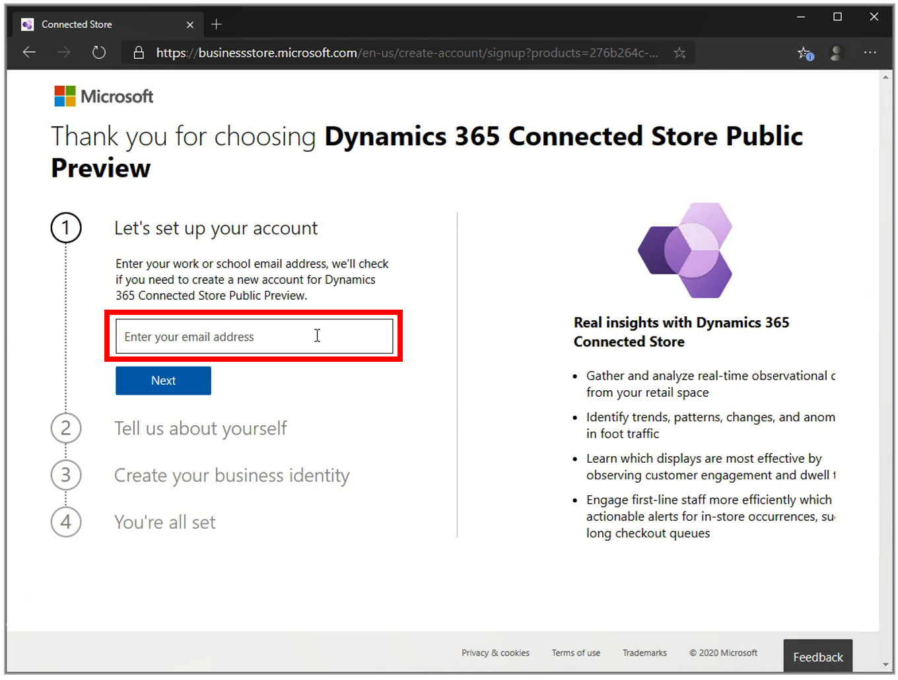
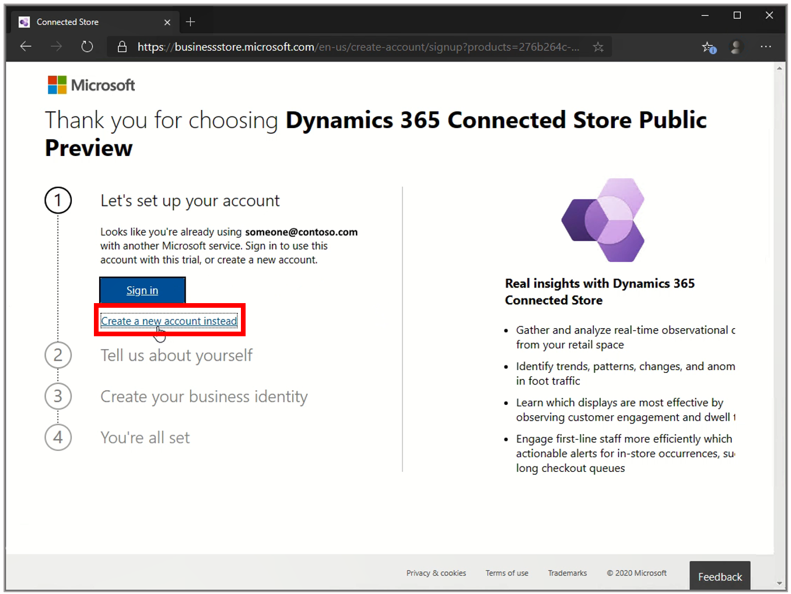
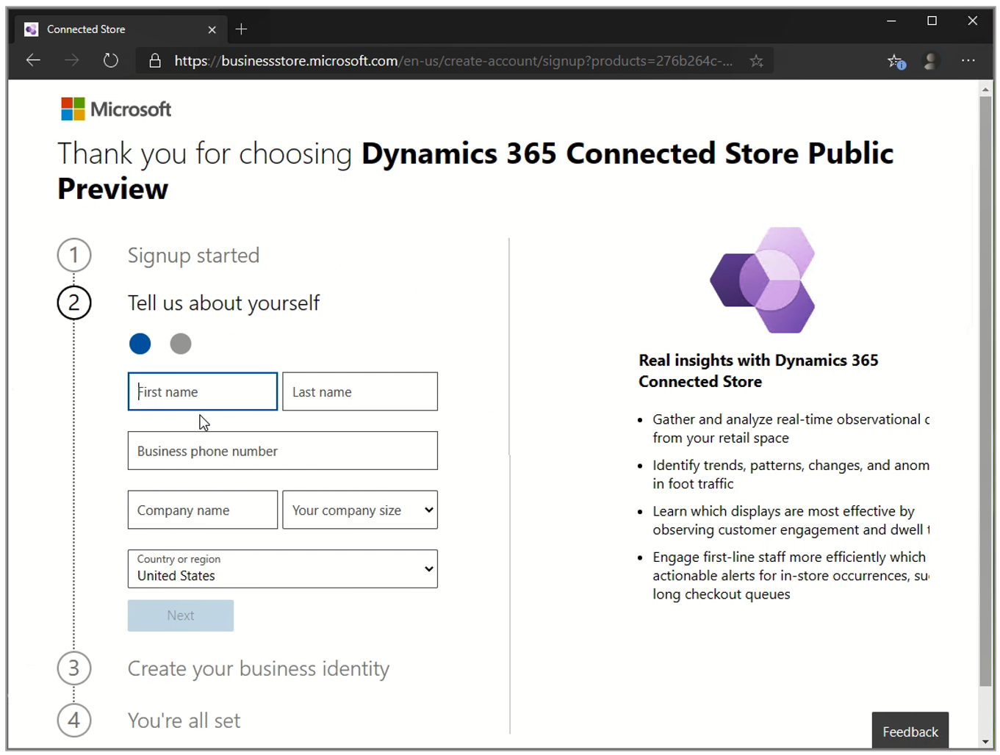
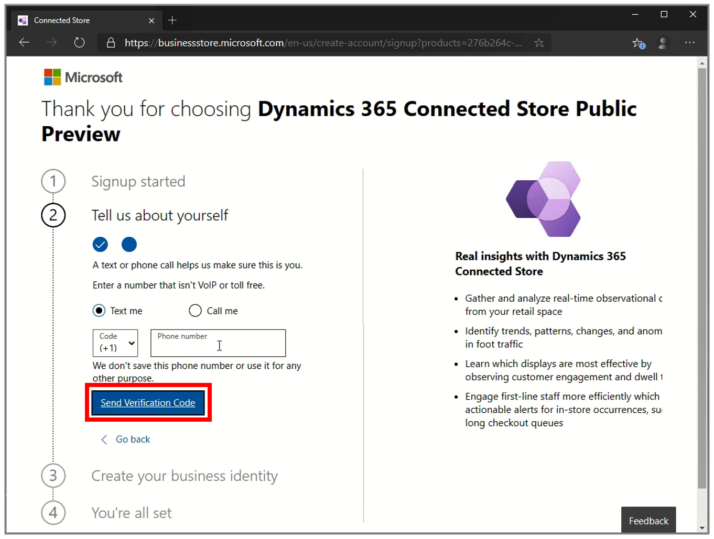
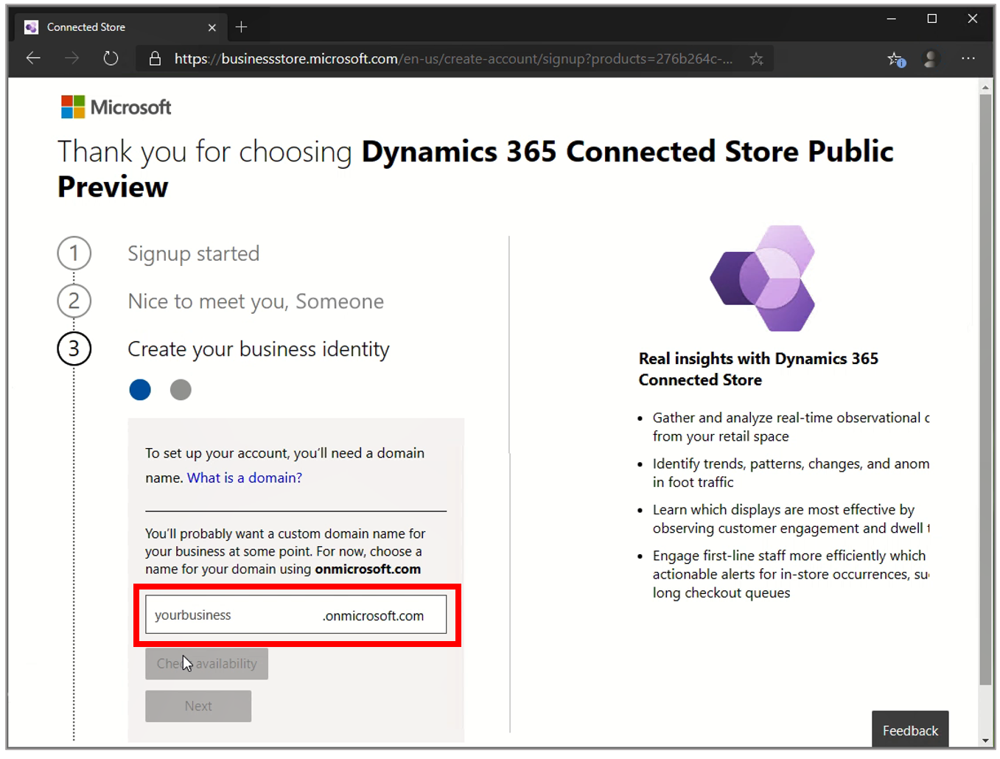
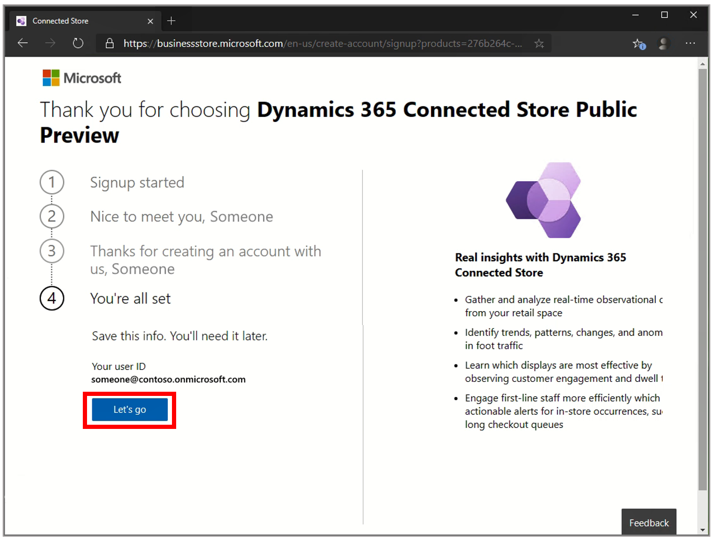

# Create a new Azure Active Directory tenant for the Dynamics 365 Connected Store public preview

For the Microsoft Dynamics 365 Connected Store public preview, we recommend signing up with a new test Azure Active Directory tenant to simplify account management 
during the preview.

## Sign up with a new test Azure Active Directory tenant

To set up a new test Azure Active Directory tenant, you’ll:

- Create a test tenant under a new domain of onmicrosoft.com

- Create a global administrator account for yourself

- Assign a 6-month trial license to Connected Store

### Sign up by creating a new tenant

1. [Go to the Dynamics 365 Connected Store sign-up page](https://go.microsoft.com/fwlink/?linkid=2128173).

2. Under **Let’s set up your account**, enter your company email address, and then select **Next**.

    

3. Select **Create a new account instead**.

    > [!IMPORTANT]
    > Important: Create a new account to test Connected Store instead of signing in with your company’s existing Azure Active Directory tenant admin account. 
    This simplifies management of Connected Store and ensures your testing doesn’t impact any of your company’s existing business processes.
    
    
    
4. Fill in your account information, and then select **Next** to verify your new account.

    > [!IMPORTANT]
    > In the **Country or region** field, select **United Kingdom** or **United States**. At this time, if you choose any other country or region, the sign-up process 
    will fail. 

    This selection determines the country or region in which your Connected Store application will be installed and where your data will reside. 
    
      
    
5. Enter a phone number for verification purposes, and then select **Send Verification Code**.

    
    
6. Select **Create your business identity**, enter a temporary domain name (for example, "Contoso"), and then select **Check availability**. 

    > [!NOTE]
    > Connected Store uses the Azure Active Directory tenant to manage permissions for Connected Store. The user accounts you’ll create later will be in the domain 
    you create in this step. For example, if you choose “Contoso” as your domain, a user account for “someone” would be: someone@contoso.onmicrosoft.com.
    
    
    
7. When you have confirmed that the name is available to use, select **Next**.

8. Enter a user account name and password for the global admin account.
  
   
   
9. Select **Sign up** to agree to the terms for the new test tenant. 

    At this point, the Setup program will: 
    
    - Create the new Azure Active Directory tenant account
    
    - Create your new admin user account
    
    - Sign you in to your new admin account
    
    - Assign the Dynamics 365 Connected Store Public Preview trial license to the tenant
    
    - Assign a client license for this trial to the admin user account    
    
10. Under **You’re all set**, select **Let’s go**, and then go to the next step: Install the Connected Store web app.  

    

## What's next?

[Install the Connected Store web app](admin-install-web-app.md)

