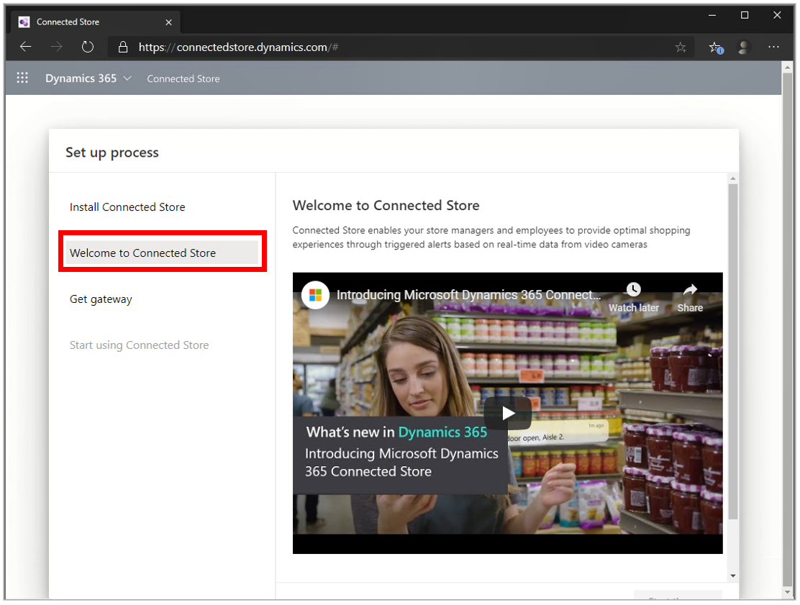

# Install Dynamics 365 Connected Store (public preview) 

After you have [created an Azure Active Directory tenant](admin-create-new-tenant.md) for the Microsoft Dynamics 365 Connected Store public preview, you can 
install Dynamics 365 Connected Store.

1. [Go to the Connected Store setup page](https://go.microsoft.com/fwlink/?linkid=2128110).

2. Read through the [Terms of Use](https://go.microsoft.com/fwlink/?linkid=2128595), and then when you’re ready, select **Start install**.

     
    
    This step can take from 5-30 minutes. You’ll see a progress indicator showing where you are in the installation process. During this time, setup:
    
    - Creates a Microsoft Power Platform default environment for your Azure Active Directory tenant
    
    - Creates a Common Data Service instance and sets up a database
    
    - Installs the Connected Store solutions in the environment
    
    
    
    If the setup process fails, you’ll see the following message:
   
    
    
    If this happens, try installing again.
    
3. While Connected Store is being installed, you can watch a demo and learn more about preparing for Connected Store by selecting **Welcome to Connected Store**.

    

## Next step

[Order the Azure Stack Edge gateway](admin-request-ase.md)
