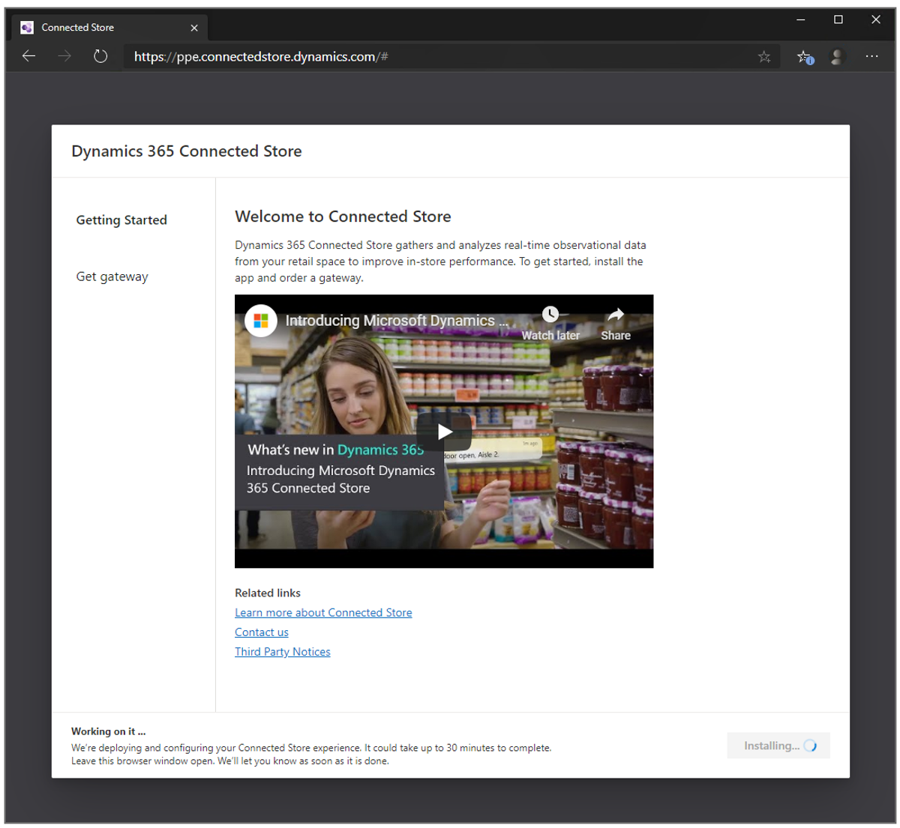

# Install Dynamics 365 Connected Store Preview

After you have [created an Azure Active Directory tenant](admin-create-new-tenant.md) for Microsoft Dynamics 365 Connected Store Preview, you can 
install Dynamics 365 Connected Store.

>[!NOTE]
>To install Connected Store, you must sign in with the global adminstrator account for your [Azure Active Directory tenant](admin-create-new-tenant.md), or with an account that has the System Administrator security role.

1. [Go to the Connected Store setup page](https://go.microsoft.com/fwlink/?linkid=2128110).

2. Read through the [Terms of Use](https://go.microsoft.com/fwlink/?linkid=2128595), and then when you’re ready, select **Install**.

     
    
    Installing Connected Store can take 30 to 60 minutes. You’ll see a progress indicator showing where you are in the installation process. During this time, setup installs the Connected Store solutions in the selected environment. It also installs the Contoso Sample Store that you can use to [explore the web app by using sample data](launch-app.md). 
    
    - Creates a Microsoft Power Platform environment for your Azure Active Directory tenant
    
    - Creates a Common Data Service instance and sets up a database
    
    - Installs the Connected Store solutions in the environment
    
    While Connected Store is being installed, you can watch a video demo and learn more about preparing for Connected Store.
    
    
    
    If the setup process fails, you’ll see the following message:
   
    
    
    If this happens, try installing again.
    
## Next step

[Order the Azure Stack Edge gateway](admin-request-ase.md)
