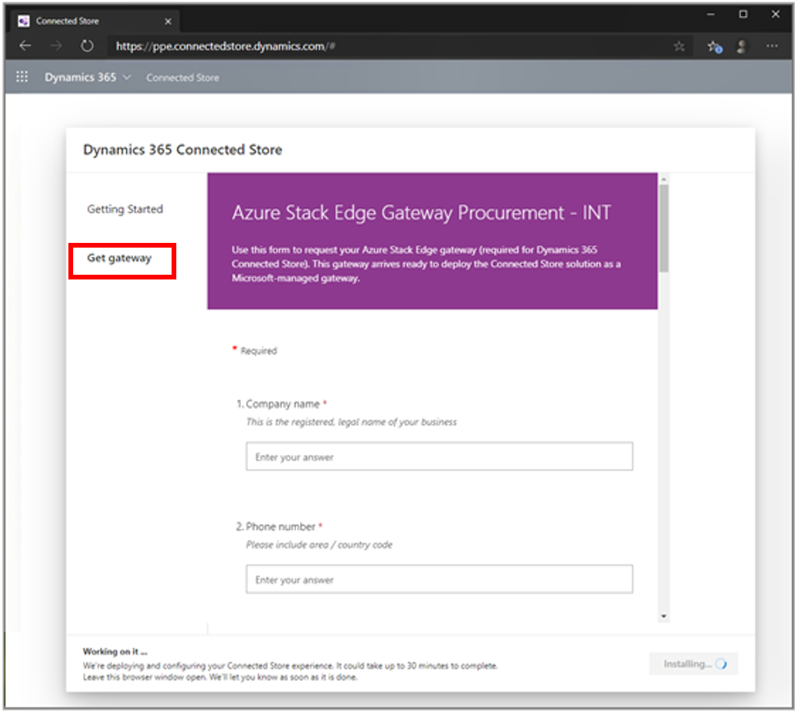

# Order the Azure Stack Edge Pro (2 GPU) gateway to use with Dynamics 365 Connected Store Preview

This procedure describes step 3 of the setup process for Microsoft Dynamics 365 Connected Store Preview. Before completing this procedure, make sure to:

1. [Create a new Azure Active Directory tenant for the preview](admin-create-new-tenant.md)

2. [Install Dynamics 365 Connected Store](admin-install-web-app.md)

## Order Azure Stack Edge

Connected Store uses the Azure Stack Edge Pro (2 GPU) gateway to transform video streams from cameras in your retail stores into data that depicts aggregated traffic patterns in your store. 

> [!IMPORTANT]
> The Azure Stack Edge Pro hardware that you order for Connected Store Preview can only be used for Connected Store Preview. You can't deploy any other resources to Azure Stack Edge Pro during the preview. 

1. In the [Connected Store Setup page](https://go.microsoft.com/fwlink/?linkid=2128110), select **Get gateway**.

2. Fill out the form. 

     
     
   The Connected Store team will contact you when the request is received. After you receive your Azure Stack Edge Pro gateway, you can [prepare your network and install it](ase-install.md).
 
## Next steps

[Launch the app and explore the Contoso sample store](launch-app.md) 
[Prepare user accounts](admin-prepare-user-accounts.md)
