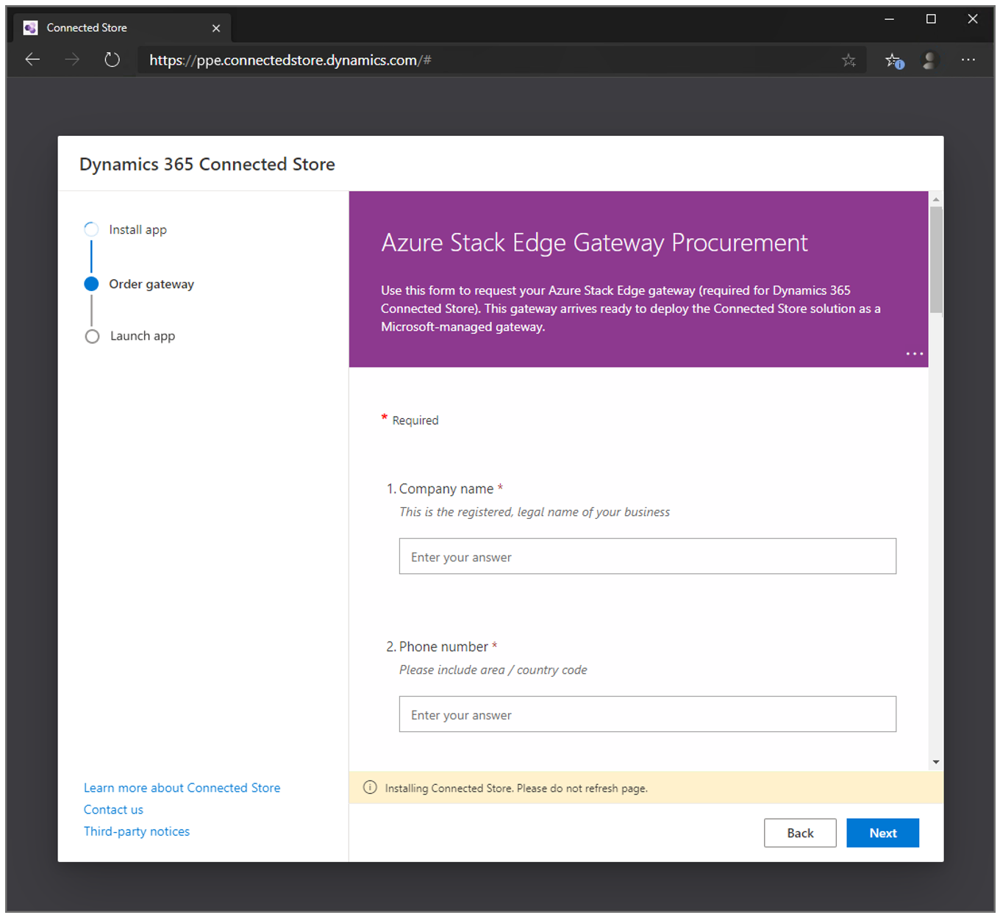

# Order the Azure Stack Edge gateway to use with Dynamics 365 Connected Store (public preview)

This procedure describes step 3 of the setup process for Microsoft Dynamics 365 Connected Store (public preview). Before completing this procedure, make sure to:

1. [Create a new Azure Active Directory tenant for the public preview](admin-create-new-tenant.md)

2. [Install Dynamics 365 Connected Store](admin-install-web-app.md)

## Order Azure Stack Edge

Connected Store transforms video streams from cameras in your retail stores into data that depicts aggregated traffic patterns in your store. Connected Store uses Azure 
Stack Edge to make this happen. Use this procedure to request an Azure Stack Edge gateway.

> [!IMPORTANT]
> The Azure Stack Edge hardware that you order for Connected Store (public preview) can only be used for Connected Store (public preview). You can't deploy any other resources to Azure Stack Edge during the public preview of Connected Store. 

1. In the [Connected Store Setup page](https://go.microsoft.com/fwlink/?linkid=2128110), select **Get gateway**.

2. Fill out the form. 

     
     
   The Connected Store team will contact you when the request is received.
 
## Next step

[Prepare user accounts](admin-prepare-user-accounts.md)
