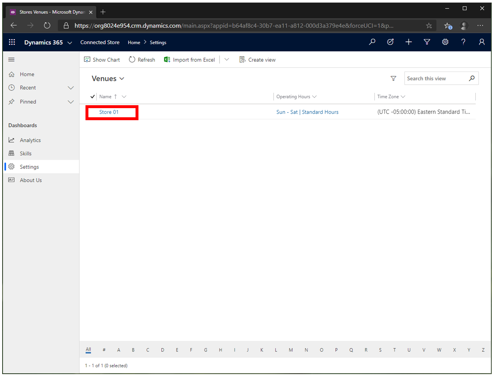
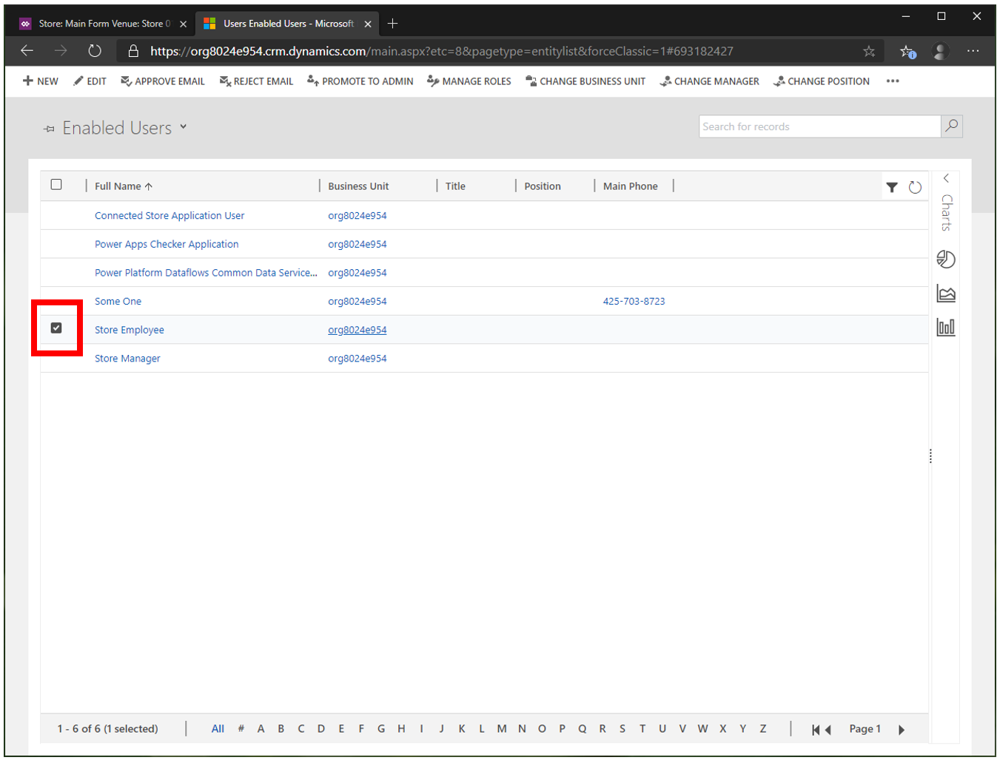
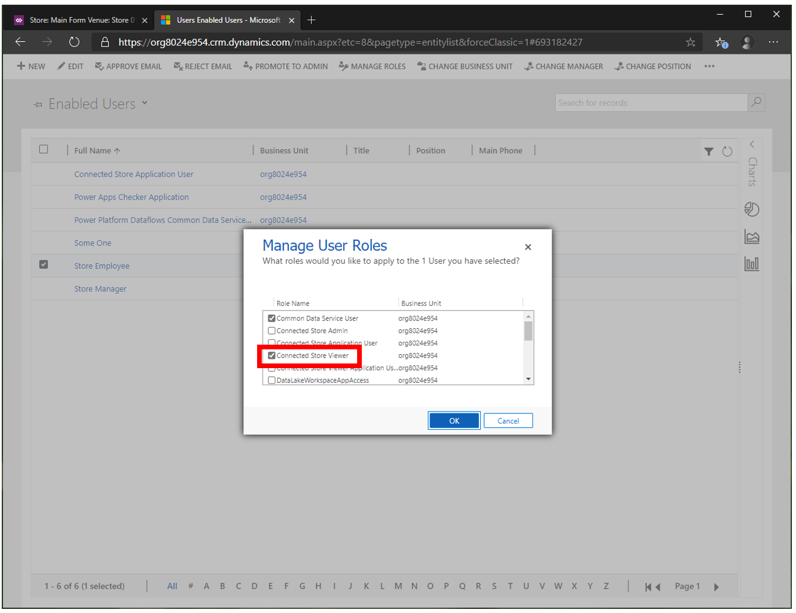

# Give users permissions to use Dynamics 365 Connected Store (public preview)

As an Azure Active Directory global admin, you can assign security roles to user accounts to enable users to do different tasks in Microsoft Dynamics 365 Connected Store (public preview).

## Connected Store security roles

To give users permissions to use Connected Store, you must first assign either the **Connected Store Viewer** or **Connected Store Admin** role to any user accounts. 

> [!NOTE]
> The **Connected Store Admin** role is a superset of the **Connected Store Viewer** role.

The following table describes the privileges that each role grants.

|Role|	Description|
|--------------------------------|----------------------------------------------------------------------------------------------|
|**Connected Store Viewer**|	Use the Connected Store web app to:  - View the analytics dashboard, which provides insights on Shopper analytics, Display effectiveness, and Queue management camera skill zones - View the health status of gateway devices  - View store settings, such as operating hours, time zone, and address 
|**Connected Store Admin**|	Use the Connected Store mobile app to:  - Create stores and edit store information - Pair gateways and edit gateway information - Connect cameras to a gateway and edit camera information - Create and modify camera skill zones  Use the Connected Store web app to:  - View the analytics dashboard, which provides insights on Shopper analytics, Display effectiveness, and Queue management camera skill zones - View the health status of gateway devices - View and modify store settings, such as operating hours, time zone, and address|

## Assign a Connected Store security role to a user account

1. In the Connected Store web app, select **Settings**, and then select a store from the list.

     

    > [!NOTE]
    > If no store is available in the list, use the mobile app to create a store first.
    
2. Switch to the **Users** tab, and then select **Assign security roles**.

    
    
3. Select the check box next to the appropriate user account.

    
    
4. Select **MANAGE ROLES**. 

   

5. Select the **Connected Store Admin** or **Connected Store Viewer** security role, and then select **OK**. 

   

[Learn more about creating users and assigning security roles](https://go.microsoft.com/fwlink/?linkid=2128632) for Dynamics 365 applications.

## Next step

[Start planning camera placement](camera-placement-checklist.md)

