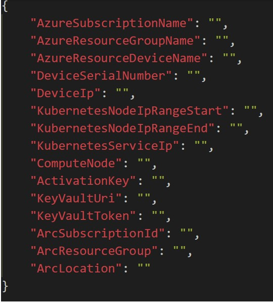
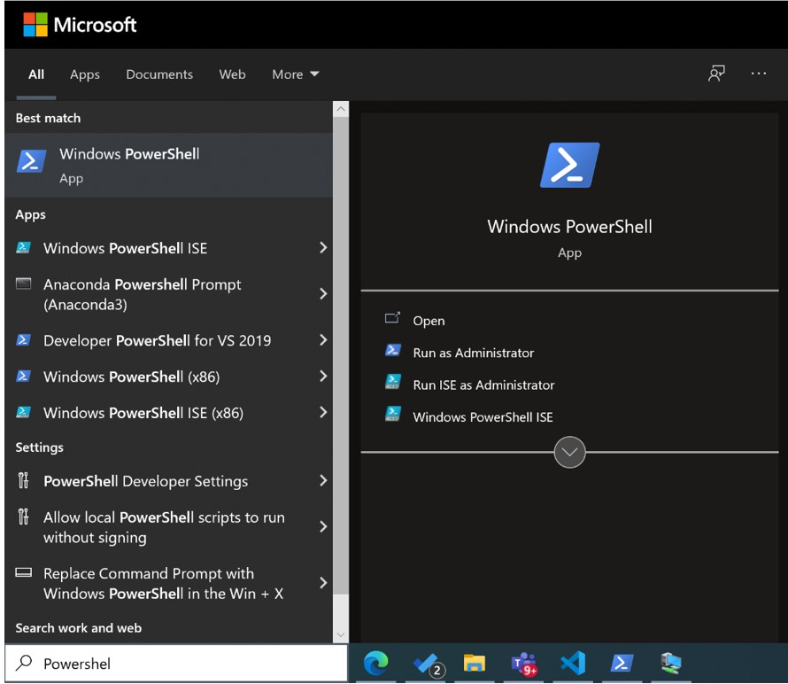

# Connect Azure Stack Edge Pro (2 GPU) to your network for use with Dynamics 365 Connected Spaces Preview

[!INCLUDE[banner](includes/banner.md)]

After you've [installed Azure Stack Edge Pro (2 GPU)](ase-install.md), you're ready to connect it to your network and configure the network for use with Microsoft Dynamics 365 Connected Spaces Preview. If you're working with a system integrator to install the hardware and set up the network, you might want to contact them for support with this step. 

## Initial setup

1. Follow [the Windows Remote Management instructions](/windows/win32/winrm/installation-and-configuration-for-windows-remote-management#quick-default-configuration) to install Windows Remote Management in your environment.

2. Contact the Connected Spaces team to get the customized deployment scripts and executables. 

    One of the files you'll receive from the Connected Spaces team is the device_settings.json file.

    

3. Update the device_settings.json file with the values from the following table. 
 
    |Field|Value|
    |------------------------------------------|-----------------------------------------------------------------------------------|
    |AzureSubscriptionName|The Azure subscription name you created the resource group in|
    |AzureResourceGroupName|The Azure resource group name you created the Azure Stack Edge resource in|
    |AzureResourceDeviceName|The name of the Azure Stack Edge resource you created|
    |DeviceSerialNumber|The serial number on the side of the physical device or the LocalUI of the device|
    |DeviceIp|The IP address that your device is set to|
    |KubernetesNodeIpRangeStart|The first of two sequential free IP addresses on your network|
    |KubernetesNodeIpRangeEnd|The last of two sequential free IP addresses on your network|
    |KubernetesServiceIp|Another free IP address on your network|
    |ComputeNode|The number of compute nodes on your device; "2" is the default value.|
    |ActivationKey|The key that was generated using the Azure resource|

4. After filling in the field values, open a Powershell window as an administrator. 

    > [!NOTE]
    > You must have administrator privileges on your computer to open PowerShell. 

     

5. Use the following command to change your directory to the customer folder containing the files that you requested in step 2.

     

6. Run the following command to kick off the script to configure and activate your device:

    ./ase_up_customer.ps1

7. When prompted to enter a password, enter the password that was used to set up the Azure Stack Edge device initially. 

8. When prompted to sign in to Azure, use the same credentials you used to create the resources in your subscription.

    You'll know that the script is complete when the PowerShell window accepts input again. The last message you'll see from the script is: "Arc setup starting..."

9. After the script has completed, contact Microsoft to take over for the final steps to set up your environment. 

## Next step

[Install your cameras](install-cameras.md)