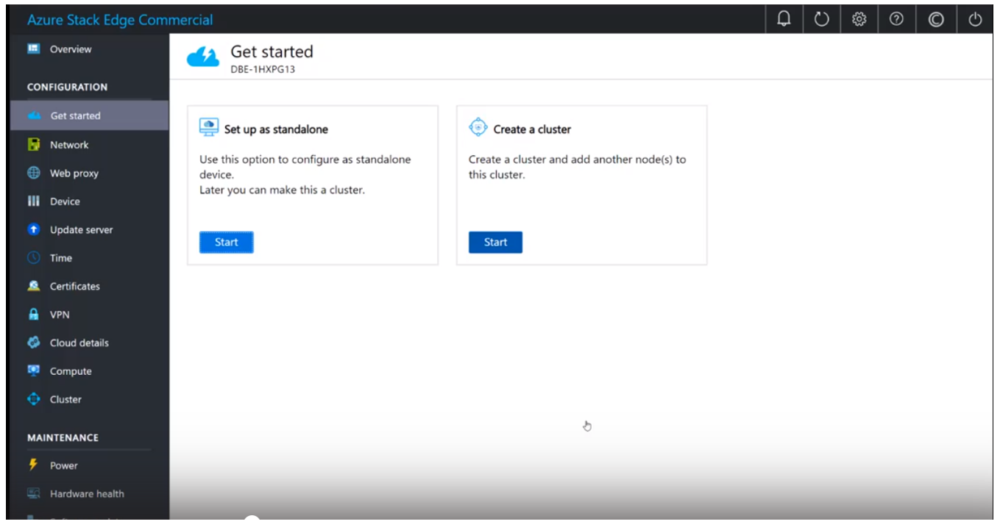
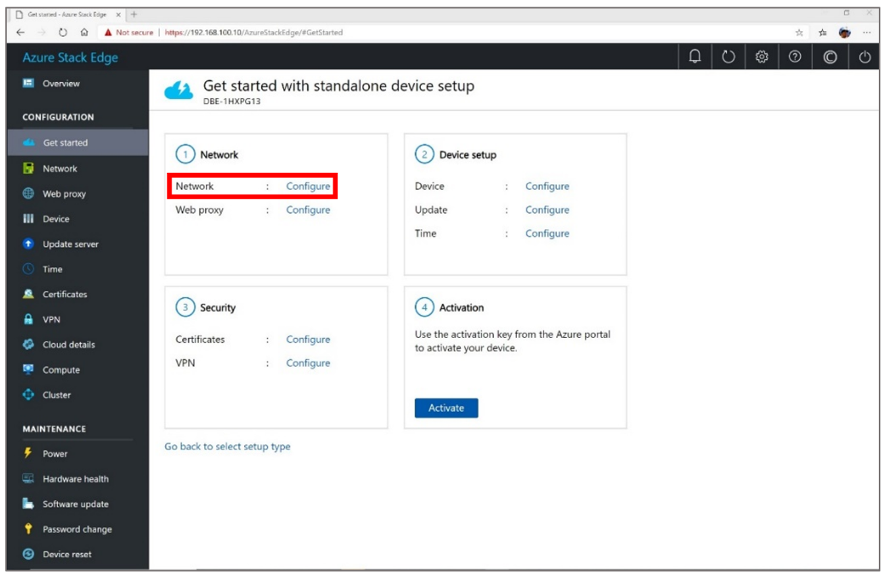
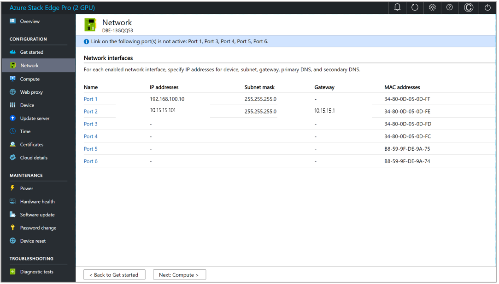
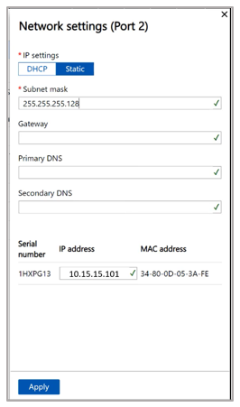
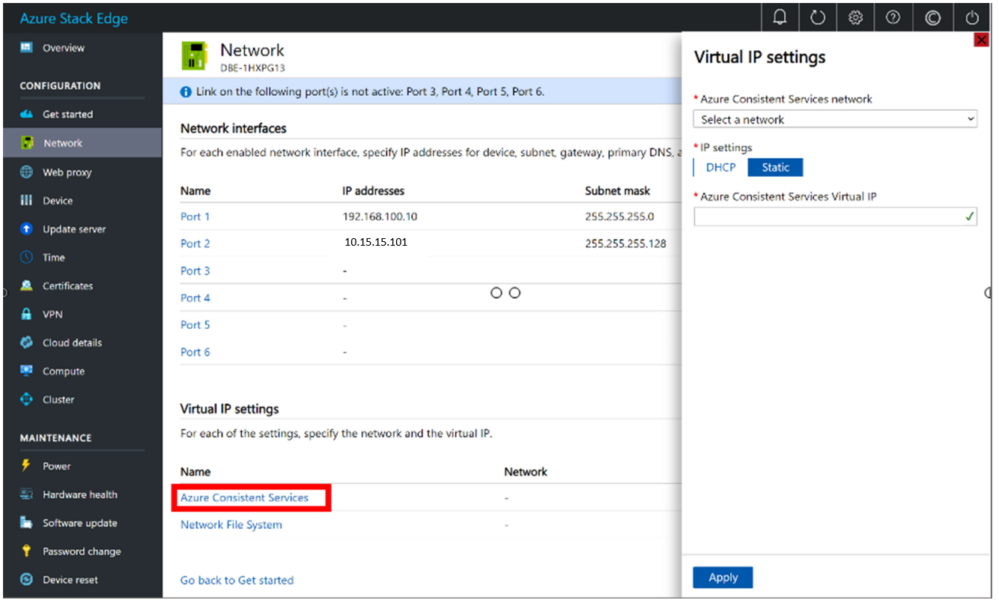
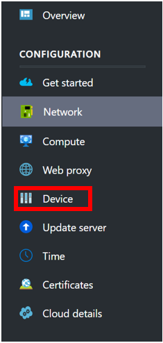
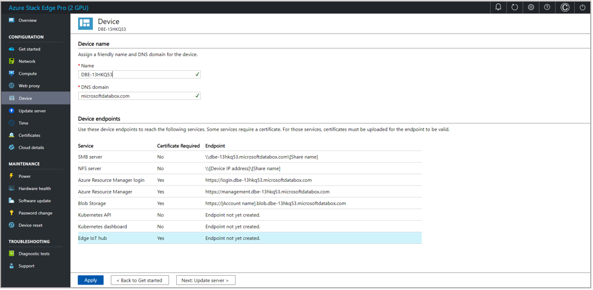
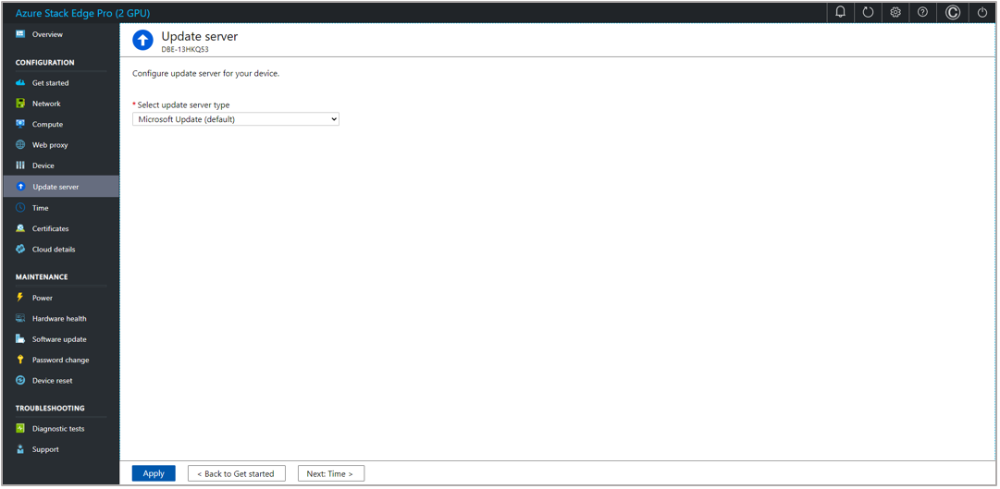

# Connect Azure Stack Edge to your network for use with Dynamics 365 Connected Store (public preview)

After you've [installed Azure Stack Edge](ase-install.md), you're ready to connect it to your network and configure the network for use with Microsoft Dynamics 365 Connected Store (public preview). If you’re working with a system integrator to install the hardware and set up the network, you may want to contact them for support with this step. 

## Connect Azure Stack Edge and configure the network

1. Use your laptop and the following documentation to connect Azure Stack Edge and configure the network: https://docs.microsoft.com/azure/databox-online/azure-stack-edge-deploy-connect-setup-activate

   After signing in to Azure Stack Edge, you’ll see the **Get started** screen.
    
   
 
2. Under **Set up as standalone**, select **Start**. 

3. In the **Get started with standalone device setup** screen, select **Configure** next to **Network**.

   
 
4. In the **Network** screen:

   a. Select the port that you connected your network to when you [installed Azure Stack Edge](ase-install.md) (Port 2 if you have an RJ45 cable or Port 3 if you have an SFP cable).
    
   
 
   b. In the **Network settings** pane on the right side of the screen, select the **Static** tab, and then enter the IP addresses for **Subnet mask**, **Gateway**, **Primary DNS**, and **Secondary DNS**. Select **Apply** when you’re done.

   
 
   > [!NOTE]
   > This is the information you recorded when you [installed Azure Stack Edge](ase-install.md). 
    
   c. In the **Network** screen, under **Virtual IP settings**, select **Azure Consistent Services**.

   
 
5. In the **Virtual IP settings** pane, in the **Azure Consistent Services network** field, select the network (same as the static port configured earlier), select the **Static** tab, enter the IP address in the **Azure Consistent Services Virtual IP** field, and then select **Apply**.

6. In the left pane, select **Device**.

   
 
7. In the **Device** screen, select the **Apply settings** button. You don’t need to make any changes in the **Device** screen, but you must select **Apply settings**. Otherwise, the activation won’t work.

   
 
   > [!NOTE]
   > At this time, you can’t change the device name. 

8. In the left pane, select **Update server**.

9. In the **Update server** screen, select **Apply** (you don’t need to make any changes in this screen).

   
 
10. In the left pane, select **Time**.

11. In the **Time** screen, select the correct time zone, and then select **Apply**. 

12. Open the Connected Store mobile application, and then do the following:

    a. [Create a store](mobile-app-create-store.md).
    
    b. [Pair a gateway](mobile-app-pair-gateway.md).
    
    c. [Connect cameras to the gateway](mobile-app-add-cameras.md).
    
    d. [Add camera skill zones](mobile-app-add-camera-skill-zones.md).
    
## What's next?

[Create a store using the Dynamics 365 Connected Store mobile app](mobile-app-create-store.md)
