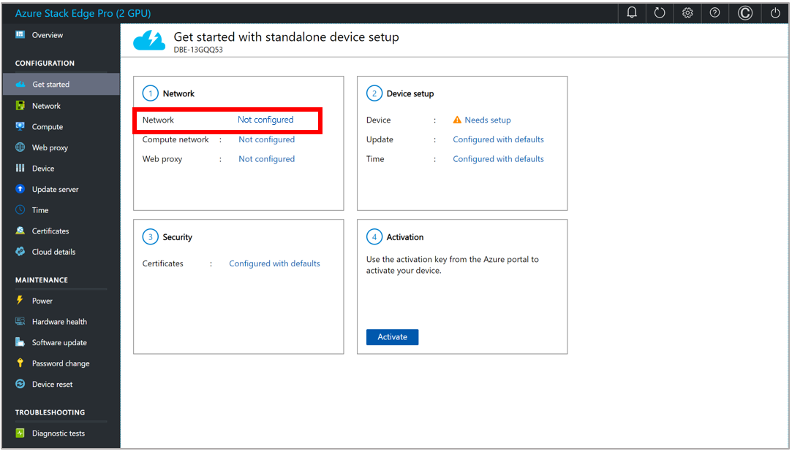

# Connect Azure Stack Edge Pro (2 GPU) to your network for use with Dynamics 365 Connected Spaces Preview

[!INCLUDE[banner](includes/banner.md)]

After you've [installed Azure Stack Edge Pro (2 GPU)](ase-install.md), you're ready to connect it to your network and configure the network for use with Microsoft Dynamics 365 Connected Spaces Preview. If you're working with a system integrator to install the hardware and set up the network, you may want to contact them for support with this step. 

## Initial setups and checks

1. Follow [the Windows Remote Management instructions](https://docs.microsoft.com/windows/win32/winrm/installation-and-configuration-for-windows-remote-management#quick-default-configuration) to install Windows Remote Management in your environment.

2. Pull the following files from this storage account (will need to update as the account hasn’t been created yet):

    ase_up_customer.ps1 
    ase_up_customer_utility.ps1 
    device_settings.json

3. Fill in the values in the device_settings.json file.

     
 
    |Field|Value|
    |------------------------------------------|-----------------------------------------------------------------------------------|
    |AzureSubscriptionName|The Azure subscription name you created the Resource Group in|
    |AzureResourceGroupName|The Azure Resource Group Name you created the Asure Stack Edge Resource in|
    |AzureResourceDeviceName|The name of the Azure Stack Edge resource you created|
    |DeviceSerialNumber|The serial number on the side of the phsyical device or the LocalUI of the device|
    |DeviceIp|The IP address that your device is set to|
    |KubernetesNodeIpRangeStart|The first of two sequential free IP addresses on your network|
    |KubernetesNodeIpRangeEnd|The Last of two sequential free IP addresses on your network|
    |KubernetesServiceIp|Another free IP address on your network|
    |ComputeNode|The number of compute nodes on your device; "2" is a solid base value|
    |ActivationKey|	The key that was generated using the Azure resource|

4. With the fields set open a Powershell window as an Administrator. 
5. Change your directory to the Customer folder containing all the scripts using this command:
cd "<File Path to folder>"
6. Run the script you downloaded earlier: ase_up_customer.ps1
7. You will be prompted to enter a password, this is the password that was used when setting up the Azure Stack Edge Device initially. 
8. You will also be prompted to log in to azure, use the same login you used to create the resources in your subscription.
9. Once the script completes Microsoft will take over for the final piece before you are ready for use.

## Connect Azure Stack Edge and configure the network

1. Use your laptop and the following documentation to connect Azure Stack Edge Pro and configure the network: https://docs.microsoft.com/azure/databox-online/azure-stack-edge-deploy-connect-setup-activate

    After signing in to Azure Stack Edge Pro, next to **Network**, select **Not configured** to start the configuration process.

    

2. In the **Network** screen:

    1. Select the port that you connected your network to when you [installed Azure Stack Edge](ase-install.md) (Port 2 if you have an RJ45 cable or Port 3 if you have an SFP cable).

        

    2. In the **Network settings** pane on the right of the screen, **DHCP** should be selected by default. If Dynamic Host Configuration Protocol (DHCP) is enabled in your environment, network interfaces are automatically configured. These interfaces include an Internet Protocol (IP) address, subnet, gateway, and Domain Name Service (DNS).

        If DHCP isn't enabled in your environment, you can assign static IP addresses as required. On the **Static** tab, enter the IP addresses in the **Subnet mask**, **Gateway**, **Primary DNS**, and **Secondary DNS** fields. When you've finished, select **Apply**. [See the Azure Stack Edge Pro GPU setup documentation to learn more](/azure/databox-online/azure-stack-edge-gpu-deploy-configure-network-compute-web-proxy#configure-network).

        

        > [!NOTE]
        > This is the information you recorded when you [installed Azure Stack Edge Pro](ase-install.md).

3. In the left pane, select **Compute**.

    

    In the **Compute** screen:

    1. Select the port that you want to open to the Compute networks. This port will probably be Port 2, which is the outward-facing IP address for the device.

        

    2. On the right side of the screen, under **Enabled for compute**, select **Yes**.

    3. In the **Network settings (Port 2)** screen, in the **Kubernetes node IPs** field, assign static IP addresses for the compute virtual machine (VM) on the device. For a one-node device, provide a contiguous range of at least two contiguous IPV4 addresses.

         screen")

        > [!NOTE]
        > Make sure that the IP addresses are available. If the compute VMs must compete for an IP address, you will receive an error because of the inconsistent connection.

    4. In the **Kubernetes external service IPs** field, assign the external service IP addresses. These contiguous IP addresses are for services that you want to expose outside the Kubernetes cluster. Specify the static IP range, depending on the number of services that are exposed. At a minimum, you must allocate at least one external IP address to configure the Connected Spaces service. In the screenshot example above, one IP address is allocated. 

    5. Select **Apply**.

4. In the left pane, select **Web proxy**. By default, the **Web proxy** tab is set to **Disable**. If you require a proxy address to establish a consistent connection between Azure resources and the device:

    1. Switch the tab to **Enable**.

        

    2. In the **Web proxy URL** field, enter a URL.

    3. Optional: Include an authentication address to handle secure proxy communications.

    > [!NOTE]
    > If you plan to use a web proxy, contact the Connected Spaces team so that we can prepare your deployment.

5. In the left pane, select **Device**, and then select **Apply**. You don't have to make any changes in the **Device** screen, but you must select **Apply**. Otherwise, the activation won't work.

    

    > [!NOTE]
    > At this time, you can't change the device name.

6. In the left pane, select **Update server**, and then select **Apply**. (You don't have to make any changes in this screen.)

    

7. In the left pane, select **Time**, select the correct time zone, and then select **Apply**.

    

## Next step

[Install your cameras](install-cameras.md)
