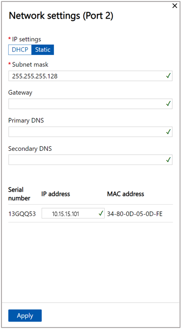

# Connect Azure Stack Edge Pro (2 GPU) to your network for use with Dynamics 365 Connected Store Preview

After you've [installed Azure Stack Edge Pro (2 GPU)](ase-install.md), you're ready to connect it to your network and configure the network for use with Microsoft Dynamics 365 Connected Store Preview. If you’re working with a system integrator to install the hardware and set up the network, you may want to contact them for support with this step. 

## Connect Azure Stack Edge and configure the network

1. Use your laptop and the following documentation to connect Azure Stack Edge Pro and configure the network: https://docs.microsoft.com/azure/databox-online/azure-stack-edge-deploy-connect-setup-activate

    After signing in to Azure Stack Edge Pro, next to **Network**, select **Not configured** to start the configuration process.
    
   
 
2. In the **Network** screen:

   a. Select the port that you connected your network to when you [installed Azure Stack Edge](ase-install.md) (Port 2 if you have an RJ45 cable or Port 3 if you have an SFP cable).
    
   
 
   b. In the **Network settings** pane on the right side of the screen, [**DHCP**](https://en.wikipedia.org/wiki/Dynamic_Host_Configuration_Protocol) should be selected by default. If DHCP is enabled in your environment, network interfaces are automatically configured, including an IP address, subnet, gateway, and DNS. 
   
   If DHCP isn't enabled in your environment, you can assign static IPs if needed. To do this, select the **Static** tab, and then enter the IP addresses for **Subnet mask**, **Gateway**, **Primary DNS**, and **Secondary DNS**. Select **Apply** when you’re done. [See the Azure Stack Edge Pro GPU setup documentation to learn more](https://docs.microsoft.com/azure/databox-online/azure-stack-edge-gpu-deploy-configure-network-compute-web-proxy#configure-network).

   
 
   > [!NOTE]
   > This is the information you recorded when you [installed Azure Stack Edge Pro](ase-install.md). 
   
3. In the left pane, select **Compute**.

    
    
    In the **Compute** screen:
    
    a. Select the port you want to open to the Compute networks. This will likely be Port 2 which is the outward-facing IP address for the device.  
    
    

    b. On the right side of the screen, under **Enabled for compute**, select **Yes**.    
    
    c. In the **Network settings (Port 2)** screen, in the **Kubernetes node IPs** field, assign static IP addresses for the compute virtual machine (VM) on the device. For a 4-node device, provide a contiguous range of a minimum of five IPV4 addresses (or more) for the compute VM using the starting and ending IP addresses. For a 1-node device, provide a minimum of two contiguous IPV4 addresses. 
    
    
    
    > [!NOTE]
    > Make sure that the IP addresses are available. If the compute VMs have to compete for an IP address, you'll get an error due to the inconsistent connection.
    
    d. In the **Kubernetes external service IPs** field, assign the external services IPs. These contiguous IP addresses are for services that you want to expose outside of the Kubernetes cluster. Specify the static IP range depending on the number of services exposed. 
    
    c. Select **Apply**.      
    
4. In the left pane, select **Web proxy**. The **Web proxy** tab is set to **Disable** by default. If you need a proxy address to establish a consistent connection between Azure resources and the device:
    
    a. Switch the tab to **Enable**.
    
    
    
    b. In the **Web proxy URL** field, enter a URL.
    
    c. Optional: Include an authentication address to handle secure proxy communications.     
    
    > [!NOTE]
    > Get in touch with the Connected Store team if you plan to use a web proxy so we can prepare your deployment. 
     
5. In the left pane, select **Device**, and then select the **Apply** button. You don’t need to make any changes in the **Device** screen, but you must select **Apply**. Otherwise, the activation won’t work.

   
 
   > [!NOTE]
   > At this time, you can’t change the device name. 

6. In the left pane, select **Update server**, and then select **Apply** (you don’t need to make any changes in this screen).

   
 
7. In the left pane, select **Time**, select the correct time zone, and then select **Apply**. 

    
   
## Next step

[Install your cameras](install-cameras.md)
