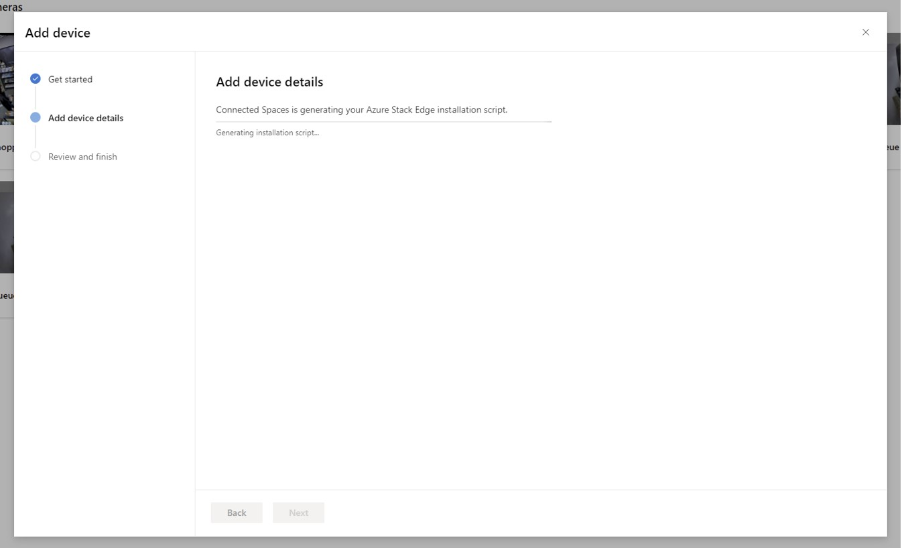

# Activate Azure Stack Edge Pro (2 GPU) for use with Dynamics 365 Connected Spaces Preview

[!INCLUDE[banner](includes/banner.md)]

After you've [installed Azure Stack Edge Pro (2 GPU)](ase-install.md), you're ready to activate it for use with Microsoft Dynamics 365 Connected Spaces Preview. If you're working with a system integrator to install the hardware and set up the network, you might want to contact them for support with this step. 

> [!NOTE]
> Contact your Connected Spaces Preview Implementation Partner to add your Azure subscription ID to the Preview list.

## Create a service principal

1. Follow [the Windows Remote Management instructions](/windows/win32/winrm/installation-and-configuration-for-windows-remote-management#quick-default-configuration) to verify that Windows Remote Management is installed and configured correctly on the laptop or desktop device you'll use during activation. 

2. Create a [service principal](https://docs.microsoft.com/azure/active-directory/develop/app-objects-and-service-principals#service-principal-object) in Azure Active Directory to use with Connected Spaces Preview. To do this:

    1. In the Azure Portal, select **Azure Active Directory**.

        
        
    2. Select **App registrations** on the left side of the screen, and then select **New registration**. 

        
        
    3. In the **Register an application** screen, enter a name for the application in the **Name** field, and then under **Supported account types**, select the **Accounts in this organizational directory only (Microsoft only - Single tenant)** option. 

        
        
    4. Go to the enterprise application that's created by the application registration. The link for the application is on the **Overview** tab in the **Managed application** field. 

        
        
    5. Copy the Application ID and the Object ID of the newly created service principal. You'll use these IDs when you add the gateway device (see below).

        

        > [!TIP]
        > You can reuse the same service principal for multiple Azure Stack Edge devices. 

## Add a gateway device

1. In the Connected Spaces Preview web app, select the **Devices** tab, and then select **Add gateway**. 

   

2. In the first screen of the **Add device** wizard, select **Next**.

    

3. In the **Add device details** screen, use the information in the following table to fill in the fields. 
 
    |Field|Description|
    |------------------------------------------|-----------------------------------------------------------------------------------|
    |Azure Tenant ID|The ID of the Azure Active Directory/tenant for the Azure Account being used.|  
    |Subscription ID|The ID of the Azure subscription which will be used for the Azure Stack Edge device and related resources.| 
    |Resource Group Name|The name of the resource group in the provided subscription to install the managed application. Connected Spaces Preview uses [Azure managed applications](https://docs.microsoft.com/azure/azure-resource-manager/managed-applications/overview) to simplify the management of Azure resources needed for running the Connected Spaces Preview application. This resource group might already exist. If it doesn't exist, it will be created in the provided subscription.| 
    |Device IP|The local management IP address of the Azure Stack Edge device (for example: 192.168.1.100).| 
    |Device Serial Number|The serial number for the device (listed on the side of the physical device) or the local UI on the device (accessible by using the IP address for the device).| 
    |Compute Node|The device interface number to install the compute node to, which should match the port number used to connect to the network (for example: 2).|
    |Kubernetes Node IP Range Start|The first IP address of two contiguous open IP addresses on the same network as the Azure Stack Edge device.| 
    |Kubernetes Node IP Range End|The second and last IP address of two contiguous open IP addresses on the same network as the Azure Stack Edge device.| 
    |Kubernetes Service IP|A single open IP address on the same network as the Azure Stack Edge device. Ideally, this IP address is next to the previous Node IP values, to use for service endpoints. | 
    |Location|The location to create resources in (for example: eastus).| 
    |Service Principal Application ID|Application ID of the enterprise app from the [service principal step](#create-a-service-principal).| 
    |Service Principal Object ID|Object ID of the enterprise app from the [service principal step](#create-a-service-principal).| 

    When you've finished filling in the fields, select **Next**.

    

4. If all the conditions for the values are met, you'll see a message that says "Connected Spaces is generating your Azure Stack Edge installation script." This script is specific for the network and device.

   

5.  After the script is generated, you'll see a message that says "Azure Stack Edge script generated." Select **Download script** to download the script and store it on a device (for example, a laptop or desktop) that has access to the Azure Stack Edge device. Access can be through remote access (on the same network as the device) or through a physical connection using an ethernet cable to the Azure Stack Edge device. 

    

    The Azure Stack Edge activation script is named **AzureGatewayActivationScript.ps1**.

    

6. Open a ‘Powershell Terminal’ as an administrator, go to the location where the file is saved, and then run the script. You’ll be prompted to sign in a few times. Sign in as the admin user that set up the Azure subscription.  

    The script does the following: 

    - Adds required permissions to the provided service principal. 

    - Creates a managed application in the provided subscription, which will be used in conjunction with the Connected Spaces Preview application. 

    - Activates the Azure Stack Edge device and prepares it to run the Connected Spaces Preview workload.

When the script has finished running, you'll see a message indicating that the activation of the Azure Stack Edge device is complete. Contact your Connected Spaces Implementation Partner for further information on adding the activated Azure Stack Edge device to the preview list. 

## Next step

[Install your cameras](install-cameras.md)
