# Camera placement recommendations for Dynamics 365 Connected Store (public preview)

This article provides camera placement recommendations for Microsoft Dynamics 365 Connected Store (public preview). It includes general guidelines as well as specific recommendations for height, angle, and camera-to-focal-point-distance to enable the [scenarios and insight goals]().

## General guidelines

Consider the following general guidelines when positioning cameras for Connected Store:

- **Lighting height.** Place cameras below lighting fixtures so the fixtures don’t block the cameras.

- **Obstructions.** To avoid obstructing camera views, take note of obstructions such as poles, signage, shelving, walls, and existing 
LP cameras.

- **Environmental backlighting.** Outdoor backlighting affects camera image quality. To avoid severe backlighting conditions, 
avoid directing cameras at external-facing windows and glass doors.

- **Local privacy rules and regulations.** Local regulations may restrict what cameras capture outside store boundaries 
(through windows or doors). Make sure that you understand local rules and regulations before placing cameras that have a view of 
the outside.

- **Store changes.** Product displays and end caps may get moved after placing cameras. Make sure that camera placement is 
optimized for potential store changes to reduce camera re-positioning.

- **Building structure.** HVAC, sprinklers, and existing wiring may limit hard mounting of cameras.

- **Cable management.** Make sure you can route ethernet cable from planned camera mounting locations to the Power Over Internet 
(PoE) switch.

## Height, focal-point distance, and angle

You need to consider three things when deciding how to install a camera for Dynamics 365 Connected Store:

- Camera height

- Camera-to-focal-point distance 

- The angle of the camera relative to the floor plane

It's also important to know the direction that the majority of people walk (person walking direction) in relation to the camera field of view, or the direction that customers face when standing in line. This direction is important for system performance. 

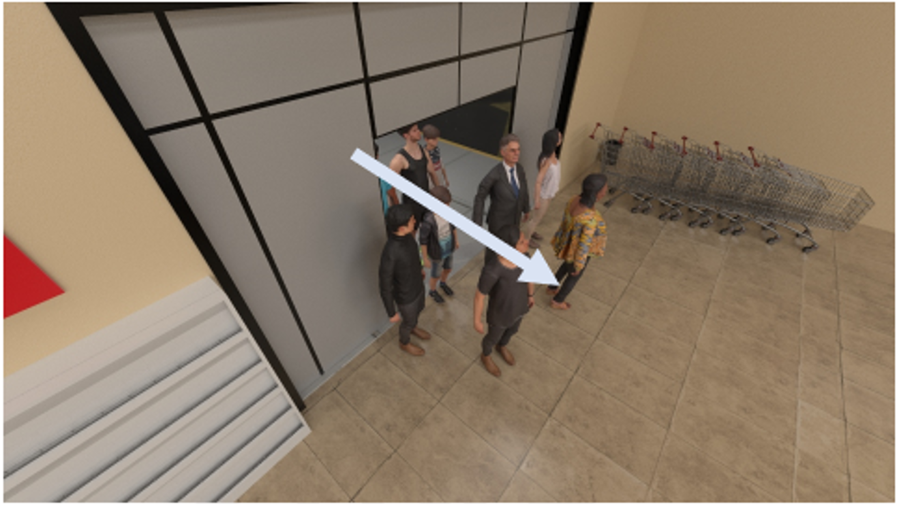

The following illustration shows the elevation view for person walking direction.

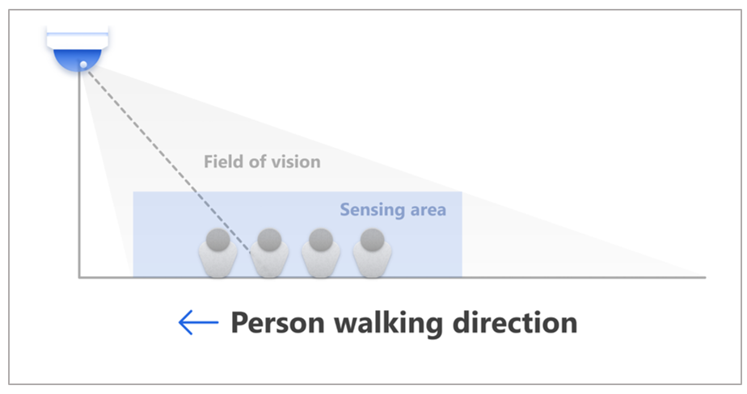

## Camera height

Generally, cameras should be mounted 12-14 feet from the ground. When planning your camera mounting in this range, 
consider obstructions (for example, shelving, hanging lights, hanging signage, and displays) that might affect the 
camera view, and then adjust the height as necessary. 

## Camera-to-focal-point distance

*Camera-to-focal-point distance* is the linear distance from the focal point (or center focal point of the point of interest) to the 
camera. 

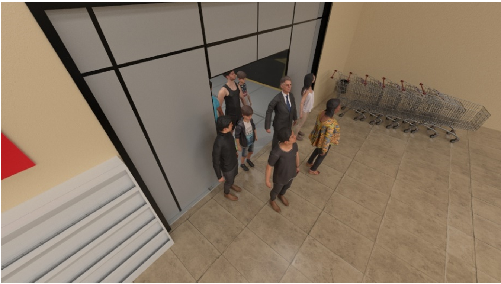

This distance is measured on the floor plane.

From above, it looks like this:

Use the table below to determine the camera’s distance from the focal point based on specific mounting heights. 
These distances are for optimal placement and are suitable for end caps (display effectiveness), queues, or entrances. 
Note that the table provides guidance below the 12-14’ recommendation since some store ceilings are limited in height.

|Camera height|Camera-to-focal-point distance (min/max)|
|-------------|-----------------------------------------|
|8’	|10’-13’|
|10’|7’-13’|
|12’|10’-17’|
|14’|11’-18’|
|16’|12’-22’|
|20’|15’-30’|

The following illustration simulates camera views from the closest and farthest camera-to-focal-point distances.

|Closest| Farthest |
|--------------------------------------------------------|----------------------------------------------------|
|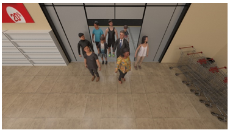|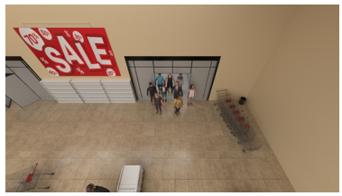|

## Camera angle mounting ranges

This section describes acceptable camera angle mounting ranges for store entrances, queues, and end caps. These mounting ranges show 
the acceptable range from optimal placement.

### Store entrances

The following table shows recommendations for store entrances.

|Camera height|Camera-to-focal-point distance|Acceptable camera mounting angle (min/max)|
|--------------|-----------------------------|-----------------------------------------------------------------|
|8’ |9’| +/-40°|
|10’|10’|+/-30°|
|12’|13’|+/-20°|
|16’|18’|+/-10°|
|20’|22’|+/-10°|

The following illustration simulates camera views using the leftmost (-) and rightmost (+) mounting angle recommendations.

|Leftmost view|Rightmost view|
|----------------------------------------------------------|-----------------------------------------------------|
|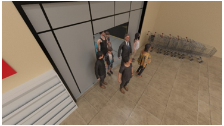|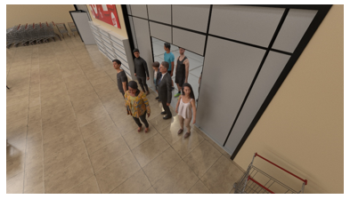|

The following illustration shows camera placement and mounting angles from a birds-eye view.

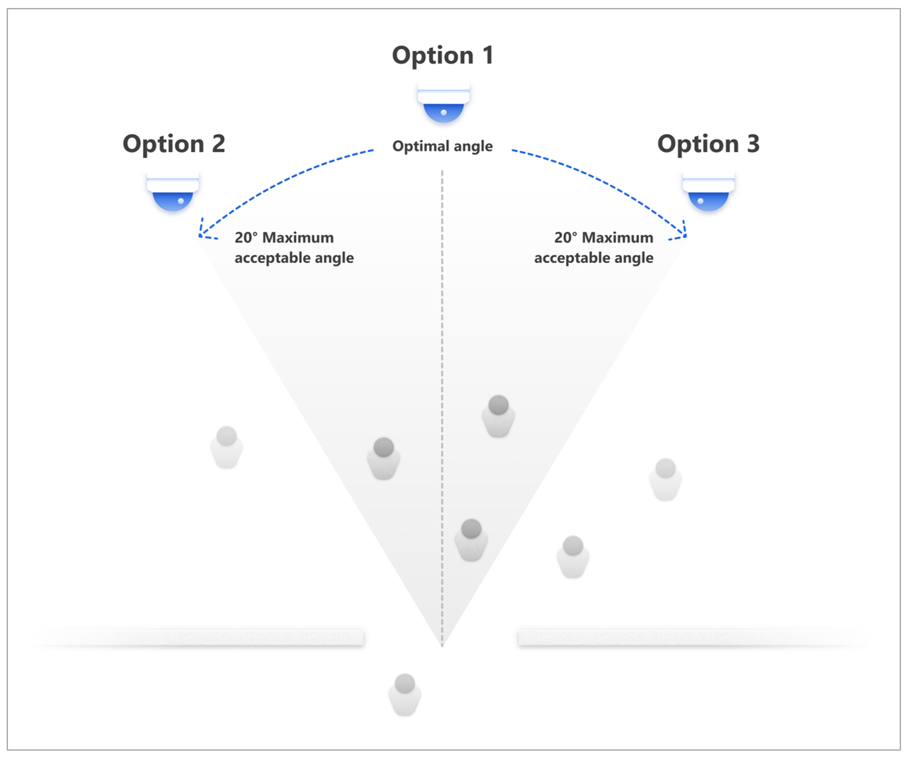
 
### End caps

We recommend that you place cameras at 10 feet or more above ground to guarantee the covered area is big enough. Mount end-cap 
cameras in the specified distance from the target within the acceptable 120-degree angle range as shown in the following illustration.

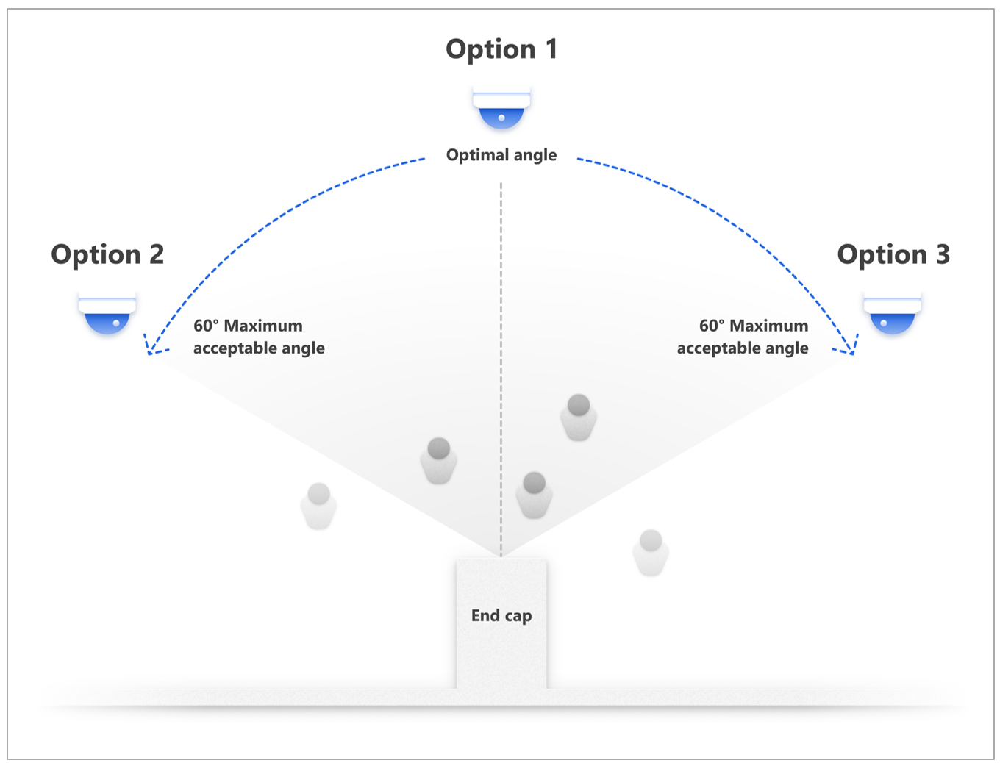

The following illustration provides simulations for left and right camera views for end caps.

|Left view|Right view|
|----------------------------------------------------------|-----------------------------------------------------|
|||

### Queues

For optimal queue data quality, retractable belt barriers are preferred. 

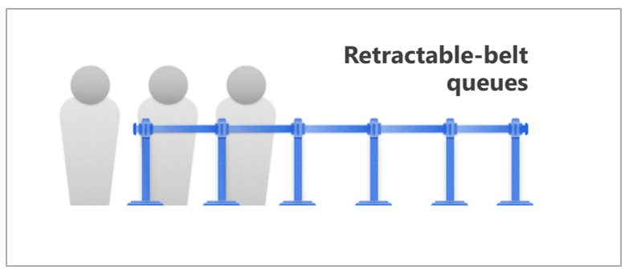

This type of barrier is preferred over opaque barriers for queue formation.

#### Zig-zag and linear queues

There are two types of queues: linear and zig-zag.

The following illustration shows recommendations for linear queues:

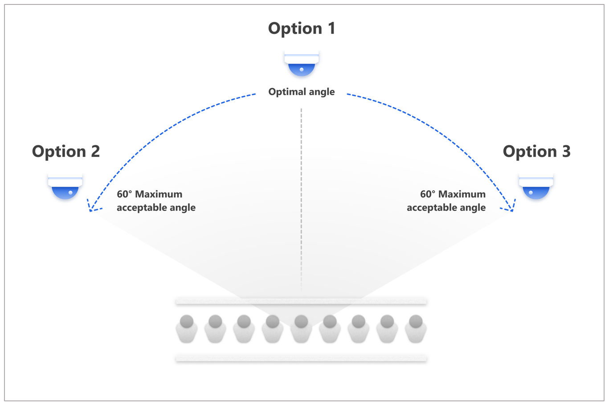
 
The following illustration provides simulations for left and right camera views for linear queues. Note that you can mount the camera 
on the opposite side of the queue. 

|Left view|Right view|
|----------------------------------------------------------|-----------------------------------------------------|
|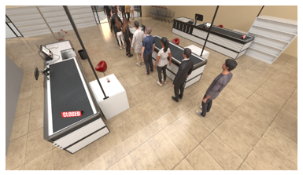|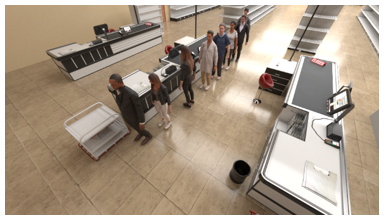| 

For zip-zag queues, it’s best to avoid placing the camera directly facing the queue line direction, as shown in the 
following illustration. Note that each of the four example camera positions in the illustration provide the ideal view with an 
acceptable deviation of +/- 15 degrees in each direction.

The following illustrations simulate the view from a camera placed in the ideal locations for a zig-zag queue.

|View 1|View 2|
|----------------------------------------------------------|-----------------------------------------------------|
|||

|View 3|View 4|
|----------------------------------------------------------|-----------------------------------------------------|
|||
  
#### Fixture (shelving) queues

Fixture queue lines use shelving to guide shoppers and to enable impulse buying. 

This style of queue formation restricts the camera’s view of customers because it blocks customers from the waist down. 
To ensure the highest quality data, mount the cameras to avoid the shelving as much as possible and capture a complete view of 
customers.

#### Organic queues

Organic queue lines form organically from the point of sale. This style of queue is acceptable if customer queues don’t form 
beyond 2-3 people and the line forms within the zone definition. If the queue length is typically more than 2-3 people, we recommend 
using a retractable belt barrier to help guide the queue direction and ensure the line forms and dwells within the zone definition.

## Placement of in-store cameras and video storage

Images in this guide are intended to represent a potential placement of a customer’s in-store camera(s) by the customer. Once a customer’s cameras are in place, Dynamics 365 Connected Store will gather and analyze observational signals, location and line of business data to produce actionable insights. Microsoft does not control or recommend particular placement of in-store cameras and Microsoft Dynamics 365 Connected Store does not store video footage from the customer’s in-store cameras. 

## Next step

After you receive your Azure Stack Edge device, you can [prepare your network and install it](ase-install.md).
