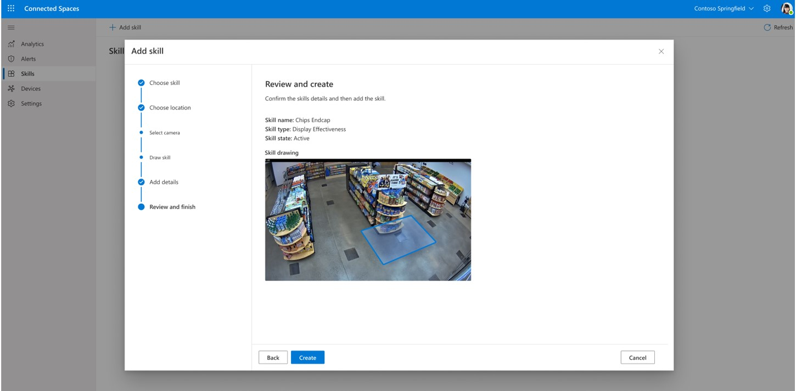

# Add skills to collect data in Dynamics 365 Connected Spaces Preview

[!INCLUDE[banner](includes/banner.md)]

You can use customizable skills in Microsoft Dynamics 365 Connected Spaces Preview to have your cameras collect physical data based on the needs of your store. You can set up a custom zone with one of three available skills:

|Skill|Description|Examples|
|-------------------------|-------------------------------------------------|-------------------------------------------------|
|**Display effectiveness**|	Track how your displays perform	|End caps, displays, promotions|
|**Queue management**| 	Monitor queue wait time, length, and abandonment rate|	Queues, checkouts, returns|
|**Shopper analytics**|	Understand traffic patterns into and around the store|	Store entry/exit|

Each gateway supports up to 10 cameras with a maximum of one skill for each camera view. Your skills can have custom names and shapes (limited to four sides).

> [!NOTE]
> Skills don't change what your camera sees at any time. After you create a skill, the camera continues to see the entire field of view but only tracks and collects data from the skill drawing that you add. 

## Create a skill

Connected Spaces includes a wizard that makes it easy to set up and customize skills. 

1.	On the **Skills** page, select **Add skill**. 

    
 
2.	In the **Add skill** wizard, select one of the three skills, and then select **Next**. 

         
 
3. Select the appropriate camera for the skill, and then select **Next**. 

    
    
    > [!NOTE]
    > If you don't see any cameras, you need to [connect your cameras to a gateway](cameras-connect.md) before adding skills.
    
4. Draw a skill zone to track customer behavior.

    

    - For a **Display effectiveness** skill, drag the zone endpoints to resize the polygon and move it where you want it. Use the tips on the right side of the page to learn  about best practices.

    - For a **Shopper analytics** skill, move and extend the line to align with your store entrance. Select **Flip Direction** to make sure that the blue arrow points in the direction that people walk when entering the store, and the white arrow points in the direction that people walk when exiting the store. Data analytics won't work correctly if you don't have the blue and white arrows set up correctly.  

    - For a **Queue management** skill, drag the zone endpoints to resize the zone and move it where you want it.

    > [!TIP]
    > If you need to start over at any point when drawing a skill zone, select **Reset**. See also [Tips for drawing skill zones](cameras-add-skills.md#tips-for-drawing-skill-zones). 

    When you're done drawing the skill zone, select **Next**. 

7. In the **Add details** section:

    1. Give your skill a name to easily identify it in dashboards (for example, "Aisle 3 Display"). 

    2. Use the **Skill state** slider to turn the skill on or off. The skill will not collect data if the slider is not in the **Active** position. 

       
       
    3. Select **Next**.

8. In the **Review and add** section, review the skill configuration, and then select **Create skill** if the skill is set up the way you want. Otherwise, select **Back** to make changes. 

    

9. Select **Finish** to create the skill. 

    

## Tips for drawing skill zones

If you want to see a specific section of your camera view, create the largest zone that you can, covering the specific floor area that you're interested in but not including other areas that you're not interested in. This increases the accuracy of the data collected and prevents false positives from areas you don't want to track. Be careful when placing the corners of your polygon, to make sure they're not outside the area you want to track. Also, don't drag the borders of the polygon to the edge of the camera field of view. You need to provide space for a person to be seen before they enter the zone. 
 
### Example of a well-shaped Display effectiveness skill zone

The skill zone should be big enough to accommodate three people standing along each edge and focused on the area of interest. When drawing zones on the 2D image, imagine you're drawing them as if they lie on the store floor.

 
### Examples of Display effectiveness skill zones that aren't well-shaped

The following examples show poorly shaped **Display effectiveness** skill zones. In these examples, the display of interest is the **It's Game Time** display.

 
> [!TIP]
> For **Display effectiveness** zones, make sure to extend the zone at least three feet (one meter) in front of the areas of interest.

**Skill zone is too small.**

**Skill zone doesn't fully capture the area around the end cap.**

**Skill zone is too close to the edge of the camera image and doesn't capture the right display.**

**Skill zone is partially blocked, so people aren't fully visible.**

### Example of a well-shaped Shopper analytics skill line

The line should be long enough to accommodate the entire entrance. When drawing lines on the 2D image, imagine you're drawing them as if they lie on the store floor.

### Examples of Shopper analytics skill lines that aren't well-shaped

The following examples show poorly defined **Shopper analytics** skill lines.

**Line doesn't cover the entire entry way on the floor.**

**Line is too high and doesn't cover the entirety of the door.**

### Example of well-shaped Queue management skill zone

The zone should be big enough to accommodate three people standing along each edge and focused on the area of interest. When drawing zones on a 2D image, imagine you're drawing them as if they lie on the store floor.

### Examples of Queue management skill zones that aren't well-shaped

The following examples show poorly defined **Queue management** skill zones.

**Queue defined is too thin.**

**Queue is extended too long.**

## Manage your skills

Use the **Skills** page to view all the skills created for your store. For each skill, the page shows the camera image, friendly name, type of skill (Display effectiveness, Shopper analytics, or Queue management), whether the skill is active or inactive, and the date the skill was last updated.

Select a column title to sort on a column. 

## Edit a skill

1. On the **Skills** page, in the **Actions** column, select the three dots (...) button, and then select **Edit**.

    
    
2. In the **Edit skill** pane on the right side of the screen, make any changes, and then select **Save**. 

    

## Delete a skill

1. On the **Skills** page, in the **Actions** column, select the three dots (...) button, and then select **Delete**.

    
    
    > [!NOTE]
    > Deleting a skill will permanently remove it from Azure Stack Edge, the Connected Spaces website, and all collected data in the dashboards. This information cannot be recovered. If you're unsure about deleting a skill, change the skill status to **Inactive** instead.

## Next step

[Get insights in dashboards](web-app-get-insights.md)
