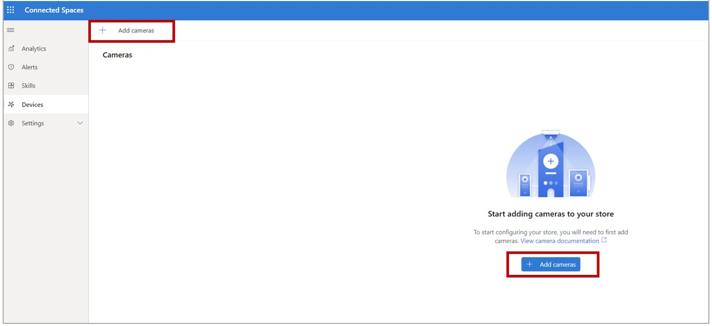
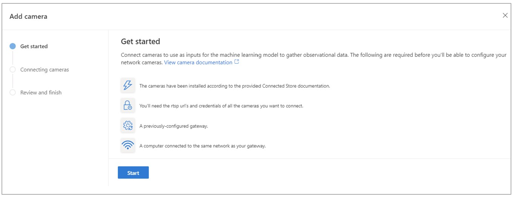
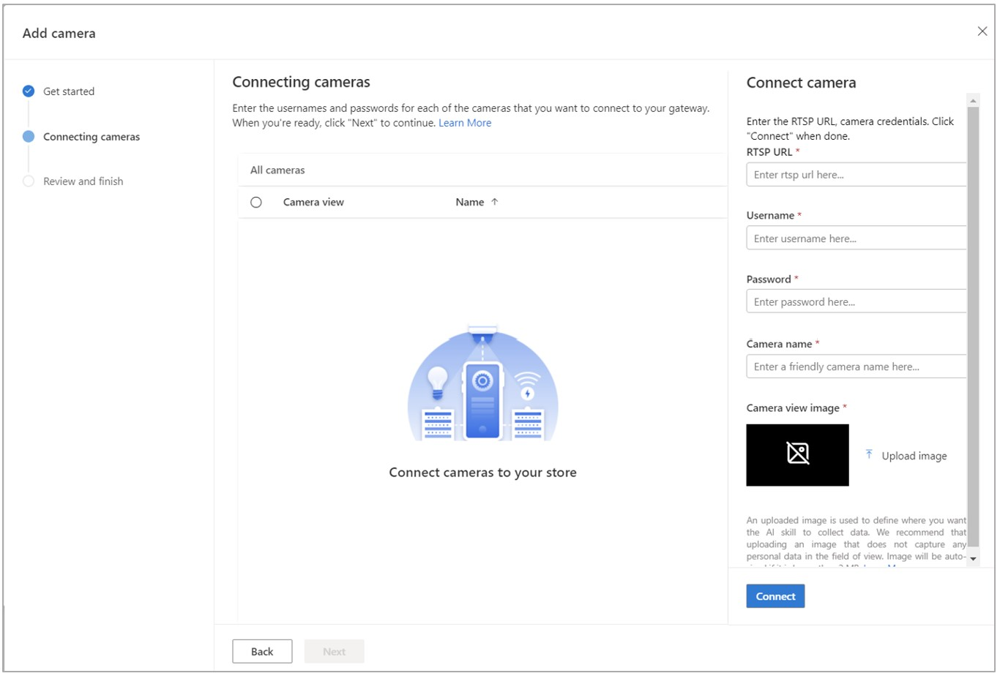
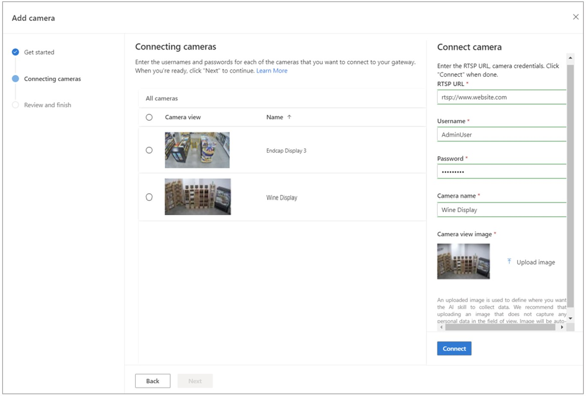
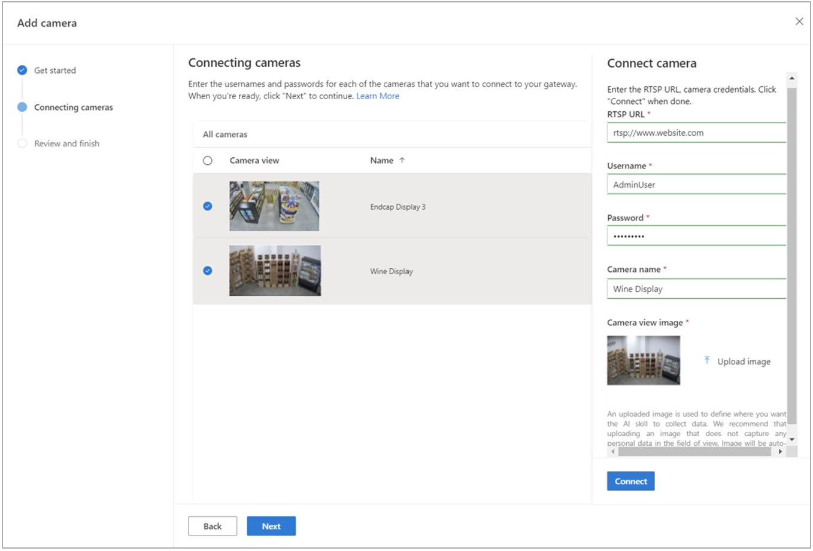
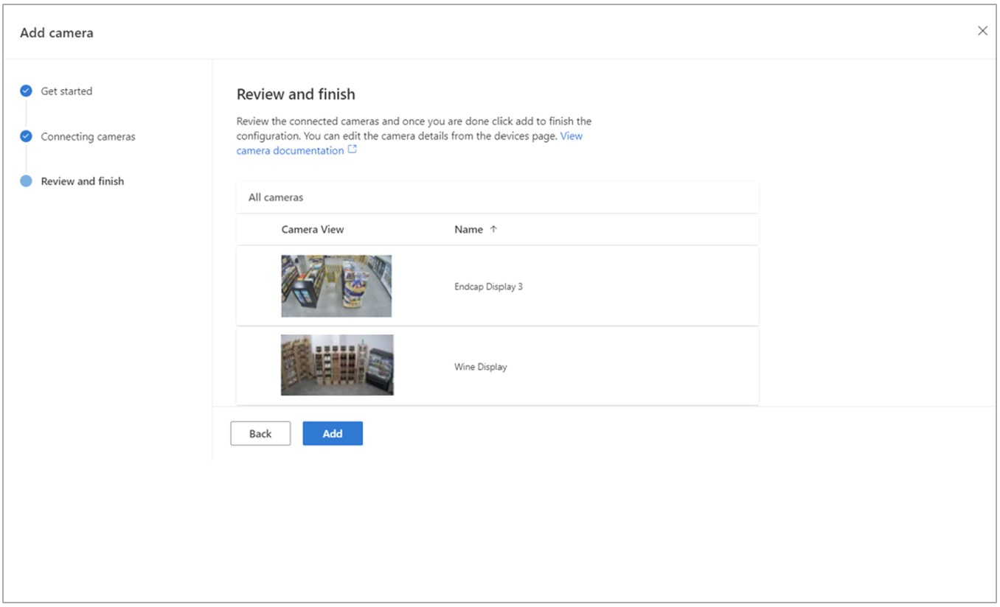
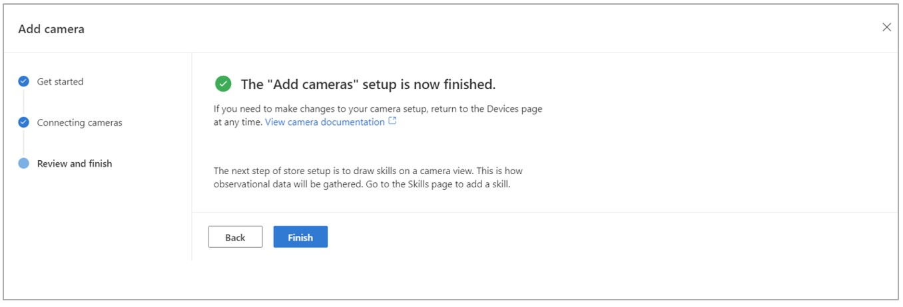
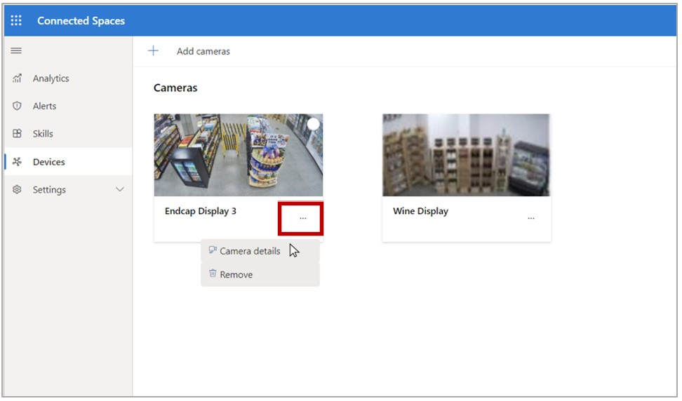
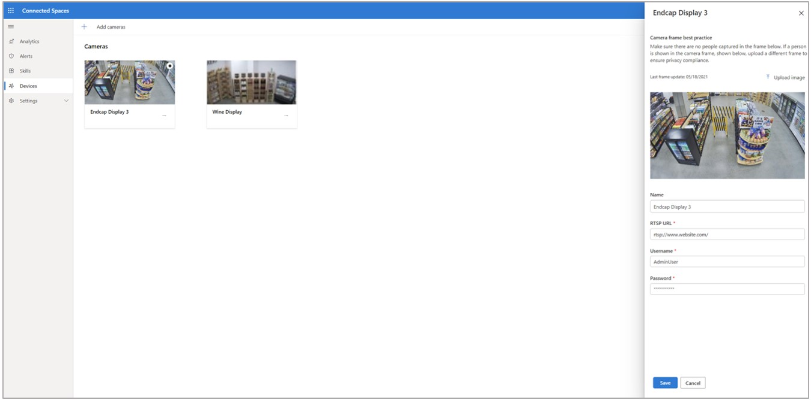

# Connect your cameras to a gateway in Dynamics 365 Connected Spaces Preview 

[!INCLUDE[banner](includes/banner.md)]

After you've paired a gateway to your store, you can connect your cameras to the gateway. Keep in mind that cameras are connected to a specific gateway. You can connect any camera approved for Connected Spaces on the same network as your gateway.

## Prerequisites

You need to do the following before you can connect your cameras to a gateway:

- [Install the cameras](install-cameras.md).

- Gather the RTSP URLs and credentials for all the cameras you want to connect.

- Have access to a previously configured gateway.

- Connect your computer to the same network as your gateway.

## Connect cameras

1. On the **Devices** page, select **Add cameras**. 

    
    
2. On the **Add camera** page, you'll see the list of prerequisites that you must do before you can connect cameras. If you've already completed these steps, select **Start** to begin connecting cameras. 

        
 
3. In the **Connecting cameras** section, fill in the fields in the **Connect camera** pane on the right side of the page for each camera that you want to connect.

    

    Use the following information to fill in the fields:

    1. In the **RTSP URL** field, enter the RTSP URL for your camera.

    2. In the **Username** and **Password** fields, enter the username and password for the camera supplied by your IT administrator.

    3. In the **Camera name** field, enter a friendly name for your camera to help identify it by location. 

    4. In the **Camera view image** field, select **Upload image** to upload an image of the camera's field of view.
    
     > [!NOTE]
     > An uploaded image is used to define where you want the AI skill to collect data. We recommend uploading an image that doesn't capture any personal data in the field of view. The image is compressed if it's larger than 2 MB.

    5. Select **Connect** to add the camera. The camera will appear in the middle of the screen under **All cameras**. 

       

    6. Repeat the above steps for each camera that you want to add.

4. When you're finished adding cameras, under **All cameras**, select the button next to each camera you want to connect, and then select **Next** at the bottom of the page. 

    
    
5. On the **Review and finish** page, review the details, and then select **Add** to add the cameras.

     
     
 6. Select **Finish** to complete the camera connection process.

    
    
## Edit camera details

You can edit the details for any camera from the **Devices** page. 

1. Select the button for the Action menu (...), and then select **Camera details**. 

    
    
2. Make any changes in the pane on the right side of the screen, and then select **Save**.

     
     
## Remove a camera

1. Select the button for the Action menu (...), and then select **Remove**. 

    
    
    > [!NOTE]
    > This will permanently remove the camera. To add the camera back again, on the **Devices** page, select **Add cameras** as described earlier in this article. 

## Next step

[Add camera skills](mobile-app-add-camera-skill-zones.md)
