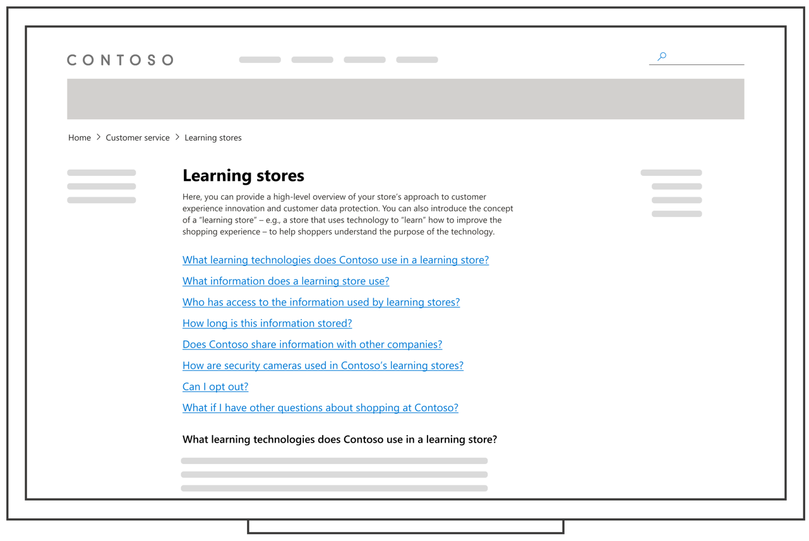
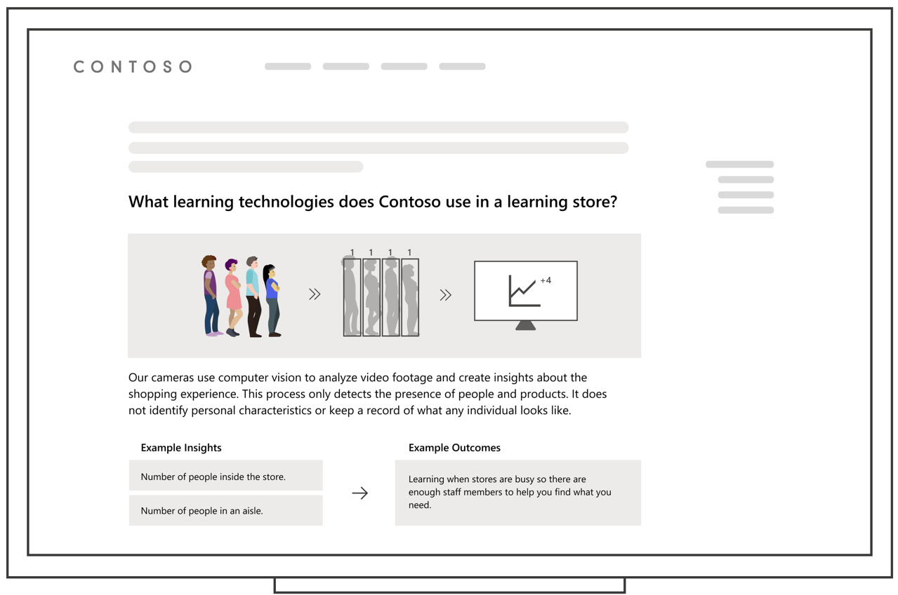
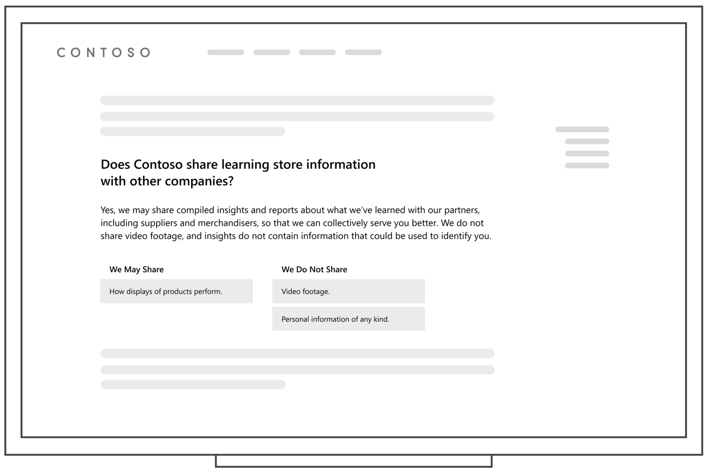

# xCommunicating with your shoppers about the use of Dynamics 365 Connected Store Preview

> [!NOTE]
> This article is provided for informational purposes only. It should not be treated as definitive or as legal advice. We strongly recommend seeking specialist legal advice when implementing Dynamics 365 Connected Store. [See Compliance and responsible use for details](compliance.md).

While shoppers may understand the use of cameras in retail spaces for security purposes, using cameras for other purposes can raise questions, potentially impacting trust in your brand.      

To help build trust, you can use a **disclosure strategy** to help you decide what information to communicate to shoppers as well as when and where to share it. A disclosure strategy can be integrated with an existing communications strategy (for example, how you communicate with shoppers about privacy or how you [communicate with employees about Dynamics 365 Connected Store](employee-plan.md)) with the goal of making the information **easy to discover and understand**.

This article offers best practices for creating and implementing a disclosure strategy for Microsoft Dynamics 365 Connected Store based on Microsoft’s [Responsible AI principles](https://www.microsoft.com/en-us/ai/responsible-ai?activetab=pivot1%3aprimaryr6). We arrived at these practices through several rounds of research conducted in a U.S. retail environment, including interviews with eight store managers and evaluations of sample disclosure materials with ten shoppers. Participants were balanced across a variety of ages, gender identities, ancestral backgrounds, privacy awareness, parental status, and accessibility needs. This article also includes design tips and examples of disclosure materials, which you can adapt to your context.

Based on our research, we’re sharing practices that we’ve found successful in **building shopper trust through transparency**, but they may not be sufficient to comply with all laws and regulations in certain jurisdictions. **It is your responsibility** to create a disclosure strategy that:

- Works within the context of your store and your scenario.

- Accurately reflects all of your data collection and processing practices, including those outside of Dynamics 365 Connected Store.

- Complies with **all laws and regulations** that apply to your use case and in your geographic location, including specific requirements related to notice, disclosure, and consent. Microsoft cannot be held liable for your failure to comply with applicable laws and regulations.

## What to disclose

Our research shows that shoppers often have a common set of questions about technologies used in stores, and transparent disclosure can help foster their trust. What you choose to disclose to shoppers will depend on the unique context of your store and the range of technologies that you use.

Dynamics 365 Connected Store does not store any video footage, does not analyze or attempt to detect faces, and does not identify individuals—and clear and accessible disclosure materials can help make this information easy for shoppers to learn about. Our research shows that a disclosure strategy can build trust by helping shoppers understand: (1) That a technology is in use; (2) What that technology does; (3) How personal data is protected.

Specifically, our research shows that shoppers are more comfortable with Dynamics 365 Connected Store when they understand the following:

- What technology is in use, when is it in use, and how does it work?   

- How do shoppers benefit?

- What potentially sensitive information is/is not collected? For information that is collected, how is it used?   

- How is personal data protected?

- Who has access to data?

- How long and where is data stored?

- What information is shared with other companies?

- Can individuals opt out?

For information on how Dynamics 365 Connected Store works and how Microsoft protects data it processes, see:

- [AI and insights](ai-insights.md)

- [Data and privacy](data-privacy.md)

## When and where to disclose  

Our research shows that for Dynamics 365 Connected Store, shoppers respond well to an **FAQ on your website** as a point of disclosure. An online FAQ lets shoppers review the information whenever they choose and lets you answer shoppers’ questions and concerns in adequate detail to build trust and understanding.

Making the content easily printable or providing it in a brochure format helps ensure that the content is accessible to people who may have limited internet access. It can also help store associates be better prepared to answer shopper questions. Examples and tips for structuring an FAQ are included in the next section.

Additionally, you may consider different ways of raising awareness among shoppers that certain technologies are in use and how they can learn more. Think about where shoppers are most likely to expect to get information from your company based on existing communication patterns, such as:

- Locating the FAQ in a place on your website that's easily discoverable

- Including a link to the FAQ in other communication materials

- Posting in-store signage with a QR code linking to the FAQ

## Design tips and examples

These tips are based on Microsoft research studies conducted on sample Dynamics 365 Connected Store disclosure materials for an in-person retail scenario. Visual examples are for explanatory purposes only.

### Example: FAQ

            
|Tip|Why?|
|-------------------------------------------------------|-------------------------------------------------------|
|✔ **DO** refer to [What to disclose](#what-to-disclose) when deciding what information to include|Shoppers tend to have a common set of questions and concerns about how data is used and protected.|
|✔ **DO** consider introducing a concept such as “learning store” |Our studies show that a clear description of a “learning store” (for example, a store that uses insights to “learn” how to provide better customer service) helps shoppers understand the technology as a whole. |  
|✔ **DO** consider the local context|Some terms or concepts may have different cultural or language connotations in your local area.|
|✔ **DO** offer a way to learn more|Shoppers appreciate being able to ask additional questions, for example through email or a phone number.|
|✔ **DO** provide accurate and transparent information about whether--and how--personal data is being processed|Shoppers need clear, factual information about how personal data is used, including whether they may be tracked or identified while shopping. For example:  - Phrasing like “your shopping experience” may lead shoppers to wrongly believe they are being personally identified. - Phrasing like “aggregate data about shopping patterns” may help shoppers understand that in Dynamics 365 Connected Store they are not uniquely identified, and their faces are not being detected or analyzed.|

### Example: Explaining what technology is in use and how it works
                

|Tip                                                     |Why?|
|-------------------------------------------------------|-------------------------------------------------------|
|✔ **DO** explain how insights are used to improve the shopper experience|If you’re able to provide a clear value proposition to shoppers, they will understand the concept of insights better when they can see clearly how insights translate to an improved shopper experience.|
|✔ **DO** use graphics to help explain unfamiliar concepts|Text is not sufficient to build understanding of less-familiar concepts such as anonymization and aggregation.|
|✔ **DO** differentiate between “video footage” and “insights” |Outlining the difference between “video footage” (which in Dynamics 365 Connected Store is not accessible by humans and is not stored) and “insights” (which are anonymized data-driven statistics derived from AI processing of video footage, and which are stored and visible to humans) helps customers understand how data is protected.|
|✔ **DO** use simple, clear language to explain technical concepts |To build trust, use simple and accessible language that accurately explains the technology. Technical terms (such as “AI” and “the cloud”) may be confusing for shoppers and may lead to inaccurate assumptions.|

### Example: Explaining what information might be shared with other companies

    

|Tip|Why?|
|--------------------------------------------------------|-------------------------------------------------------|
|✔ **DO** clearly state whether personally identifiable information is stored|Shoppers’ primary concern around data privacy is the collection of personally identifiable information without their consent.|
|✔ **DO** provide examples of what you do and do not do with information|Especially when it comes to topics of higher privacy concern, shoppers show better understanding when examples are highlighted.|
|✔ **DO** use words that accurately reflect your practices and also provide flexibility for how technologies or your practices might evolve in the future|Keep in mind that technologies, practices, and perceptions may evolve over time, so using absolutes such as “never” or “not ever” may not seem realistic or trustworthy to shoppers.  Frequently revisit and update disclosure materials to make sure they reflect your practices as they or the technologies you use may change.|

## More resources

We are always expanding our research and best practices for responsible innovation. For more information and resources about putting people at the center of AI technologies, see [Microsoft’s Responsible AI principles](https://www.microsoft.com/en-us/ai/responsible-ai).
