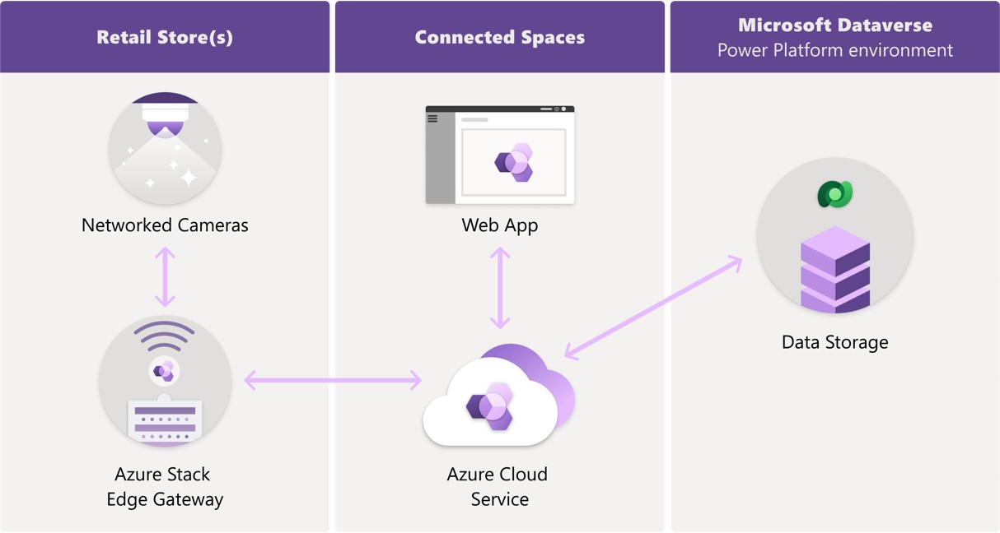

# Data and privacy for Dynamics 365 Connected Spaces Preview

[!INCLUDE [end-of-life](includes/end-of-life.md)]

> [!NOTE]
> This article is provided for informational purposes only and not for the purpose of providing legal advice. We strongly recommend seeking specialist legal advice when implementing Microsoft Dynamics 365 Connected Spaces. [See Compliance and responsible use](compliance.md).

Dynamics 365 Connected Spaces Preview has three components, and each has been designed with privacy, security, and compliance in mind. 

- **Azure Stack Edge gateway** – A customer-managed Azure Stack Edge Pro (2 GPU) gateway computing device installed in the retail store that runs computer vision AI model(s) to convert video streams from existing or new cameras into inference data. The edge gateway processes video data from the in-store camera locally on the device (at the edge) and uses AI models to generate data that can be used to infer a particular event (“**inference data**” or “event data”) from that video footage. Inference data includes information about what occurred in a snippet of input video but does not include images or video. For example, it includes data such as a time stamp, location relative to user-defined lines and zones, and bounding box coordinates that can be used to infer presence of a person (for example, PersonCrossingZone). Inference data is generated without identifying individuals.

- **Connected Spaces cloud service and web app** – A  Software-as-a-service (SaaS) cloud service running on Azure and a Connected Spaces web app that provides insights for the retailer. The edge gateway sends the inference data to the Connected Spaces cloud service so that it can be correlated with the retailer’s business data (for example, store business hours, camera zone name) and aggregated to generate actionable **insights data** regarding retail operations. The Connected Spaces cloud service saves the inference data and insights data to the customer's Microsoft Dataverse storage. Customers can then use the Connected Spaces web app to view the resulting insights data for shopper analytics, display effectiveness, and queue management insights.

- **Microsoft Dataverse storage** – Database and file storage in the customer’s Power Platform environment. All of the customer’s data is stored in Microsoft Dataverse for easy access and management.

## What data does Connected Spaces process?

### Retail store(s)

In the retail store(s), customers use the Azure Stack Edge gateway to process the following types of data:

- **Video stream:** The video stream from customers’ in-store cameras is processed in memory, in near real time, on the customer's Azure Stack Edge gateway to generate inference data.

- **Inference data:** This is the event data output by AI skills (models) running on the edge gateway that describe an inferred person event. Event data includes:

   - Time stamp
   
   - Event type: line crossing, zone enter or exit, zone dwell 

   - Values: Crossing direction, dwell time, dwell frames, orientation, speed, frame 
   
   - Rectangle “bounding box” points, width, and height (area tracked within the camera frame) 
   
   - Confidence score: confidence of the “bounding box” being a person

   - Camera orientation angles: ground and mapped image
   
   - Pseudonymous identifier associated with the “bounding box”

   - Identifiers: camera, zone, inference

- **Insights data:** The inference data described above is depersonalized and aggregated into event counts for every 30 seconds of time. Insights data does not include pseudonymous identifiers or bounding box geometry data. Insights data includes:
 
   - Time stamps for the start and end of the 30-second time window
   
   - Values over that time: entries, exits, dwells, zone dwell time, visits, visit time, peak occupancy, occupancy change

   - AI skill type: shopper analytics, display effectiveness, queue management

   - Zone: such as "Front entrance", "Aisle 1 display", and so on

   - Identifiers: store, camera, customer AAD tenant, insight

-	**Configuration data:** This is information about the retailer’s store and the edge gateway configuration used for setup and configuration of camera zones (for example, store name, paired camera IP address, camera view snapshot image, and zone skills).

The data described above is processed on the Azure Stack Edge on the customers’ premises. Customers are responsible for securing their equipment and network, and Microsoft’s privacy and security commitments only apply to data processed in environments controlled by Microsoft (for example, the Connected Spaces cloud service and the Dataverse cloud service described below).

Customers are in control of Azure Stack Edge, which processes the data described above. Connected Spaces software running on the customer’s Azure Stack Edge stores this customer data locally:

- Incoming Video stream data, processed inference data and insights data is stored temporarily for up to 24 hours.

- A copy of configuration data is also kept in sync on Azure Stack Edge. It mirrors the configuration data stored in the customer’s Dataverse storage, and is kept in sync daily after each store’s working hours.

All of this data is stored in local storage, and is not easily accessible by customers from their Azure Stack Edge resource on the Azure Portal. Customers that need to delete all the data on their Azure Stack Edge can follow [these instructions for Azure Stack Edge device reset and reactivation](/azure/databox-online/azure-stack-edge-reset-reactivate-device).

> [!NOTE]
> After local processing, insights data is uploaded to the Connected Spaces cloud service for further processing and presentation through Connected Spaces dashboards. Customers can control whether they want to upload video data and inference data to their Microsoft Dataverse cloud storage and manage it. Go to **Settings** > **Privacy and about** to change where video and inference data is stored. [Learn more](video-inference-data-upload.md)

### Connected Spaces cloud service

In the Connected Spaces cloud service on Azure, the following types of data are processed at the instructions of the customer.

#### Video data

The video stream data sent from the Edge gateway is saved to the customer's Microsoft Dataverse cloud storage. Video is not stored by default and customers can [opt-in to save their video data](video-inference-data-upload.md#turn-video-upload-off-or-on). Storing video in the cloud enables additional features like detecting and troubleshooting data quality issues. For more information, see [Benefits of uploading video and inference data](video-inference-data-upload.md#benefits-of-uploading-video-and-inference-data).

#### Inference data

The inference data sent from the Edge gateway is saved to the customer's Microsoft Dataverse cloud storage. Inference data is only stored in Dataverse when [video data](#video-data) is also stored.

#### Insights data

The insights data described above is aggregated further into hourly summaries and correlated with other business data (for example, total entry events during the 9 AM hour for the entire store) and then stored in the customer's Microsoft Dataverse cloud storage for viewing via the Connected Spaces web app. Insights data includes:

- Time stamp, summarized by hour or other time interval

- Type: entrance, display, queue, venue

- Value sums, averages and maximums over the hour: dwell time, dwells, enters, exits, visits, visit time, occupancy, occupancy change, over capacity

- AI skill type: shopper analytics, display effectiveness, queue management

- Zone, such as "Front entrance", "Aisle 1 display", and so on

- Time zone info: day of year, hour of day

- Store name, such as "Redmond store", "Seattle store", and so on

- Identifiers: store, skill, insight

#### Configuration data

This is information about the retailer’s store and the edge gateway configuration used for setup and configuration of camera zones (for example, store name, paired camera IP address, camera view snapshot image, and zone skills). 

#### Telemetry data

This is information about the health of the edge gateway, the Connected Spaces cloud service, and the Connected Spaces web app.

- The cloud service processes the data as it arrives for each hourly aggregation and does not store the data in the Connected Spaces cloud.

### Microsoft Dataverse cloud storage

In Microsoft Dataverse cloud storage, the customer data is stored and can be managed by the customer. These Microsoft Dataverse tables are created to store the customer data:

- Power Aggregations: Insights data (hourly summaries)

- HyperStore: Uses Microsoft Dataverse file capacity storage to archive copies of the data sent from the edge gateway:

    - Video data (rows with names containing "1-video")
    - Inference data (rows with names containing "1403-metadata")
    - Insights data with 30-second summaries (rows with names containing "1405-metadata")

    > [!NOTE] 
    > To manage retention of the archive data stored in the HyperStore table, learn how to [free up storage space in Microsoft Dataverse](/power-platform/admin/free-storage-space). The article shows examples of how to manage file capacity using advanced queries and how to automate retention using a bulk deletion job.

- HyperDocument: Uses Microsoft Dataverse database capacity to store the data used by the app for configuration, for analytics dashboards, and for HyperStore data indexes:

    - Configuration data
    - Index data to access the HyperStore table (rows with primary key value of HyperAsset or HyperTrack)

The customer can manage the data at any time in their Microsoft Dataverse instance. [Learn more about responding to Data Subject Rights (DSR) requests for Microsoft Dataverse customer data](/power-platform/admin/common-data-service-gdpr-dsr-guide). When handling DSRs for data such as video data or inference data, customers might need to use a date and time to narrow down the data searches since the data does not have any direct association with a particular person’s identity.

## How does Connected Spaces process data?

Dynamics 365 Connected Spaces processes data as instructed by the customer to provide the Connected Spaces solution.  

Customers use the Connected Spaces web app to configure their store. They connect cameras, draw skill zones, and configure their store settings in the web app. After the configuration is completed, video footage from the paired cameras is streamed directly to the edge gateway (installed on the customer's premises) to create inference data using AI skills. The AI skills (models) running on the customer's premises are pre-trained "out of the box" and not trained with the customer's specific video data unless a customer specifically instructs Microsoft to do so and grants Microsoft the right to access its video feed to enhance the underlying AI skill models.

The AI skills running locally on the edge device detect and track unidentified people’s movements in the video feed based on algorithms that detect the presence of one or more humans. The algorithms generate events when a person moves in or out of designated zones configured by the customer in the camera’s field of view and outputs the coordinates of the person’s body into a bounding box. For each bounding box movement detected in a camera zone, the AI skills output "inference data". People are not re-identified across multiple cameras and no facial recognition is done.

The AI data inferencing is done locally in memory on the edge gateway near real time. This inference data is aggregated into insights data and is then sent to the Connected Spaces cloud service for further processing and aggregation with other customer business data and configuration data to deliver insights that are accessible through the Connected Spaces web app. Customers can control whether they want to upload video data and inference data to their Microsoft Dataverse cloud storage and manage it ([learn more](video-inference-data-upload.md)). All of the customer data is saved to the customer's Microsoft Dataverse cloud storage (the customer must opt in to save video data to customer's storage). The customer's data stays in the customer's geographic region when processed by the Connected Spaces cloud service and when stored in Microsoft Dataverse. During the Preview, Connected Spaces is only available to customers with Azure Active Directory tenants in the UK or US geographic regions, and Connected Spaces data will be processed in those regions.

Customer data processed in the Connected Spaces cloud is used to provide customers with the Connected Spaces cloud service, including by providing insights about retail locations, and also to improve and troubleshoot the Connected Spaces cloud service and other operations incident to delivering the services (for example, managing your account, internal reporting, and improving core functionality such as privacy and accessibility). While Dynamics 365 Connected Spaces is still in a Preview phase, some privacy measures may differ from controls in place for Microsoft commercial cloud services. However, for any personal data sent to the Connected Spaces cloud service, such as inference data, Microsoft provides the contractual commitments required by Article 28 of the GDPR. For more information, see [Privacy and Personal Data for Microsoft Dynamics 365 and GDPR Overview](/dynamics365/get-started/gdpr/).

Shoppers and employees may have privacy questions related to data collected and processed by retail stores. Connected Spaces customers can refer to the best practices outlined in [Communicate with shoppers](communication-plan.md) and [Communicate with employees](employee-plan.md) as they consider how to effectively communicate about data used by Connected Spaces.
