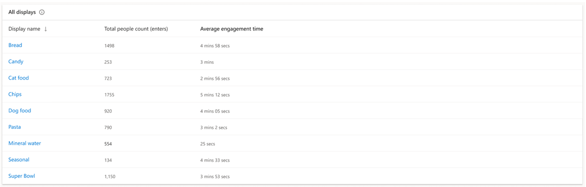
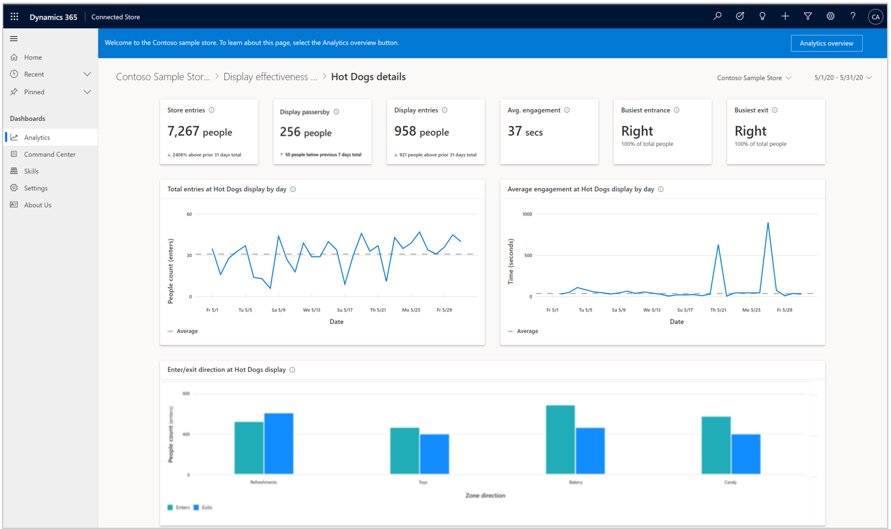
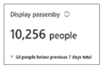
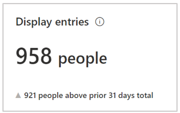
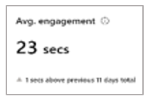
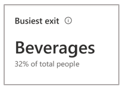
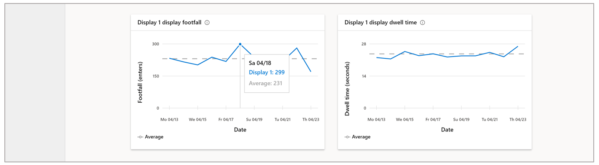

# View the Display effectiveness details page in the Dynamics 365 Connected Store Preview web app

You can use the [**Analytics** page](web-app-get-insights.md) in the Microsoft Dynamics 365 Connected Store Preview web app to get insights on your retail store. The **Analytics** page includes insights for the Shopper analytics, Display effectiveness, and Queue management camera skill zones. This article focuses on the details page for the Display effectiveness skill zone, which is available from the [Display effectiveness summary page](display-effectiveness-summary-page.md). 

## View the Display effectiveness details page

To see details for a specific Display effectiveness zone in Microsoft Dynamics 365 Connected Store, select the desired display name at the bottom of the 
[Display effectiveness summary page](display-effectiveness-summary-page.md).

## Display effectiveness details page

On this page, you can use the cards and graphs to understand:

- Of total store visitors (assuming the store has been configured to capture store entries), *how many people passed by the 
display?*

- Of display passersby, *how many people visited the display?*

- Of total display visitors, *how long, on average, did they dwell?*

- *From what direction (side of display zone) did visitors enter/exit the display zone?*

## Highlights banner

The highlights banner at the top of the page provides a loose indication of a customer acquisition funnel. The **Store entries** card is carried over from the [**Analytics** page](web-app-get-insights.md). 

**Display passersby.** This card highlights the number of people that passed within the camera field of view that contains the 
Display effectiveness zone of interest. This gives you an indication of how much traffic passed by the display. 

The subscript in the card describes the absolute change in this value for the current time frame compared to the previous time frame of equal duration. The triangle to the left of the subscript indicates whether the change was positive or negative. 

**Display entries.** This card highlights the number of people who entered the Display effectiveness zone. 

The subscript in the card describes the absolute change in this value for the current time frame compared to the previous time frame of equal duration. The triangle to the left of the subscript indicates whether this change was positive or negative. 

**Avg. engagement.** This card highlights average time people engaged (dwelled) in the selected Display effectiveness zone. 

The subscript in the card describes the absolute change in this value for the current time frame compared to average engagement (dwell) time across all displays during the selected time frame. The upward-facing triangle to the left of the subscript indicates the positive direction. 

**Busiest entrance.** This card highlights the side of the Display effectiveness zone through which most people entered, 
using the friendly name assigned to the side. 

The subscript in the card details show much of the total display entries came through that side.

**Busiest exit.** This card highlights the side of the Display effectiveness zone through which most people exited, using the 
friendly name assigned to the side. 

The subscript in the card details how much of total display entries came through that side.

## Graphs

There are three graphs at the bottom of the details page: **Total entries at [x display] display by day**, **Average engagment at [x display] display by day**, and **Enter/exit direction at [x display] display**.

**[Display 1] display footfall.** This graph shows footfall into Display 1 for the selected time frame, compared to the average 
footfall, represented by the dashed line for Display 1, during the selected time frame.

**[Display 1] display dwell time.** This graph shows the average time spent dwelling in the Display 1 zone for selected time frame, 
compared to the average engagement (dwell) time, represented by the dashed line for Display 1, during the selected time frame.

**[Display 1] Enter/Exits sum.** This graph shows the break-down of footfall type by zone side, including how much traffic is 
coming/going from a specific direction into/out of the zone. Side names correspond to the friendly names created during skills/zone 
configuration. 

> [!TIP]
> You can hover over the information icon for any graph to get more information about the graph. You can also hover over a point 
in a graph to reveal details.

## Next steps

Learn about these web app pages:

[Analytics page](web-app-get-insights.md) 
[Shopper analytics summary page](shopper-analytics-summary-page.md) 
[Display effectiveness summary page](display-effectiveness-summary-page.md) 
[Queue management summary page](queue-management-summary-page.md) 
[Queue management details page](queue-management-details-page.md)
