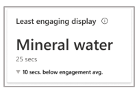
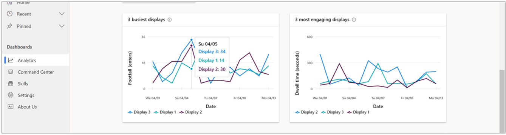

# View the Display effectiveness summary page in Dynamics 365 Connected Store public preview

The **Display effectiveness summary** page in Microsoft Dynamics 365 Connected Store public preview shows a view of the performance of all display effectiveness zones and 
their performance relative to each other. Use this page to answer this question: “How effective are my displays?”

## Highlights banner

The banner at the top of the page highlights the key takeaways and comparisons. The **Store footfall**, **Busiest display**, and 
**Most engaging display** cards are carried over from the [**Analytics** page](web-app-get-insights.md). 

**Least busy display.** This card highlights the name of the display that had the least number of people for the selected time 
frame, along with the people count. 

> [!NOTE]
> Because there are several factors that can contribute to a change in value (for example, number of displays in the store or a change 
in display configuration), the app does not include a comparison subscript.

**Least engaging display.** This card highlights the name of the display where people engaged (dwelled) shorter on average than other 
displays, along with the time, in seconds, for dwell time. 

The subscript in the card describes the absolute change in this value for the current time frame compared to average engagement (dwell time) across all displays during the selected time frame. The downward triangle to the left of the subscript indicates that the change was negative. 

## Graphs and table

The **Display effectiveness summary** page also includes the **3 busiest displays** graph, **3 most engaging displays** graph, and **All store displays** table.

**3 busiest displays.** This graph shows the people count trend data for the three display effectiveness zones that, on average, 
received the greatest footfall during the selected time frame. These trend lines are placed in context with the average footfall 
across all display effectiveness zones, illustrated by the dotted line.

**3 most engaging displays.** This graph shows the dwell time trend data for the three display effectiveness zones in which people, 
on average, spent the most time during the selected time frame. These trend lines are placed in context with the average engagement 
(dwell) time across all display effectiveness zones, illustrated by the dotted line.

**All store displays.** This table contains a sortable list of all display effectiveness zones by name, total people count, and average 
engagement time. Sort the list by selecting a single column heading. You can also filter each metric for a specific value by using 
the **Filter** button next to each column heading.

To see data values for each display, hover over the graph. 

