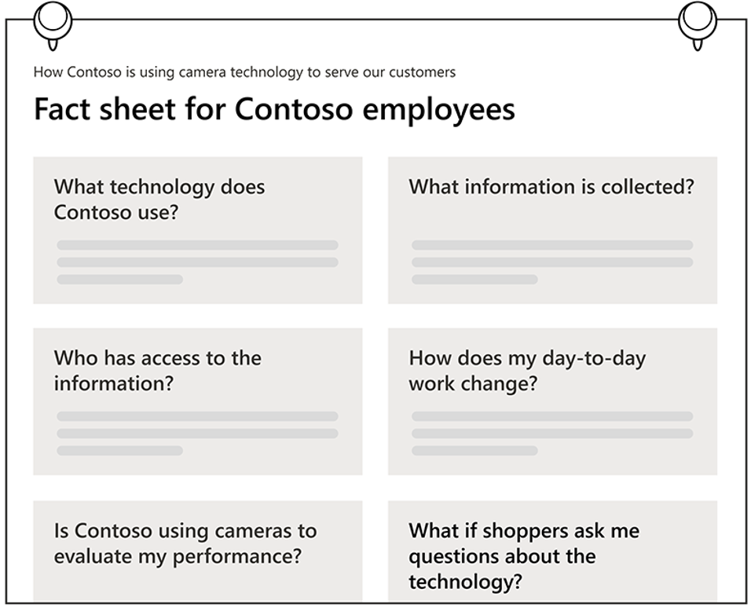
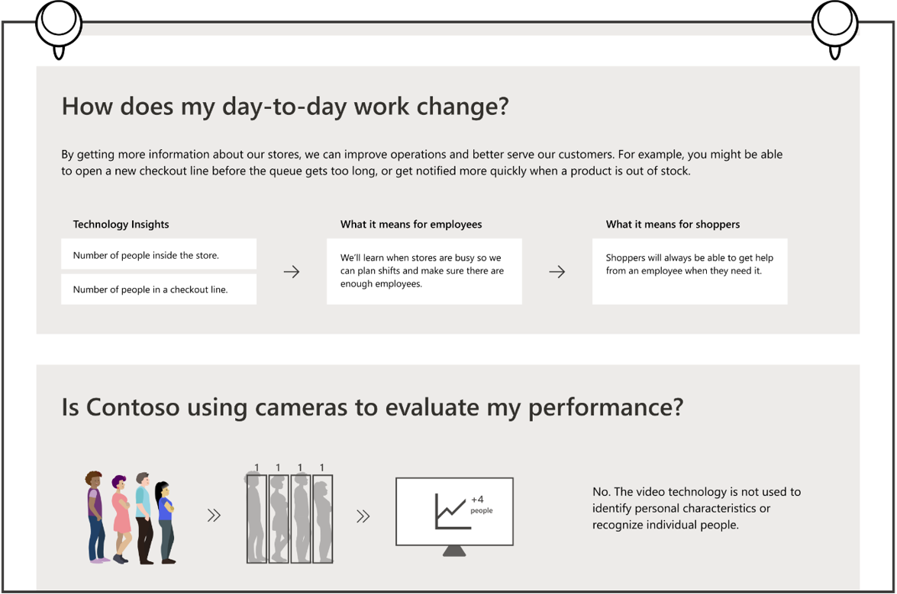
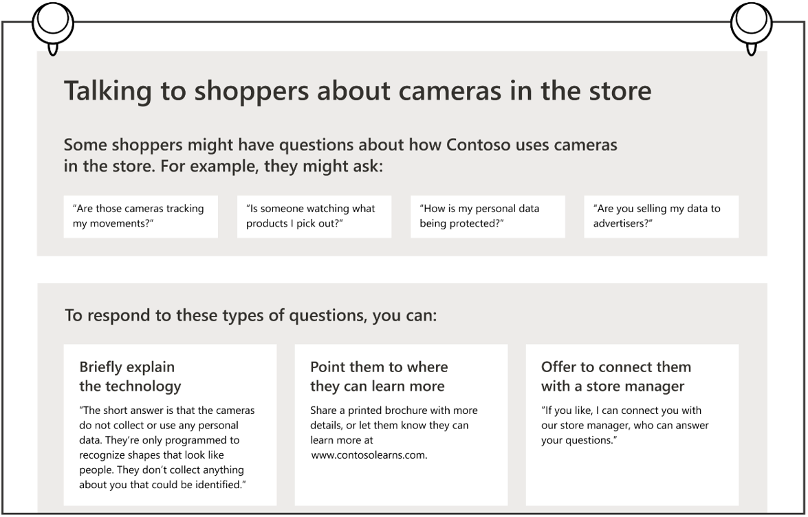

# Communicating with your employees about the use of Dynamics 365 Connected Store

> [!NOTE]
> This article is provided for informational purposes only. It should not be treated as definitive or as legal advice. We strongly recommend seeking specialist legal advice 
when implementing Dynamics 365 Connected Store. [See Compliance and responsible use for details](compliance.md).

When it comes to the use of cameras in retail settings, employees have many of the same questions and concerns as shoppers about what data is collected and how it's used. 
Employees also have additional concerns about how the technology will affect their day-to-day work and whether cameras may be used to monitor their performance. 

To uphold human dignity, build trust, and align with the standards set out in Microsoft’s [Responsible AI principles](https://www.microsoft.com/en-us/ai/responsible-ai), 
we suggest creating an employee disclosure strategy or expanding an existing strategy, such as how you [communicate with shoppers](communication-plan.md). Our research suggests that employees who understand and trust the technology will be in a better position to use the system effectively and also help shoppers reach the same level of trust and understanding.

The practices in this article can help you decide what information to share with employees as well as how to communicate that information. We arrived at these practices through several rounds of research conducted in a U.S. retail environment, including interviews with eight store managers and evaluations of sample disclosure materials with ten employees. Participants were balanced across a variety of ages, gender identities, ancestral backgrounds, store type, size of store, and their position within the store. We also offer tips for designing disclosure materials with the goal of making information easy to discover and understand.

Based on our research, we’re sharing practices that we’ve found successful in **building shopper trust through transparency**, but they may not be sufficient to comply with all laws and regulations in certain jurisdictions. **It is your responsibility** to create a disclosure strategy that:

- Works within the context of your store and your scenario.

- Accurately reflects all of your data collection and processing practices, including those outside of Dynamics 365 Connected Store.

- Complies with **all laws and regulations** that apply to your use case and in your geographic location, including specific requirements related to notice, disclosure, and consent. Microsoft cannot be held liable for your failure to comply with applicable laws and regulations.

## What to disclose

Our research shows that employees may have a common set of questions regarding Dynamics 365 Connected Store, and transparent disclosure can help build their trust. Because Dynamics 365 Connected Store is built with privacy in mind, it does not store any video footage, does not analyze or attempt to detect faces, and does not identify individuals. Our research shows that this information is reassuring to employees when it’s disclosed in clear and accessible ways. 

A disclosure strategy can build trust by answering employees’ questions and helping them understand the following:

- What technology is in use and how does it work?

- When and where is the technology in use?

- What potentially sensitive information is/is not collected? For information that is collected, how is it used? Note that employees are particularly concerned that data will be used to monitor or evaluate their performance, so this should be clearly addressed.

- How is personal data protected?

- Who has access to data?

- How long and where is data stored?

- What information is shared with other companies?

- Can individuals opt out?

- How does the technology help employees do their job well? For example, how does it help them make more informed decisions or provide better customer service to shoppers?

- How will employees’ day-to-day work be affected?

- How can employees best respond to shopper questions or concerns?

Many of these answers may be similar to the ones you provide to shoppers (see [Communicate with shoppers](communication-plan.md) for other tips based on our user research). Note that answers to these questions will depend not only on how your store uses Dynamics 365 Connected Store, but also how you use other technologies that might affect the employee experience, including technologies you cover in other disclosure strategies. 

## When and where to disclose

Our research shows that it is most effective to notify employees about Dynamics 365 Connected Store when the technology is being integrated, and then provide disclosure materials that are available for employees to review anytime. 

The following suggestions represent a range of practices that have been designed to be flexible so that you can choose options that make sense in the unique context of your store. 

### Ideas for notifying employees

- Our research shows that while email may be a common way to reach store managers, letting frontline employees know in person, such as during a staff meeting, can be more effective.

- Post a **one-page FAQ** where it is highly visible to employees, such as a break room or online. 

- Visual communication methods such as a short training video or illustrations help make the technology easier to understand, especially for employees who aren’t native speakers. 

- Provide easy ways for employees to ask questions. 

### Ideas for additional resources

- Provide frontline workers with talking points or scripts for responding to shoppers’ questions and concerns about the use of video technology. 

- Include information about Dynamics 365 Connected Store in new employee onboarding.

## Design tips and examples

Refer to the guidelines for [communicating with shoppers](communication-plan.md) for tips on presenting information about Dynamics 365 Connected Store in a way that makes it easy to understand. The following examples build on those guidelines with additional tips for communicating with employees. The images are for explanatory purposes only.

### Example: Employee FAQ (Printed)

|Tip|Why?|
|--------------------------------------------------------|-------------------------------------------------------|
|✔ **DO** explain that Dynamics 365 Connected Store is not intended and won’t be used to monitor employee behavior or evaluate employee performance|Workplace surveillance is a top employee concern. Dynamics 365 Connected Store is not designed or intended for use in—and should not be used to make—decisions affecting employment, including performance evaluation, compensation, rewards, seniority, or other rights or entitlements. Our research shows that you can build trust by reiterating how Dynamics 365 Connected Store protects the privacy of individuals (see [Data and Privacy](data-privacy.md)), and by assuring employees that you will not use insights for employee monitoring or decisions that affect their employment. You are solely responsible for use of the product in compliance with all applicable laws.|
|✔ **DO** explain how Dynamics 365 Connected Store will affect employees’ day-to-day work|Employees expect to get information on how their daily work will be impacted.|
|✔ **DO** offer a way to learn more|Employees appreciate being able to ask additional questions, for example by contacting a manager or an HR team.|

### Example: Explaining how employees’ work is affected

|Tip|Why?|
|--------------------------------------------------------|-------------------------------------------------------|
|✔ **DO** give specific examples of how employees' responsibilities and tasks might change|Vague answers may be ignored or create confusion and distrust. |
|✔ **DO** describe measures taken to prevent technology misuse|Employees may have concerns regarding the misuse of technology by the company or managers, and appreciate knowing what preventive measures and policies are in place.  |
|✔ **DO** provide details on how Dynamics 365 Connected Store benefits both store operations and customer service.|Employees understand the technology better with specific examples of how insights translate into outcomes. Read our tips for how to [communicate with shoppers](communication-plan.md) for more examples of how insights result in outcomes for shoppers. |
|✔ **DO** differentiate between “video footage” and “insights”|Outlining the difference between “video footage” and “insights” helps employees understand how data is protected. In Dynamics 365 Connected Store, video footage is not accessible by humans and is not stored. Insights, which are statistics derived from video footage and which are aggregated and anonymized before anyone sees them, are visible to humans and are stored. |
|✔ **DO** use simple, concise, non-technical language|Simple language helps make the content more accessible to all employees, including those who aren’t native speakers. |

### Example: Helping employees respond to shoppers’ concerns

|Tip|Why?|
|---------------------------------------------------------|-------------------------------------------------------|
|✔ **DO** share a range of concerns that shoppers might bring up|Anticipating likely shopper questions or concerns can help employees provide better customer service. |
|✔ **DO** provide “quick reply” responses that employees can use to respond to any shopper questions |Employees might not have time to study detailed information about the technology, so it may be easier for them to remember brief, scripted answers.  |
|✔ **DO** provide an easy escalation as needed, such as redirecting to a store manager |Offering to connect a shopper with a store manager lets employees focus on their primary tasks while reassuring shoppers that their questions are taken seriously. |

## More resources

We are always expanding our research and practices for responsible innovation. For more information and resources about putting people at the center of AI technologies, visit [Microsoft’s Responsible AI principles](https://www.microsoft.com/en-us/ai/responsible-ai).

