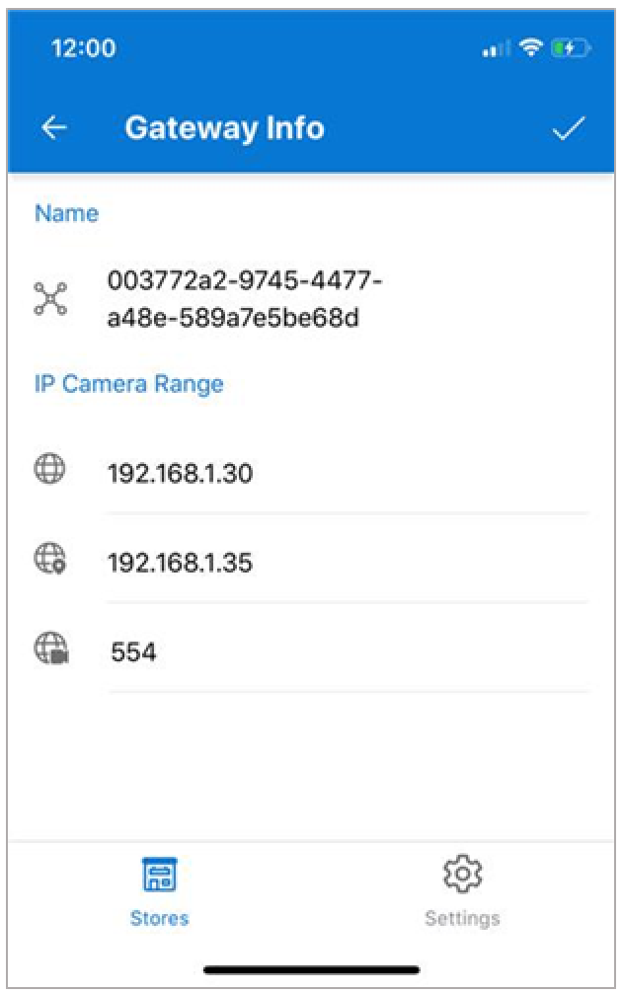
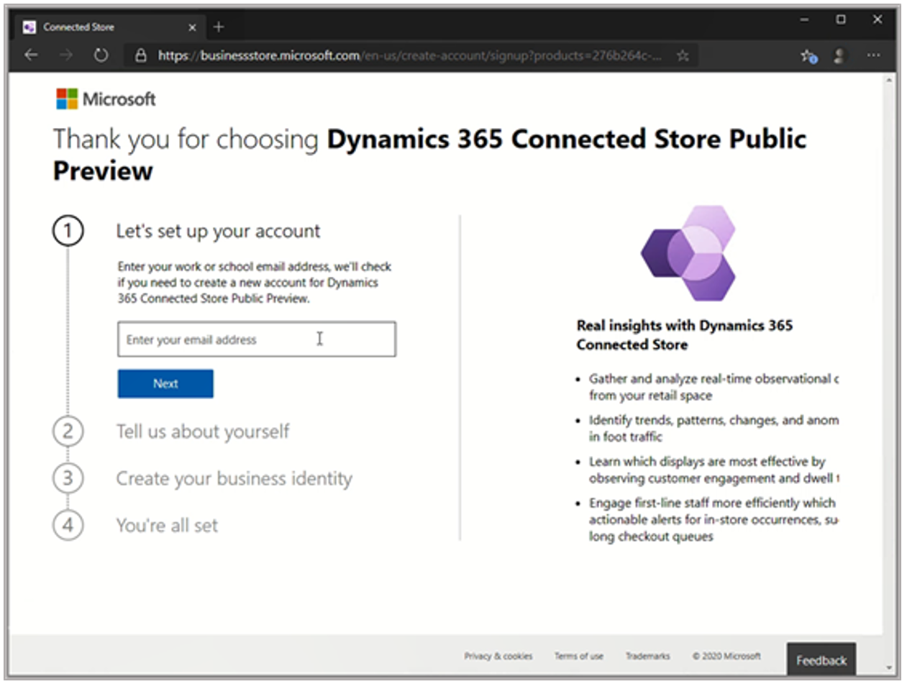
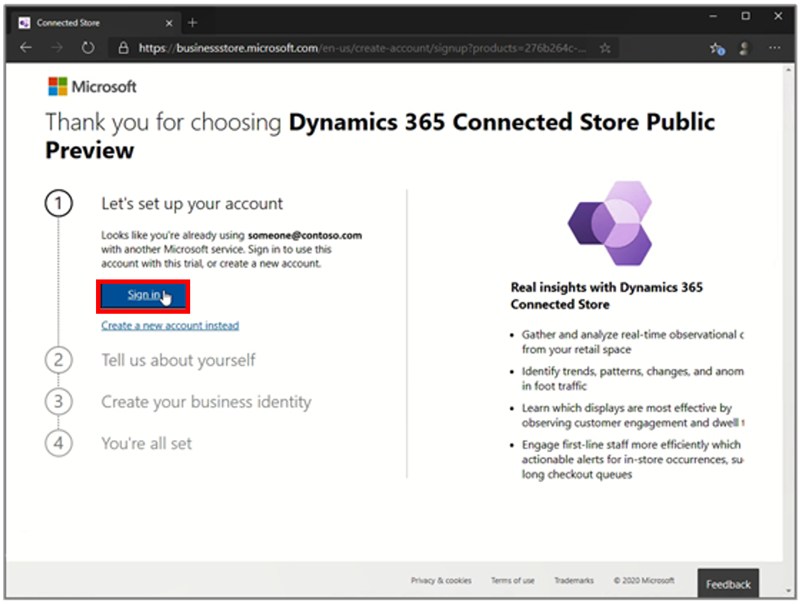
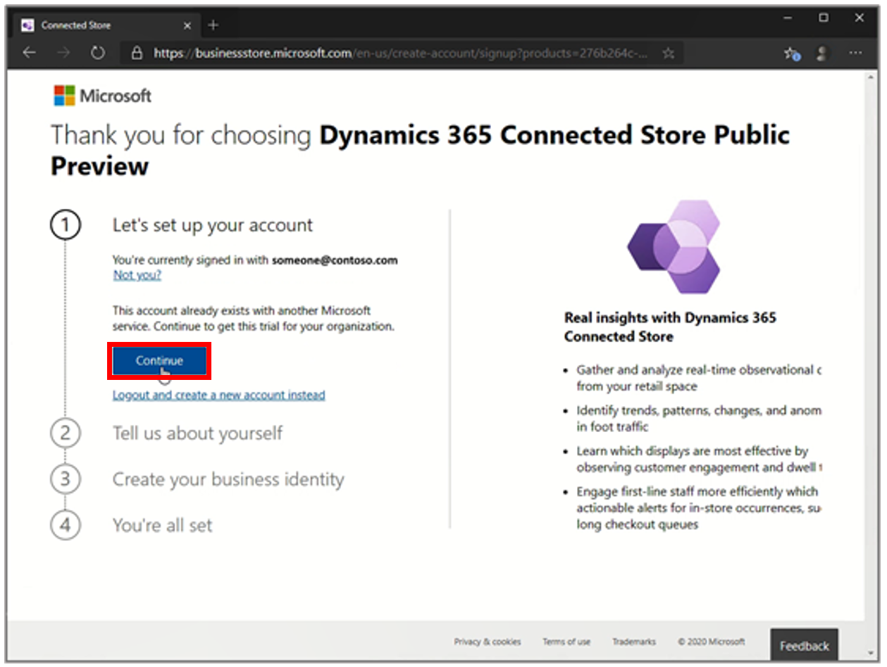
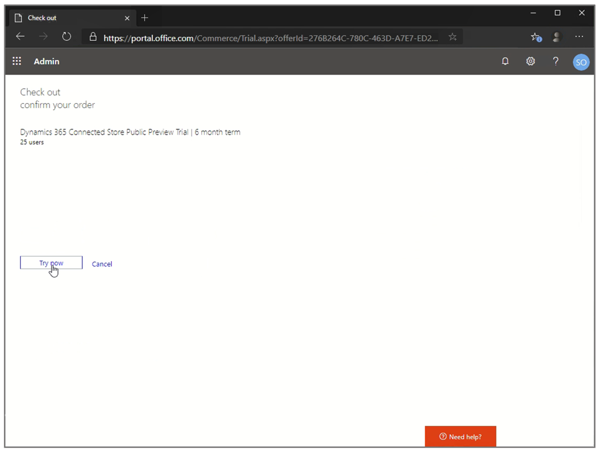

# Dynamics 365 Connected Store Preview FAQ

## Are all IP cameras supported?

[See the list of supported cameras](install-cameras.md#supported-cameras).

## Can I use my existing analog CCTV cameras?

[See the list of supported cameras](install-cameras.md#supported-cameras).

## Can I reconfigure an existing skill zone if I have already reached the 10-zone limit?

Yes, if you need a new skill zone, you can reconfigure an existing zone. However, zones can be reconfigured only for the same skill category. For example, you can reconfigure an existing Display Effectiveness zone as a new Display Effectiveness zone, but not as a new Shopper Analytics or Queue Management zone. You can't add more than 10 zones.

> [!NOTE]
> When you rename a skill zone, all data that is associated with the previous zone name will be associated with the new zone name.

## Why is the average dwell time of my Display Effectiveness skill zone less than expected?

Be sure to create the largest skill zone that you can, so that it covers the specific floor area that you're interested in but **excludes** areas that you aren't interested in. In this way, you help increase the accuracy of the data that is collected and prevent false positives from areas that you don't want to track. Be careful when you place the corners of your polygon. Make sure that they aren't outside the area that you want to track.

[See tips for drawing skill zones](mobile-app-add-camera-skill-zones.md#tips-for-drawing-skill-zones).

## How do I change the IP range that the gateway uses to scan for cameras?

To change the Internet Protocol (IP) range that is used to get the list of available cameras, follow these steps.

1. On the **Gateways** page, tap the **Actions** (three dots) button for the gateway that you want to change.

2. Tap **Info** at the bottom of the page.

3. Update the IP ranges. 

    

4. When you've finished, select the check mark in the upper-right corner of the page.

## I don't have the Connected Store Admin role. How can I view a gateway in the mobile app?

To use the mobile app, you must have the **Connected Store Admin** role. If you sign in by using the **Connected Store Viewers** role, you can view the list of stores, but you can't view any gateways in those stores. [Learn how to assign a user role](admin-user-accounts.md).

## How do I use my existing Azure Active Directory tenant to sign up for Connected Store? 

If you want to use your company's existing Microsoft Azure Active Directory (Azure AD) tenant to sign up, the global admin on your team must complete these steps:

1. Complete the sign-up by using their user account, which has Azure AD tenant administrator permissions.

2. Assign a six-month trial license to Microsoft Dynamics 365 Connected Store.

3. Assign client licenses to Azure AD user accounts.

Currently, you must use an Azure AD tenant in the United Kingdom (UK) or the United States (US). If your company's tenant is registered in another country or region, **the sign-up will fail**. If you're the global admin for your organization and want to try out Connected Store, you can [sign up by using a new test Azure AD tenant](admin-create-new-tenant.md) in the UK or US.

1. Go to the Connected Store setup page.

2. In the **Let's set up your account** step, enter your company email address, and then select **Next**.

    

3. Select **Sign in** to authenticate.

    

4. After authentication is completed, select **Continue**.

    

    The web page verifies that you have permissions to sign up on behalf of your company. If you do, it redirects you to portal.office.com, where you can get the license for Connected Store.

5. On the Office **Check out** page, select **Try now** to get the trial license for your company.

    

    An order receipt page appears.

    

    At this point, Setup completes the following actions:

    - Assigns the Dynamics 365 Connected Store Preview trial license to your company's Azure AD tenant.
    
    - Assigns a client license for this trial to your admin user account.

6. [Install Connected Store](admin-install-web-app.md).

## How do I notify shoppers and employees about the use of Dynamics 365 Connected Store in my store?

While shoppers and employees may understand the use of cameras in retail spaces for security purposes, using cameras for other purposes can raise questions and concerns, potentially impacting trust in your brand. For tips for building shopper and employee trust through a notice and disclosure strategy, refer to the best practices outlined in our two guides, [Communicate with shoppers](communication-plan.md) and [Communicate with employees](employee-plan.md).

## See also

[Known issues](known-issues.md)
