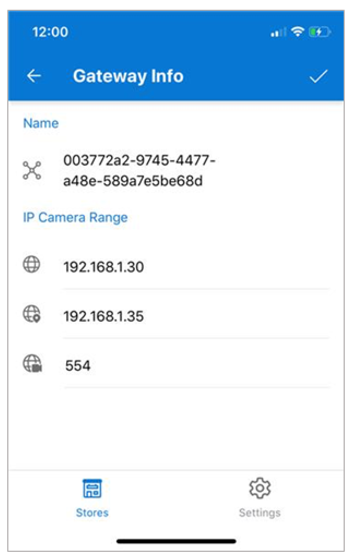
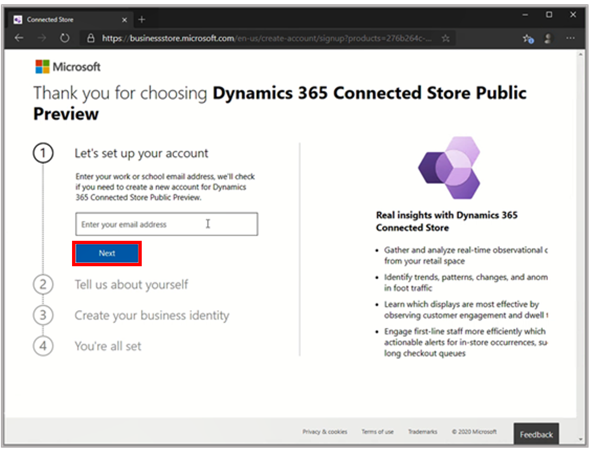

# Frequently asked questions about Dynamics 365 Connected Store

## Are all IP cameras supported?

[See the list of supported cameras](install-cameras.md#supported-cameras).

## Can I use my existing analog CCTV cameras?

[See the list of supported cameras](install-cameras.md#supported-cameras).

## Can I reconfigure an existing skill zone if I have already reached the 10-zone limit?

Yes, if you need a new skill zone, you can reconfigure an existing zone. Zones can only be reconfigured for the same skill category, however. For example, you can reconfigure an existing Display Effectiveness zone as a new Display Effectiveness zone but not as a new Shopper Analytics or Queue Management zone. You can’t add more than 10 zones. 

>[!NOTE]
>When you rename a skill zone, all data associated with the previous zone name will be associated with the new zone name. 

## My Display Effectiveness skill zone has lower average dwell time than expected

Make sure to create the largest skill zone that you can, covering the specific floor area that you’re interested in, but **excluding** areas that you’re not interested in. This increases the accuracy of the data collected and prevents false positives from areas you don’t want to track. Be careful placing the corners of your polygon to make sure they’re not outside the area you want to track. 

[See tips for drawing skill zones](mobile-app-add-camera-skill-zones.md#tips-for-drawing-skill-zones).

## How do I change the IP range that the gateway uses to scan for cameras?

To modify the IP range used to get the list of available cameras:

1. On the **Gateways** page, tap the **Actions** (three dots) button for the gateway you want to modify. 

2. Tap **Info** at the bottom of the page.

3. Update the IP ranges. 

    

## How do I sign up for Connected Store with my existing Azure Active Directory tenant? 

To sign up using your company’s existing Azure Active Directory tenant, the global admin on your team needs to:

- Complete the sign-up using their user account, which has Azure Active Directory tenant administrator permissions.

- Assign a 6-month trial license to Connected Store.

- Assign client licenses to Azure Active Directory user accounts.

At this time, you must use an Azure Active Directory tenant that is in the United Kingdom or United States. If your company’s tenant is registered in another country or region, the sign-up will fail. If you’re the global admin for your organization, you can [sign up with a new test Azure Active Directory tenant instead](admin-create-new-tenant.md). 

1. Go to the Connected Store setup page.

2. Under **Let’s set up your account**, enter your company email address, and then select **Next**.

   

3. Select **Sign in** to authenticate.

   

4. After authenticating, select **Continue**.

   
    
    The web page will verify that you have permissions to sign up on behalf of your company and redirect you to portal.office.com where you can acquire the license for Connected Store.
    
5. In the Office **Check out** screen, select **Try now** to get the trial license for your company.

    
    
    You’ll see the following confirmation page:    
    
    

    At this point, Setup:
    
    - Assigns the Dynamics 365 Connected Store Public Preview trial license to your company’s Azure Active Directory tenant.
    
    - Assigns a client license for this trial to your admin user account.

6. [Install Connected Store](admin-install-web-app.md). 
