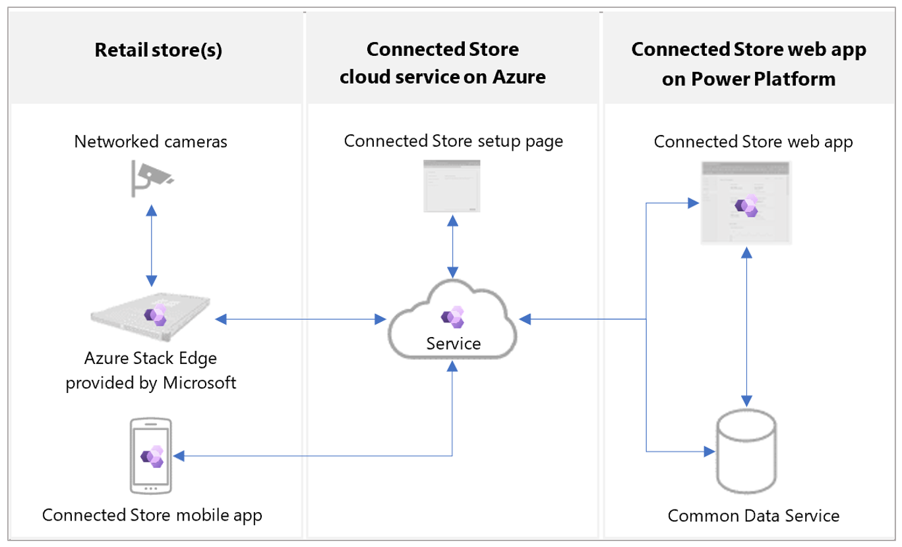
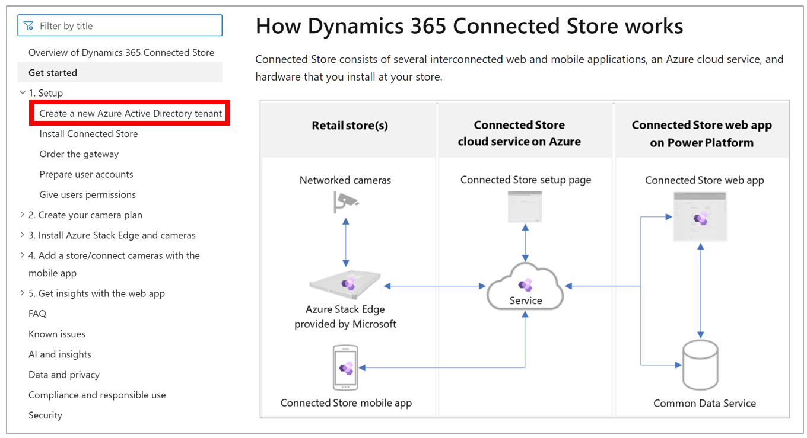

# Get started with Dynamics 365 Connected Store public preview

Welcome to the public preview of Microsoft Dynamics 365 Connected Store! This article describes how Connected Store works, and the overall process for acquiring, installing, configuring, and using Connected Store. 

## How Dynamics 365 Connected Store works

Microsoft Dynamics 365 Connected Store consists of several interconnected web and mobile applications, an Azure cloud service, and hardware that you install at your store.

 
In each of your retail stores, you’ll:

- Install and activate an Azure Stack Edge gateway. The gateway will receive video from the cameras connected to it and transform your customer activity into datapoints 

- Use the mobile app to create a store, pair the gateway to the store, and configure your store’s cameras to track activity in the store

The Azure cloud service:

- Receives and stores the stream of datapoints

- Processes the datapoints into aggregated observational data

- Sends the processed data on a regular basis to Common Data Service in your Microsoft Power Platform environment

The Power Platform environment:

- Stores the incoming data and makes it available for the Connected Store web app. You’ll use the web app to view analytics reports about activity in your stores.

## Ready to go?

The Connected Store table of contents is organized to make it easy to get up and running quickly with the hardware and software described above. When you're ready to sign up for the public preview and install the software, start with the first article in the Setup section and then proceed in order through the articles in the table of contents:

At the end of each article, you'll see a **What's next?** reminder for the next step in the process.

## What's next?

[Start the setup process by creating a new test Azure Active Directory tenant](admin-create-new-tenant.md)

