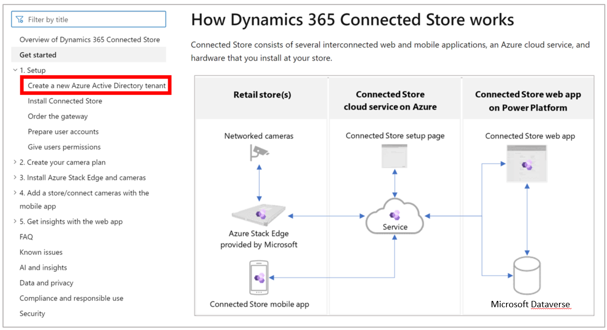

# Get started with Dynamics 365 Connected Spaces Preview

[!INCLUDE[banner](includes/banner.md)]

Welcome to the Microsoft Dynamics 365 Connected Spaces Preview! This article describes how Connected Spaces works, and the overall process for acquiring, installing, configuring, and using Connected Spaces. 

## How Dynamics 365 Connected Spaces works

Connected Spaces consists of several interconnected web and mobile applications, an Azure cloud service, and hardware that you install at your store.

 
In each of your retail stores, you’ll:

- Install and activate an Azure Stack Edge Pro (2 GPU) gateway. The gateway will receive video from the cameras connected to it, analyze it, and transform your customer activity into pseudonymous datapoints.

- Use the mobile app to create a store, pair the gateway to the store, and configure your store’s cameras to track activity in the store.

The cloud service:

- Receives and stores the stream of datapoints.

- Processes the datapoints into aggregated observational data.

- Sends the processed data on a regular basis to Microsoft Dataverse in your Microsoft Power Platform environment.

- Processes and sends video streams and video stream metadata to Microsoft Dataverse in your Microsoft Power Platform environment. Customers can choose to have their video data streamed to Microsoft Dataverse.  

The Power Platform environment:

- Stores the incoming data and makes it available for the Connected Spaces web app. You’ll use the web app to view analytics reports about activity in your stores.

## How Connected Spaces documentation is organized

The Connected Spaces table of contents is organized to make it easy to get up and running quickly with the hardware and software described above. When you're ready to sign up for the preview and install the software, start with the first article in the Setup section and then proceed in order through the articles in the table of contents.

At the end of each article, you'll see a **Next step** heading that includes a link for the suggested next step to take.

## Next step

[Start the setup process by creating a new Azure Active Directory tenant](admin-create-new-tenant.md)
