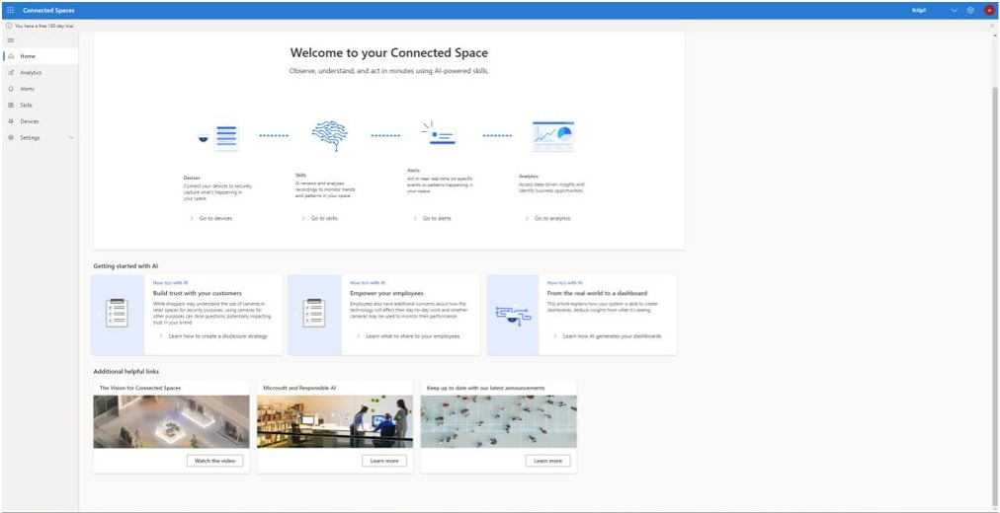

# Get started with the Dynamics 365 Connected Spaces Preview web app

You can use the Dynamics 365 Connected Spaces Preview web app to:

- [Connect cameras to your Azure Stack Edge Pro gateway](cameras-connect.md)

- [Add camera skills to collect data](cameras-add-skills.md)

- [Configure alerts]()

- [Get insights using the Analytics page](web-app-get-insights.md)

- Access setttings

The web app Home page provides links for all of the above tasks, which makes it easy to get started.

The Home page also provides links to videos and other helpful information for your customers and employees. 
