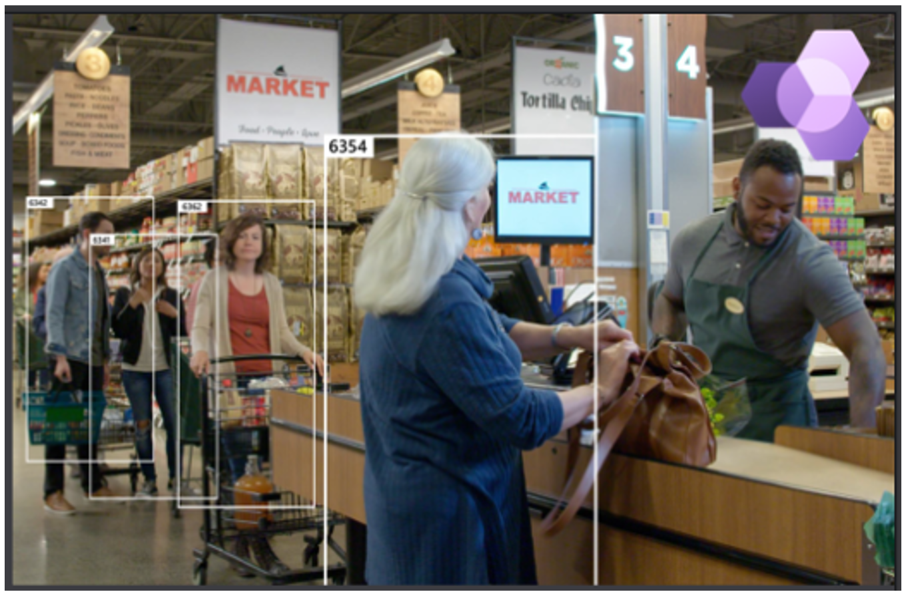

# Overview of Dynamics 365 Connected Store Preview

> [!VIDEO https://www.microsoft.com/en-us/videoplayer/embed/RE4GRQM]

Microsoft Dynamics 365 Connected Store Preview brings together computer vision and AI to help transform the retail store experience. By utilizing data from video cameras, Dynamics 365 Connected Store delivers real-time actionable recommendations that can make retail store operations more efficient and improve customer experiences. 

Dynamics 365 Connected Store enables you to:

- **React to environmental triggers.** Ensure that customer needs are met effectively and quickly by equipping store managers and employees with actionable alerts triggered by store activity, such as long checkout lines. Access to automated, sensor-driven reporting is standardized and available in-the-moment for immediate action.

- **Understand and optimize your space.** Take advantage of reports that inform you on the status of your space and the change that occurs within it. Optimize staffing and merchandising decisions using AI-driven insights around the shoppers visiting a store on any given day and time. Reports are accessible to employees, managers, and even stakeholders outside of the immediate environment, such as a regional store manager.

- **Empower long-term decision making.** Predict the ideal future behaviors as your environment status changes over time. Make your insights stronger with each passing day.

## Scenarios

The preview release enables the following scenarios to make retail store operations more efficient and improve customer experiences: 

- **Display effectiveness.** Create the real-world equivalent of the digital customer engagement funnel for promotions. This capability allows merchandisers and store managers to measure the effectiveness of promotions/displays within the store, tracking shopper footfall and engagement.  

- **Queue management.** Monitor queue wait time and queue lengths to improve shopper experience and provide informed insights for employee shift management. 

- **Shopper analytics.** Understand traffic patterns into and around the store to allow retailers to plan for shift management and inventory. 

Microsoft is committed to [responsible AI](https://www.microsoft.com/en-us/ai/responsible-ai?activetab=pivot1%3aprimaryr6). These scenarios are powered by an innovative computer vision technology for people counting and dwell time measurement without individual shoppers being identified.   

## Next step

[Learn how to get started with Dynamics 365 Connected Store Preview](get-started.md)

