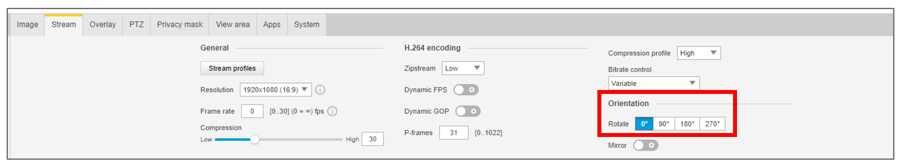
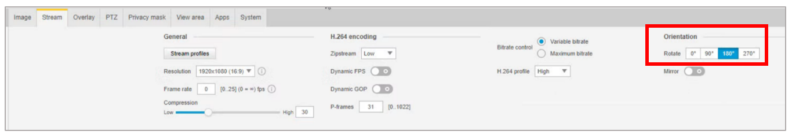
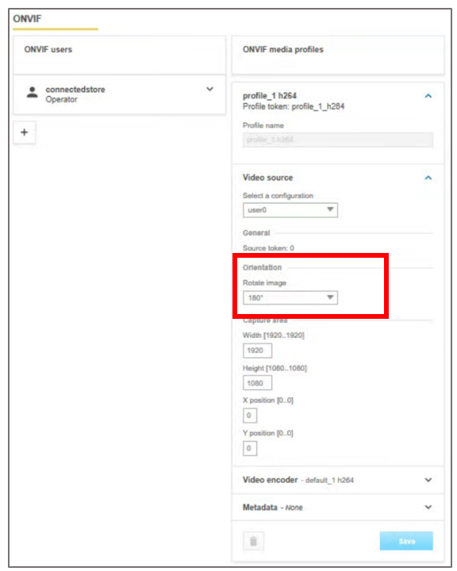

# Install a camera to use with Dynamics 365 Connected Store (public preview)

This article describes how to install and configure a Loss Prevention (LP) camera to use with Microsoft Dynamics 365 Connected Store (public preview).

## Supported cameras

Dynamics 365 Connected Store supports the following LP cameras:

- Axis:

   - M3045V (must have 9.60.1 or later firmware)
   
   - M5055 PTZ
   
   - M5065 PTZ
   
- Bosch:

   - NUC-51022-F2
   
- Lorex:

   - LNZ32P4B

> [!IMPORTANT]
> Lorex cameras are currently banned by the US government. We don’t recommend using these cameras unless they have already been installed in your environment.

## Install a camera	

Use the steps below in addition to your local standards and requirements for installing ethernet.

> [!NOTE]
> If you’re using Axis cameras, create your ONVIF user profile before installing the cameras.

1. Review the [camera placement checklist](camera-placement-checklist.md) to plan your installation.

2. To make camera installation easier, use tape to mark the camera locations on the floor.

3. Install the CAT5e/CAT6 Ethernet cabling. Route the cable from the server/switch location to the planned camera placement location.

    > [!NOTE] 
    > It's a good idea to leave a service loop of about 10 extra feet to enable camera movement, as necessary.
    
4.	Remove the camera from the packaging.

5.	Pre-configure the camera by setting up a temporary PoE switch, connecting your laptop to the switch, and then connecting the camera to the switch through an ethernet cable.

6.	Change the default username/password as instructed by the camera manufacturer documentation, to align with your corporate security guidelines.

    > [!NOTE] 
    > Make sure to set the date/time correctly, according to your local time zone.
  
7.	Mount the camera to the ceiling or drop structure (pole or truss structure used to lower the camera height) as outlined in the [camera height, angle, and focal-point recommendations](camera-placement-recommendations.md) article.

    > [!NOTE] 
    > For camera mounting, we recommend focusing the lens 0-degree position toward your point of interest when mounted (not the 180-degree position).
   
    
 
    If installed at 180 degrees, or moved later, ensure the ONVIF profile settings correspond to the camera lens position. 
   
    
 
    > [!NOTE]  
    > If the camera is positioned at 180 degrees, the ONVIF media profile should also specify 180.
   
    
 
When you’re finished mounting and setting up the camera per the manufacturer’s documentation, you’re ready to [install and configure Azure Stack Edge](ase-install.md).

## Next step

[Prepare your network and install Azure Stack Edge](ase-install.md)

