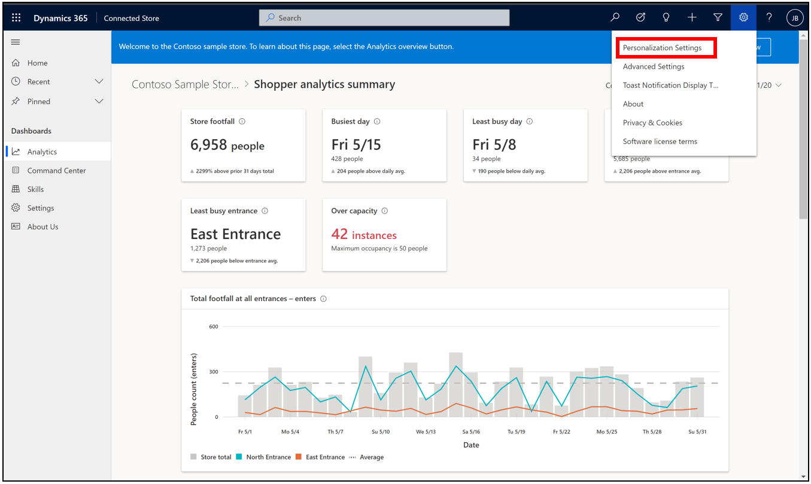
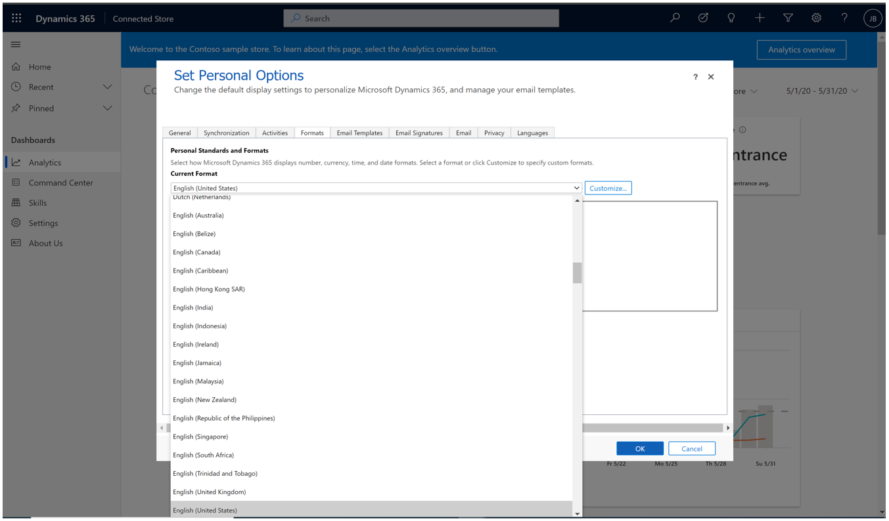
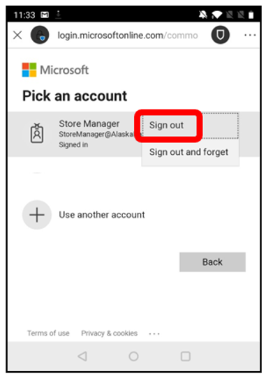
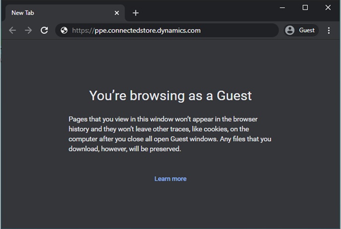
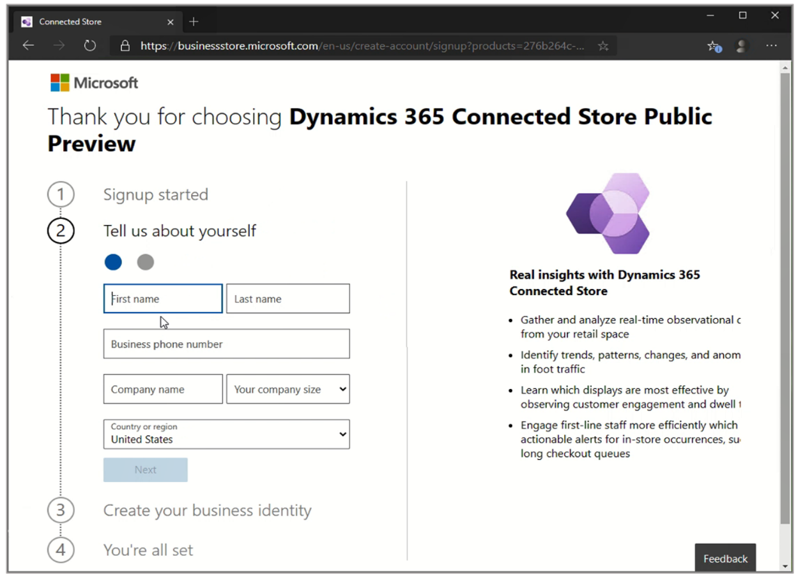
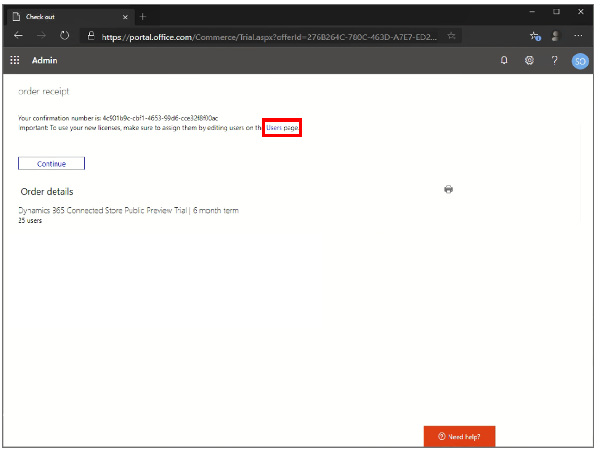

# Known issues with Microsoft Dynamics 365 Connected Store Preview

## I see blank pages in the web app

You must use a supported browser and the browser must have the most up-to-date version installed. Connected Store supports Chromium-based browsers (Chrome, Opera, and Edge), Firefox, and Safari. Internet Explorer is not supported. 

## Newly created store doesn’t appear in Store list

If you have a slow network connection, and if you create a store, the store may not immediately appear in the Store list. Select the **Refresh** button at the top of the page to update the Store list.

## In the Contoso sample store, hourly data breakdown in the Daily view is unavailable

If you select a single day to view, there will be a single data point. Higher granularity hourly data will be available in a future product update.

## Time/Date formatting in the web app **Analytics** page does not auto adjust based on region

To work around this:

1. Select the **Settings** button, and then select **Personalization Settings**.

    
    
2. Select the **Formats** tab, and then select the appropriate region from the **Current Format** list.

    
    
## The Power Automate flow for occupancy alerting will not run if you have reached the 20,000-action-per-day limit for a preview SKU

[Learn more about Power Automate limitations](/power-automate/limits-and-config#daily-limits).

## You can't delete stores, gateways, or cameras in the mobile app

Currently, stores, gateways, and cameras can't be deleted in the mobile app. Skills can be deleted, however once deleted, data cannot be recovered. If you're unsure about deleting a skill, you can make it inactive instead.

## Changing the time zone for a store only affects the data collected after making the change

If the time zone for a store is changed, it does not change the time zone for the data already collected. Future data collected for the store will be recorded using the new time zone.

## Issue signing in and out of the Android mobile app

If you sign out of the Android mobile app, to successfully sign in again using the same credentials you were previously signed in with, you have to select **Sign out**, and then enter your password again. 

## I see the following message when I install Connected Store: "It's taking longer than usual to validate your license. Please contact your administrator or sign up here."

If you see this message, the account that you used to sign in doesn't have a valid Connected Store license. This issue can occur when the browser automatically signs you in by using your work account. 

To work around this issue, start a new Guest browser session, and then [go to the Connected Store setup page](https://ppe.connectedstore.dynamics.com/). Sign in by using the account that you created when you signed up for Connected Store.

## You must activate Azure Stack Edge Pro (2 GPU) within 24 hours after the activation key is generated

After you receive your activation key, you have 24 hours to use it. If you try to use an activation key after 24 hours have passed, Azure Stack Edge Pro will be activated, but it won't be paired to the store in the mobile app.

To work around this issue, generate the activation key again to unblock the store/gateway pairing.

> [!NOTE]
> If you regenerate the activation key, you create a duplicate gateway that has the same name.

## After a gateway is activated and assigned to a store, the store information can't be changed

Store details can't be updated or edited after the store is connected to a gateway.

## A gateway can't support more than 10 skills

If you add more than 10 skills to a gateway, performance might become degraded because the number of people who are being tracked concurrently exceeds the performance threshold of Azure Stack Edge Pro. To add an additional skill, delete an existing skill, or make it inactive.

## To rename a camera in the mobile app, you must re-enter your ONVIF camera profile credentials

If you add more than 10 skills to a gateway, performance might become degraded because the number of people who are being tracked concurrently exceeds the performance threshold of Azure Stack Edge Pro. To add an additional skill, delete an existing skill, or make it inactive.

## A camera shows Disconnected status for all camera issues, including issues that are related to credentials, network connection, timing, or a missing profile

If sign-in fails for any reason, the camera will show **Disconnected** status. [Make sure that cameras are set up correctly](install-cameras.md).

## The sign-up form doesn't accept phone numbers that have a plus sign (+) prefix

The sign-up form for a new Azure Active Directory (Azure AD) account doesn't accept a business phone number that has a plus sign (+) prefix, such as `+44 1234 123456`. To work around this issue, enter the number without the prefix. For example, enter `44 1234 123456`.

## You receive an error when you select the Users link on the order receipt page

When you sign up for Connected Store by using an existing Azure AD tenant admin account, the **Users** link on the order receipt page might not work.

To work around this issue, select **Continue**, and then [install Connected Store](admin-install-web-app.md).

## See also

[Connected Store FAQ](faq.md)