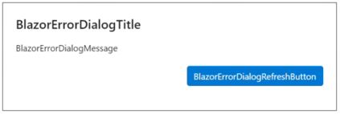
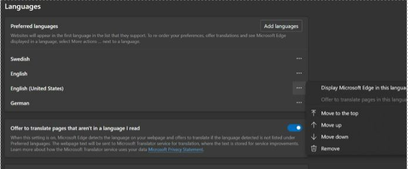

# Known issues with Microsoft Dynamics 365 Connected Spaces Preview

## Error message displayed on Settings page if browser is not set to English or German

If your browser's language setting is not set to English or German, when you go to the **Settings** page, you'll see the following error message. 

To work around this issue, update your brower's language setting to English or German. For example, this is what the language setting looks like in Microsoft Edge.

## When I connect a camera and configure a skill, screen items aren't rendering properly

The minimum resolution required for Dynamics 365 Connected Spaces Preview is 1024 x 1366. If you use a device that has a lower resolution (for example, a mobile phone), screen items (scroll bars and buttons, for example) may not render properly. Apple iPad Pro devices have a screen resolution of 1024 x 1366. 

## My company doesn't allow team members to sign up with a work email address

You may see the following message when you try to sign up for a free trial: "Your company doesn't allow team members to sign up with their work email." 

To complete the trial sign-up, [your Azure Active Directory administrator can assign you a special license so you can sign up for the trial](trial-signup-admin.md). 

## The Connected Spaces Preview app is running in the wrong geographic region

When using Connected Spaces Preview, make sure you're using the web app in the geographic region that your company's Azure Active Directory tenant and user accounts are in.

| Your Azure Active Directory account region | Connected Spaces Preview web app URL |
| --- | --- |
| United States | https://us.connectedspaces.dynamics.com/ |
| United Kingdom | https://uk.connectedspaces.dynamics.com/ |

Doing this will ensure that Connected Spaces will be able to process your customer data within your company's geographic region.

## Changing the time zone for a store only affects the data collected after making the change

If the time zone for a store is changed, it does not change the time zone for the data already collected. Future data collected for the store will be recorded using the new time zone.

