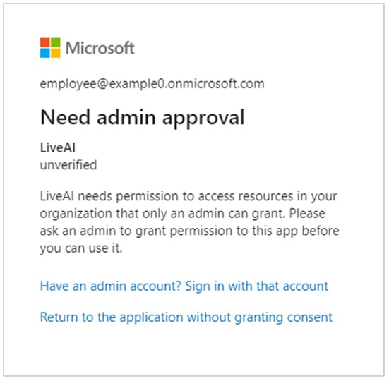
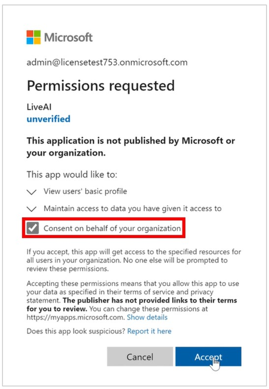
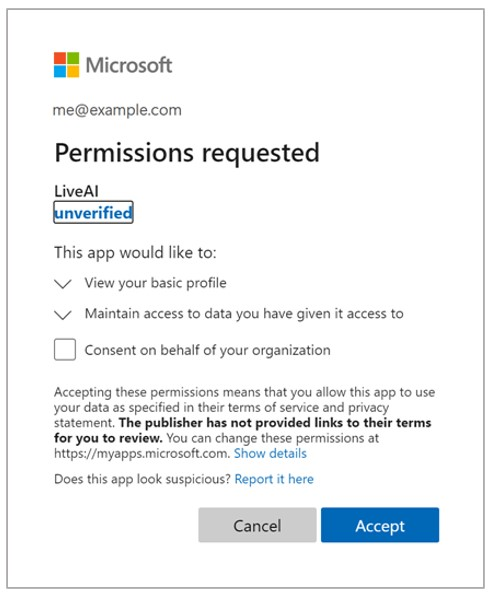
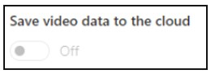

# Known issues with Microsoft Dynamics 365 Connected Spaces Preview

[!INCLUDE[banner](includes/banner.md)]

## Need admin approval when signing in to Connected Spaces for the first time

When signing in to the Connected Spaces web app for the first time, you might see a prompt explaining that you need admin approval.

To give permission to the Connected Spaces web app, sign up with a user account that has Azure Active Directory Global Administrator permissions (or have your admin sign in with those permissions). 

When you sign in to the Connected Spaces web app with the appropriate permissions, you'll see the **Permissions Requested** prompt.

Select **Consent on behalf of your organization**, and then select **Accept**.

The prompt will appear again. Select **Consent on behalf of your organization** again, and then select **Accept** again.

> [!NOTE]
> If you're an admin and you'd like to instead grant individual approval to each user that needs permissions, use [these instructions to configure the admin consent workflow](https://docs.microsoft.com/azure/active-directory/manage-apps/configure-admin-consent-workflow).

## I'm prompted to accept permissions multiple times when I start up the Connected Spaces web app

When signing in to Connected Spaces web app for the first time, this prompt might appear more than once:

If this happens, wait a few minutes for the permissions to be applied and then try to sign in again.

## I can’t turn the Save video data to the cloud setting to Off because the setting is disabled
 

If the **Save video data to the cloud** setting has been recently changed, it will be disabled for several days until our service has completed the requested change. Wait for a day or two and try again.

This setting may also be disabled if your user account doesn't have admin permissions for Dynamics 365 Connected Spaces Preview. To assign the admin role to your user account, contact your Azure Active Directory account administrator who has System Admin or Global Admin permissions, and then have them follow these steps:

1.	Sign in to the [Azure Active Directory Admin Center](https://aad.portal.azure.com/) (the account must have System Admin or Global Admin permissions).

2.	Select **Azure Active Directory**.

3.	Select **Enterprise applications**.

4.	Select the **LiveAI** name link to view the application with this Application Id: 762320d4-bb27-47f4-bb73-826007f397dc.

5.	Select **Users and groups**.

6.	Select **Add user/group**.

7.	Under **Users**, select **None Selected**. In the panel that opens:

    1.	Select the user name you want to enable.

    2.	Select **Select** to confirm your choice.

8.	Under **Select a role**, make sure “Administrators” is shown. If not, select **None Selected**, and then in the panel that opens:

    1.	Select **Administrators**.

    2.	Select **Select** to confirm your choice.

9.	Select **Assign** at the bottom of the page.

Now you can sign back in to the Connected Spaces web app with the newly enabled account. The option should be enabled.

## The Connected Spaces app is running in the wrong geographic region

When using Connected Spaces, make sure you're using the web app in the geographic region that your company's AAD tenant and user accounts are in.

| Your AAD account region | Connected Spaces web app URL |
| --- | --- |
| United States | https://us.ppe.connectedspaces.dynamics.com/ |
| United Kingdom | https://uk.ppe.connectedspaces.dynamics.com/ |

Doing this will ensure that Connected Spaces will be able to process your customer data within your company's geographic region.

## Changing the time zone for a store only affects the data collected after making the change

If the time zone for a store is changed, it does not change the time zone for the data already collected. Future data collected for the store will be recorded using the new time zone.

