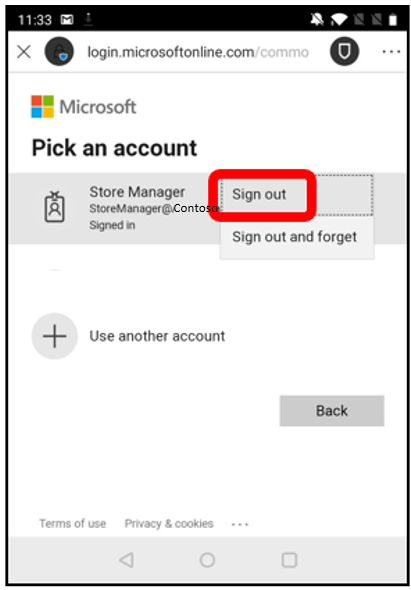

# Known issues with Dynamics 365 Connected Store

## You can't delete stores, gateways, or cameras in the mobile app

Currently, stores, gateways, and cameras can't be deleted in the mobile app. Skills can be deleted, however once deleted, data cannot be recovered. If you're unsure about deleting a skill, you can make it inactive instead.

## Changing the time zone for a store only affects the data collected after making the change

If the time zone for a store is changed, it does not change the time zone for the data already collected. Future data collected for the store will be recorded using the new time zone.

## Issue signing in and out of the Android mobile app

If you sign out of the Android mobile app, to successfully sign in again using the same credentials you were previously signed in with, you have to select **Sign out**, and then enter your password again. 

## You must activate Azure Stack Edge within 24 hours after the activation key is generated

After you receive your activation key, you have 24 hours to use it. If you try to use an activation key after 24 hours have passed, Microsoft Azure Stack Edge will be activated, but it won't be paired to the store in the mobile app.

To work around this issue, generate the activation key again to unblock the store/gateway pairing.

> [!NOTE]
> If you regenerate the activation key, you create a duplicate gateway that has the same name.

## After a gateway is activated and assigned to a store, the store information can't be changed

Store details can't be updated or edited after the store is connected to a gateway.

## A gateway can't support more than 10 skills

If you add more than 10 skills to a gateway, performance might become degraded because the number of people who are being tracked concurrently exceeds the performance threshold of Azure Stack Edge. To add an additional skill, delete an existing skill, or make it inactive.

## A camera shows Disconnected status for all camera issues, including issues that are related to credentials, network connection, timing, or a missing profile

If sign-in fails for any reason, the camera will show **Disconnected** status. [Make sure that cameras are set up correctly](install-cameras.md).

## The sign-up form doesn't accept phone numbers that have a plus sign (+) prefix

The sign-up form for a new Azure Active Directory (Azure AD) account doesn't accept a business phone number that has a plus sign (+) prefix, such as `+44 1234 123456`. To work around this issue, enter the number without the prefix. For example, enter `44 1234 123456`.

## You receive an error when you select the Users link on the order receipt page

When you sign up for Connected Store by using an existing Azure AD tenant admin account, the **Users** link on the order receipt page might not work.

To work around this issue, select **Continue**, and then [install Connected Store](admin-install-web-app.md).

## If you change the environment URL for your Microsoft Power Platform environment, the flow of data from Connected Store is broken

If you change the environment URL for your Microsoft Power Platform environment (for example, to make the URL easier to remember), you will break the connection to Connected Store. After 24 hours, the original URL will expire, and the mobile app will fail to connect. Additionally, new data won't appear in the Connected Store web app reports.

If this issue occurs, sign in to the [Connected Store Setup page](https://ppe.connectedstore.dynamics.com/) to trigger a connection update. The Connected Store service will start to use the new URL within an hour.

