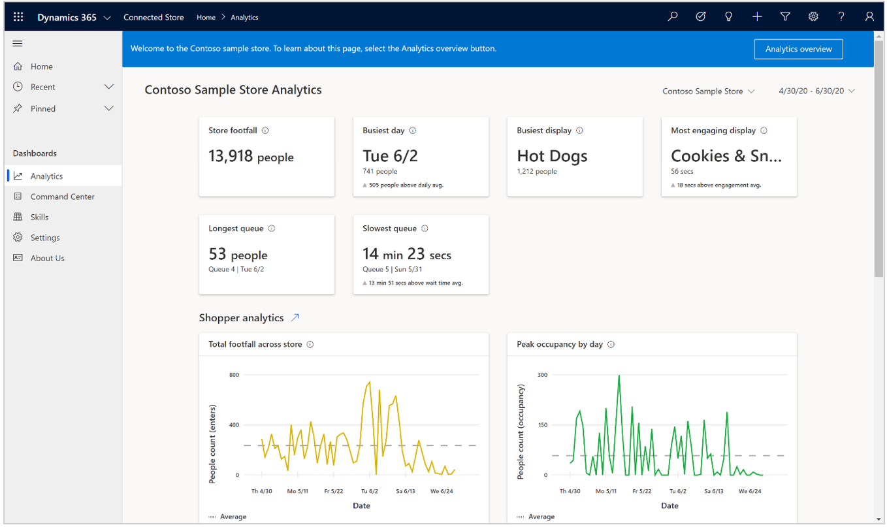
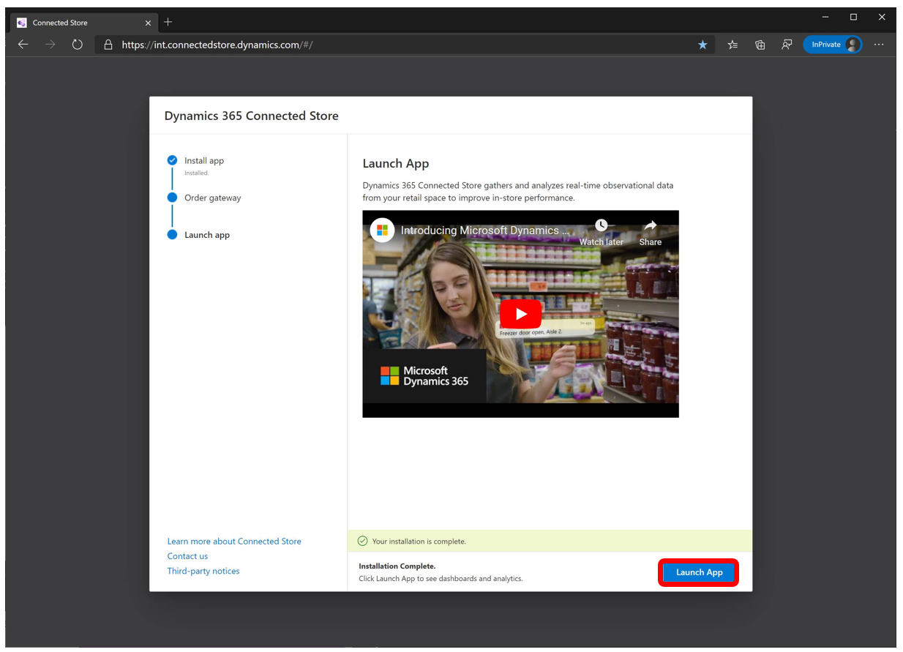
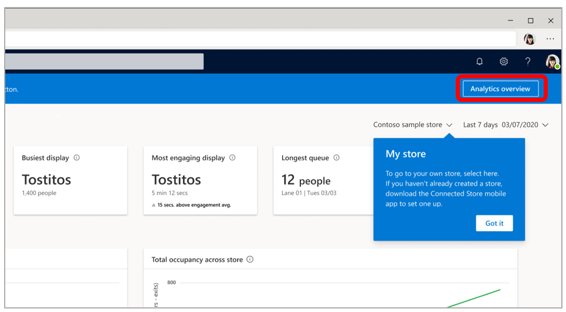
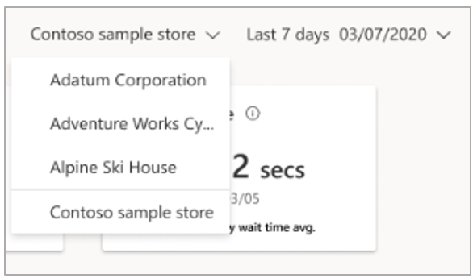
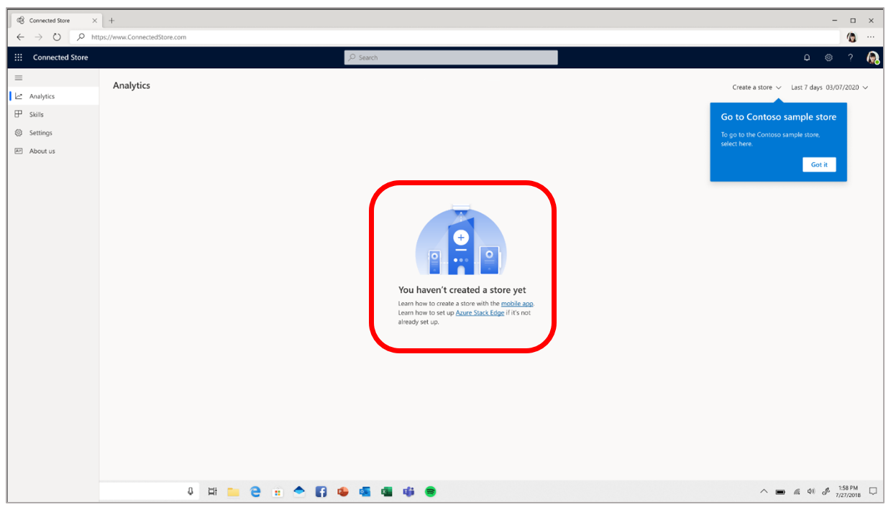
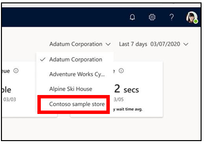

# Launch the Dynamics 365 Connected Store Preview web app and explore the Contoso sample store

After you have [installed the Microsoft Dynamics 365 Connected Store Preview web app](admin-install-web-app.md), you can launch the app and start familiarizing yourself with the Connected Store dashboards and analytics by exploring the Contoso sample store. You can switch back and forth between the Contoso sample store and your own store as you explore the different dashboards that provide insights into your store's performance. 

## Launch the web app and explore the Contoso sample store

1. Select **Launch App**.

     
        
2. In the **Welcome to Connected Store** page, select **Go to sample store**.

    
    
    This opens the Contoso sample store.     
       
## Overview of the Contoso sample store

When you open the Contoso sample store, you'll see the **Analytics** page, which is one of several dashboards included in Connected Store. 

To learn about the **Analytics** page and other dashboards in Connected Store, select the **Analytics overview** button in the upper-right corner of the page.

To switch from the Contoso sample store to your own store, select the down arrow next to **Contoso sample store**, and then select your store from the list. 

> [!NOTE]
> Your store won't appear in the list if you haven't already [set up the Azure Stack Edge Pro (2 GPU) gateway](ase-install.md) (required for installing cameras) and [created a store with the Connected Store mobile app](mobile-app-create-store.md). If you select **My store** in the list, you'll see the following 
page with links to articles that can help you with these tasks. 

To go back to the Contoso sample store from your store page, select the down arrow next to your store name, and then select **Contoso sample store** from the 
list.

> [!NOTE]
> The Contoso sample store includes data from 4/20/2020 through 6/30/2020, UTC. If you choose a custom time range, you won't see any data outside of this time range.

## Next steps

[Learn how to set up the Azure Stack Edge Pro gateway](ase-install.md) 
[Create a store with the mobile app](mobile-app-create-store.md) 
[Learn about the Analytics page](web-app-get-insights.md)

