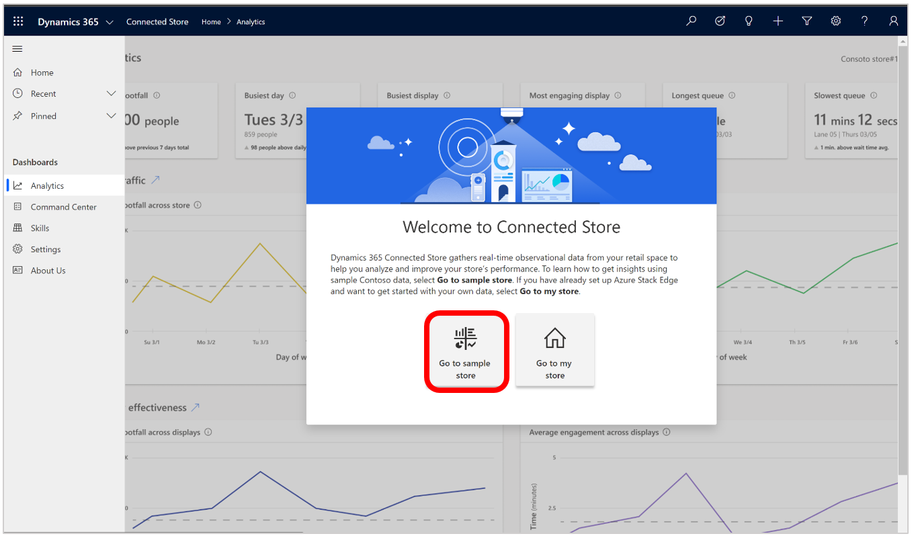

# Launch the Dynamics 365 Connected Store app and explore the Contoso Sample Store

After you have [installed the Microsoft Dynamics 365 Connected Store web app](admin-install-web-app.md), you can launch the app and start familiarizing yourself with the Connected Store dashboards and analytics by exploring the Contoso Sample Store. You can switch back and forth between the Contoso Sample Store and your own store as you explore the different dashboards that provide insights into your store's performance. 

## Launch the web app and explore the Contoso Sample Store

1. Select **Launch App**.

    

2. In the next screen, select **Get started**.

           
        
3. In the **Welcome to Connected Store** page, select **Go to sample store**.

    
    
    This opens the Contoso Sample Store.     
       
## Overview of the Contoso Sample Store

The Contoso Sample Store opens to the **Analytics** page, which is one of several dashboards included in Connected Store. 

To learn about the **Analytics** page and
other dashboards in Connected Store, select the **Analytics overview** button in the upper-right corner.

To switch from the Contoso Sample Store to your own store, select the down arrow next to **Contoso sample store**, and then select your store from the list. 

This assumes you have already [set up the Azure Stack Edge gateway](ase-install.md) (required for installing cameras) and [create a store with the 
Connected Store mobile app](mobile-app-create-store.md).

If you haven't already set up Azure Stack Edge or created a store using the Connected Store mobile app, select **My store** in the list. You'll see the following 
page with links to articles that can help you with these tasks. 

To go back to the Contoso Sample Store from your store page, select the down arrow next to your store name, and then select **Contoso sample store** from the 
list.

## What's next?

[Learn how to set up the Azure Stack Edge gateway](ase-install.md) 
[Create a store with the mobile app](mobile-app-create-store.md) 
[Learn about the Analytics page](web-app-get-insights.md)

