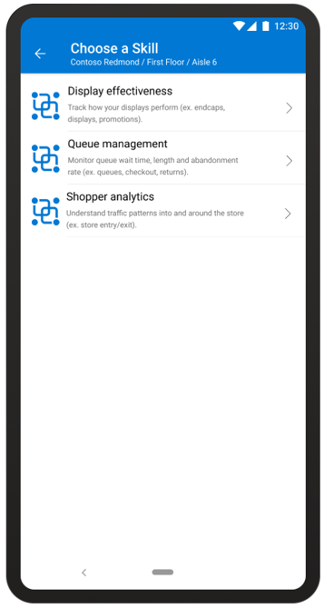
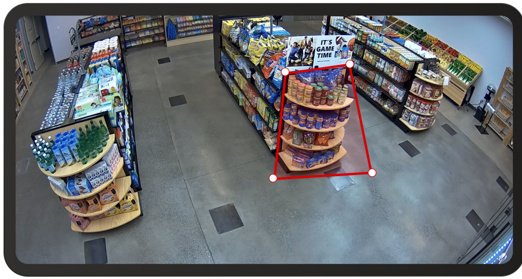

# Add camera skill zones to a store by using the Dynamics 365 Connected Store (public preview) mobile app

You can use customizable skill zones in Microsoft Dynamics 365 Connected Store (public preview) to have your camera collect physical data based on the needs of your store. 

You can use the mobile app to set up custom zones with one of three available skills:

|Skill|Description|Examples|
|-------------------------|-------------------------------------------------|-------------------------------------------------|
|**Display effectiveness**|	Track how your displays perform	|End caps, displays, promotions|
|**Queue management**| 	Monitor queue wait time, length, and abandonment rate|	Queues, checkouts, returns|
|**Shopper analytics**|	Understand traffic patterns into and around the store|	Store entry/exit|

You can add one skill zone per camera view, with a limit of 10 zones per gateway device for the public preview. Your skill zones can have custom names and shapes (limited to four sides).

> [!NOTE]
> Skill zones don’t change what your camera sees at any time. After you create a skill zone, the camera will continue to see the entire field of view but will only track and collect data from the zones that you add. You can add or update your skill zones at any time using the mobile app.

## Create a skill zone

1.	On the **Cameras** page, select the camera you want to add a skill zone to by tapping it, and then tap the + button.

    
 
2.	Select one of the three available skills.

    
 
    The zone is added to the Zone list. It shows the skill zone name, type of skill zone, and whether it’s active or not.

3.	Rotate your phone to Landscape mode so you have a larger screen to work with. (You may need to change your screen rotation setting to allow Landscape mode.)    
 
4.	Do the following, depending on the type of skill zone you want to add:

    - If you're adding a **Shopper analytics** skill zone, move and extend the line to align with your store entrance. Select **Flip Direction** to make sure that blue points to the entrance and white points to the exit. This is important for data analytics to work correctly. If you need to start over at any point, select **Reset**.
    
    
    
    - If you're adding a **Display effectiveness** or **Queue management** skill zone, tap and drag the zone endpoints to resize the zone and move it where you want it to go. If you need to start over at any point, select **Reset**.
    
    

5.	When you’re done, tap **Done** at the bottom of the screen. When you see a pop-up message saying that your zone as been set, select **Continue**.

6.	In the next screen, make any changes to the fields to customize the skill for your store’s needs.

    
 
    The fields change depending on which skill you choose in step 2. The following table describes the fields for each skill zone.

    |Field|	Description|	Applies to (skills)|
    |----------------|------------------------------------------------|-------------------------------------------------------|
    |**Zone Name**|Give your zone a name to easily identify it in the dashboard (for example, Holiday promotion).|- Display effectiveness - Queue management - Shopper analytics|
    |**Active Date Range**|Set the time frame for collecting data in the selected zone.  For the Display effectiveness skill, this is especially useful for zones where the physical location of the zone may not change but the product changes.|- Display effectiveness - Queue management - Shopper analytics|
    |**Engagement Threshold**|Set a dwell time threshold over which you consider people engaged in the zone.|- Display effectiveness|
    |**Direction Names**|Personalize the names of the sides of your zone to give context to the people count data.|- Display effectiveness - Queue management - Shopper analytics|
    |**People Count**|The number of people crossing into and/or out of a zone.|- Display effectiveness - Queue management - Shopper analytics|
    |**Dwell Time**|The average time spent by people in a selected zone.|- Display effectiveness|
    |**Direction**|Associates people count with the direction name of a zone side.|- Display effectiveness - Queue management - Shopper analytics|
    |**Direction Names**|Personalize the names of the sides of your zone to give context to the people count data.|- Shopper analytics|

7.	When you’re finished editing the skills, tap the check mark in the upper-right corner of the page.

    > [!TIP]
    > You can edit skills details or zone placement anytime by tapping the **Actions** button for the zone you want to update.
    
    
 
## Tips for drawing skill zones

Remember that every store is different; you’ll need to update the position or size depending on your needs.

If you want to see a specific section of your camera view, create a small, selective zone for it. This increases the accuracy of the data collected and prevents false positives from areas you don’t want to track. Be careful placing the corners of your polygon to make sure they’re not outside the area you want to track.
 
### Example of a well-shaped Display effectiveness skill zone

This zone is small, focused on the area of interest, and doesn't overlap with the end cap:

 
### Example of a Display effectiveness skill zone that isn’t well-shaped

The corners of this zone will capture data from the side aisles instead of the focus area—the display.

 
> [!TIP]
> For Display effectiveness zones, make sure to extend the zone at least three feet (one meter) in front of the areas of interest.

## Sort the Skills list

If you have a lot of skills on your camera, you might want to sort the list to find the skill you're looking for. 

To sort the Skills list:

- Select the **Sort**  button at the top of the skills page.

## Next step

[Get insights with the web app](web-app-get-insights.md)
