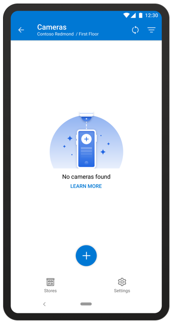
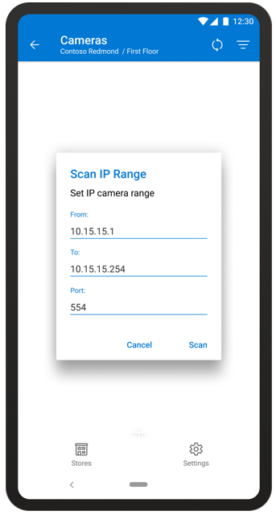
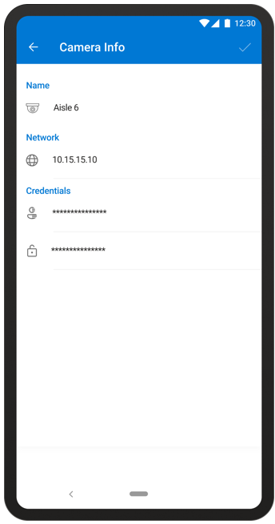

# Connect a camera to a gateway in the Dynamics 365 Connected Store (public preview) mobile app

After you've paired a gateway to your store in the Microsoft Dynamics 365 Connected Store (public preview) mobile app, you can connect your cameras to the gateway. Keep in mind that cameras are connected to a specific gateway. You won’t be able to find or add a camera if it isn’t available on the gateway network. You can connect any Connected-Store-approved camera on the same network as your gateway.

If your store has multiple gateways, you’ll need to access them one by one to see all the connected or available cameras. You can pair up to 10 cameras per gateway. If you need more cameras for your store, contact your account manager to request an additional gateway.

If you haven't already installed your cameras, see: 

- [Checklist for placing cameras](camera-placement-checklist.md)

- [Install your cameras](install-cameras.md)

## Connect a camera to a gateway

1. On the **Gateways** page, tap the gateway you want to add a camera to. This opens the **Cameras** page.   

2. On the **Cameras** page, tap the **+** button. 

    
    
2. To get the list of available cameras, enter the starting and ending IP addresses, and the RTSP port that the network is connected to. For more information on IP range and port, see [Prepare your network for Azure Stack Edge](ase-install.md).

    
 
3. Select an available camera, and then tap the **+** sign  next to it. (You’ll see the camera feed after you sign in).

   > [!TIP]
   > To add multiple cameras that use the same sign-in credentials, tap a camera image, tap the button to the left of each camera you want to add, and then tap the **+** button in the upper-right corner of the page.
    
    
 
4.	Enter the current username and password for the camera (supplied by your IT administrator), and then select **Apply** (or **Apply All** if you selected multiple cameras).
 
    
    
After connecting a camera to a gateway, you can [add a camera skill zone](mobile-app-add-camera-skill-zones.md).

## Get more information about a camera

On the **Cameras** page, you can get quick information about the camera from the Camera View list. For example, you can see the name of the camera, the IP address, a still image, the date the image was last updated, and whether the camera is connected or not. To get more information about a camera, including the camera description, camera credentials, network properties, firmware, and device model:

1. On the **Cameras** page, tap the **Actions** button.

2. Tap **Info** at the bottom of the page.

    
 
3. Review and/or edit the information.

    
 
    The following table describes each field:

    |Field|Description|
    |-------------------|----------------------------------------------------|
    |**Name**|The friendly name of the camera|
    |**Network**|The IP Address and MAC Address. For more information, see [prepare your network and install Azure Stack Edge](ase-install.md).|
    |**Credentials**|The username and password for the camera|

4.	When you’re finished, select the check mark in the upper-right corner of the page to go back to the **Cameras** page.

## Sort the Cameras list

If you have a lot of cameras in your Cameras list, you might want to sort the list to find the camera you're looking for. 

To sort the Cameras list:

- Select the **Sort**  button at the top of the **Cameras** page.
 
## Next step

[Add camera skill zones](mobile-app-add-camera-skill-zones.md)

