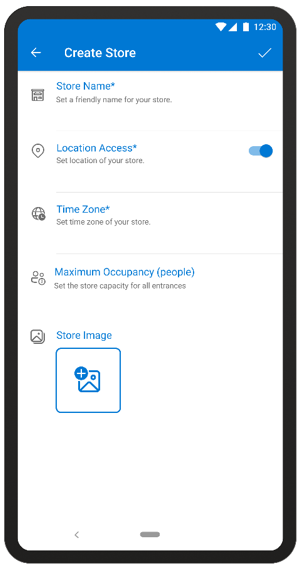
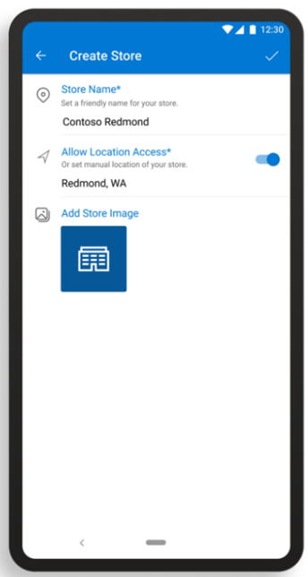
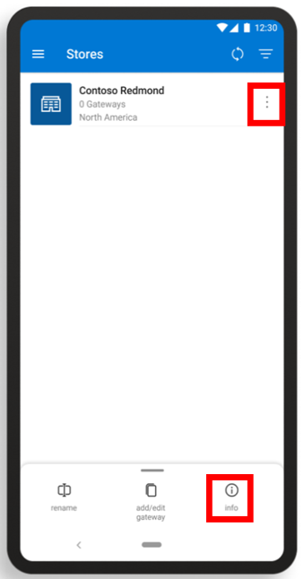
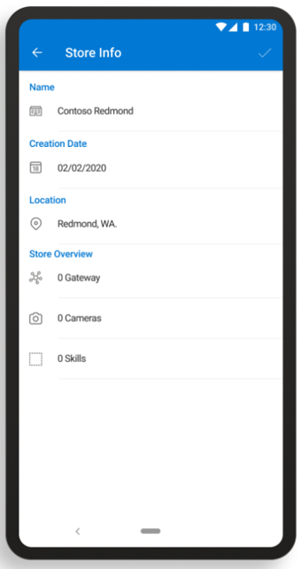
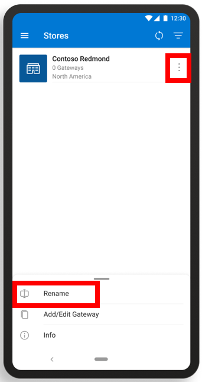

# Create a store with the Dynamics 365 Connected Store (public preview) mobile app

After you [prepare your network and install Azure Stack Edge Pro (2 GPU)](ase-install.md), you’re ready to create a store with the 
Microsoft Dynamics 365 Connected Store (public preview) mobile app. 

>[!NOTE]
>[Download the mobile app if you haven't already](mobile-app-download.md).

## Create a store

1. On the **Stores** page, tap the **+** sign.

     
  
2. On the **Create Store** page:

   a. In the **Store Name** field, enter a friendly name for the store.

   b. In the **Location Access** field, move the slider to the On position if you want to detect the location from your 
mobile device. You can also enter your location manually, but make sure to enter the information carefully since this field doesn't autofill.

   c. In the **Time Zone** field, set the time zone for your store.
   
   > [!NOTE]
   > You can also set the time zone through the **Settings** command in the web app. 

   d. In the **Maximum Occupancy** field, set the total store capacity (number of people) across all entrances for total visitors at one time.

   e. Tap the **Store Image** field, and then do one of the following:

      - Select a photo from your phone files.

      - Take a picture with your phone camera.
    
   
 
3. When you’re done, tap the check mark in the upper-right corner of the page.

    On the **Stores** page, you’ll see your new store in the Stores list. The Stores list shows at a glance the name of the store, 
    how many gateways are set up for the store, and the store location.
    
    
    
If this is the first store that you're creating a store in the mobile app, the next step is to learn how to [pair a gateway](mobile-app-pair-gateway.md) so you can add cameras and camera skill zones.
    
 ## Get more information about a store
 
In the Stores list, you can see at a glance how many gateways each store has and the location of the store. To get more information 
about a store, use this procedure.

1. Tap the **Actions** button in the upper-right corner of the page.

2. Tap **Info** at the bottom of the page.

    
 
3. Review the info. 

    
    
    The following table describes each field:

    |Field|Description|
    |----------------------|--------------------------------------------|
    |**Store Name**|The friendly name of the store|
    |**Allow Location Access**|Allow your device to determine your location|
    |**Set Time Zone**|Set the time zone for the store|
    |**Maximum Occupancy**|Set the total store capacity across all store entrances|
    |**Add Store Image**|Select a photo from your files or take a picture with your phone camera|

4. When you’re finished, tap the check mark in the upper-right corner of the page to go back to the **Stores** page.

## Rename a store

1. Tap the **Actions** button in the upper-right corner of the page.

2. Tap **Rename** at the bottom of the page.

    
    
## Sort the Stores list

If you have a lot of stores in your Stores list, you might want to sort the list to find the store you're looking for. 

To sort the Stores list:

- Select the **Sort**  button at the top of the **Stores** page.

 
## Next steps

[Pair a gateway](mobile-app-pair-gateway.md)

[Connect cameras to the gateway](mobile-app-add-cameras.md)

[Add camera skill zones](mobile-app-add-camera-skill-zones.md)
 
