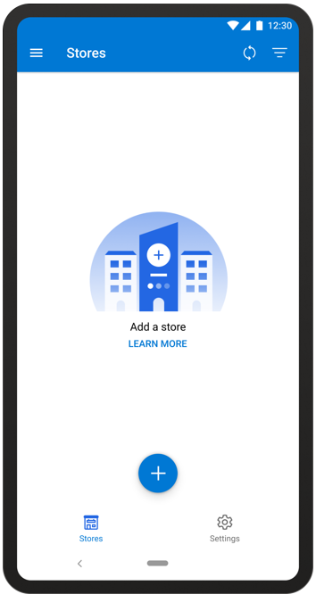
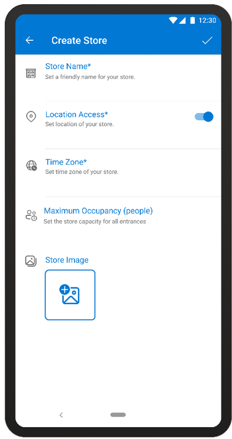
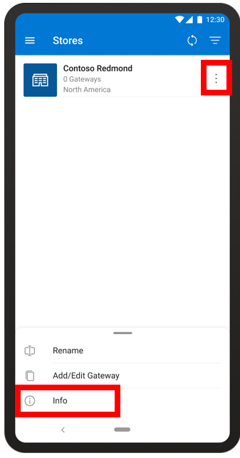
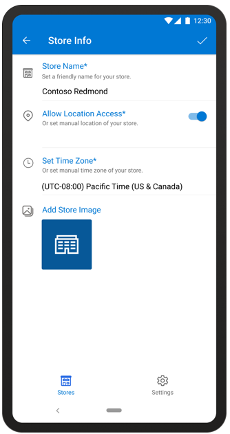
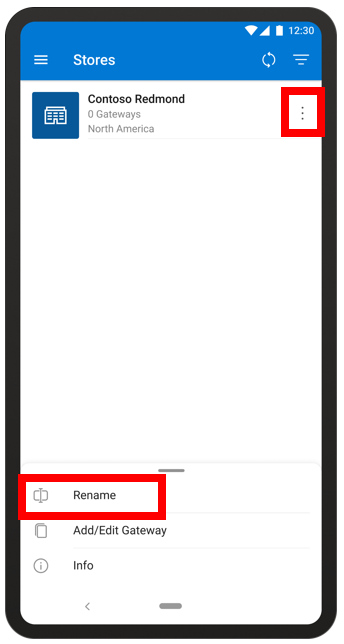

# Create a store with the Dynamics 365 Connected Store (public preview) mobile app

After you [prepare your network and install Azure Stack Edge](ase-install.md), you’re ready to create a store with the 
Microsoft Dynamics 365 Connected Store (public preview) mobile app. 

## Create a store

1. On the **Stores** page, tap the **+** sign.

     
  
2. On the **Create Store** page:

   a. In the **Store Name** field, enter a friendly name for the store.

   b. In the **Allow Location Access** field, move the slide to the On position if you would like to detect the location from your 
mobile device.

   c. Tap the **Add Store Image** field, and then do one of the following:

      - Select a photo from your phone files.

      - Take a picture with your phone camera.
    
   
 
3. When you’re done, tap the check mark in the upper-right corner of the page.

    On the **Stores** page, you’ll see your new store in the Stores list. The Stores list shows at a glance the name of the store, 
    how many gateways are set up for the store, and the store location.
    
    
    
If this is the first store that you're creating in the mobile app, the next step is to learn how to [pair a gateway](mobile-app-pair-gateway.md) so you can add cameras and camera skill zones.
    
 ## Get more information about a store
 
In the Stores list, you can see at a glance how many gateways each store has and the location of the store. To get more information 
about a store, including the creation date, number of cameras, and zones:

1. Tap the **Actions** button in the upper-right corner of the page.

2. Tap **Info** at the bottom of the page.

    
 
3. Review and/or edit the info. 

    
    
    The following table describes each field and specifies whether the field is editable from the **Store Info** page:

    |Field|Description|Editable?|
    |----------------------|--------------------------------------------|--------|
    |**Name**|The friendly name of the store|Yes|
    |**Creation Date**|The date the store was added to the app|No|
    |**Location**|The location of the store|Yes|
    |**Store Overview**|The number of available gateways, cameras, and skill zones installed in the store.  Learn more about: - [Gateways](mobile-app-pair-gateway.md) - [Cameras](mobile-app-add-cameras.md) - [Skill zones](mobile-app-add-skill.md)|No|

4. When you’re finished, tap the check mark in the upper-right corner of the page to go back to the **Stores** page.

## Rename a store

1. Tap the **Actions** button in the upper-right corner of the page.

2. Tap **Rename** at the bottom of the page.

    
    
## Sort or filter the Stores list

If you have a lot of stores in your Stores list, you might want to sort or filter the list to find the store you're looking for. 

To sort or filter the Stores list:

- Select the **Filter**  button at the top of the **Stores** page.

 
## What's next?

[Pair a gateway](mobile-app-pair-gateway)

[Connect cameras to the gateway](mobile-app-add-cameras.md)

[Add camera skill zones](mobile-app-add-camera-skill-zones.md)
 
