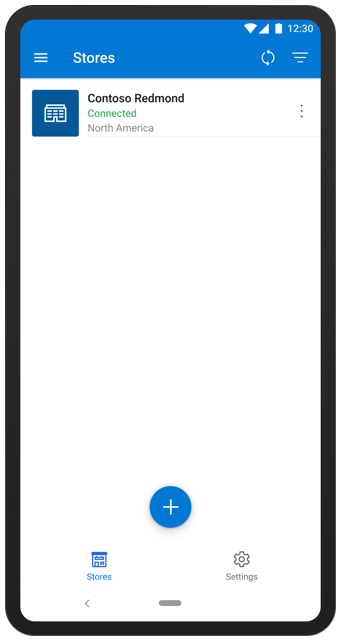
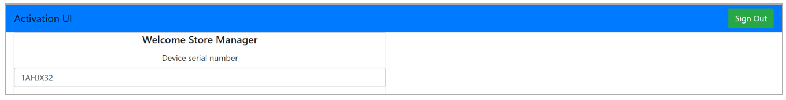
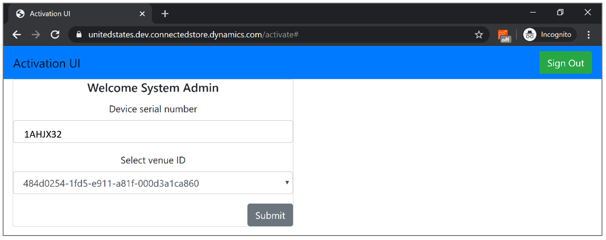
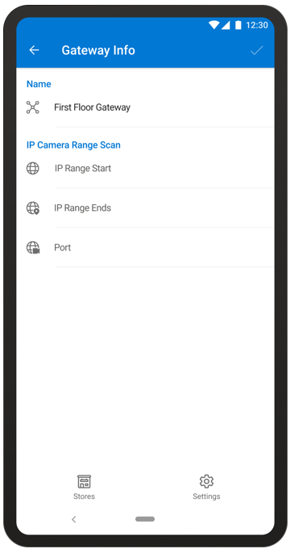

# Pair a gateway with the Dynamics 365 Connected Store (public preview) mobile app

Before you can pair a gateway with the Microsoft Dynamics 365 Connected Store (public preview) mobile app, you need to:

1. [Install Azure Stack Edge](ase-install.md).

2. [Connect Azure Stack Edge to your network](ase-connect.md).

3. [Create a store with the mobile app](mobile-app-create-store.md).

## Pair a gateway

To complete this procedure, you'll use the mobile app and your laptop, which should be connected to Azure Stack Edge as described in [Connect Azure Stack Edge to your network](ase-connect.md).

1.	On the **Stores** page, tap a store in the Stores list. 

    
    
    This opens the **Gateways** page. 
 
2.	Tap the **+** sign at the bottom of the **Gateways** page.

    

3.	Select the gateway you want to pair with, and then tap the **Add** button next to it. You’ll see the following message: 

    “Go to aka.ms/ConnectedStore on your laptop and enter the following <serial number> to get the activation key of your gateway.”

    

4.	Enter **aka.ms/activategateway** into your laptop web browser that’s connected to the gateway, and then select **Sign in**.

    
 
5.	Enter your Dynamics 365 Connected Store credentials.

    
 
6.	Enter the serial number from the mobile app.
 
    
 
7.	Select the venue ID you created earlier in the mobile app, and then select **Submit**.

    
 
8.	When the activation key is ready, copy the key (use **Copy to clipboard** to copy the full key), paste it into the **Activation** key field in the **Activate** pane, and then select **Activate**.

    
 
    The activation process can take from one to ten minutes. When the device is activated, a notification will appear on your laptop to inform you that activation is complete. The Dynamics 365 Connected Store modules will begin downloading on the gateway. This can take up to 60 minutes. You’ll see a notification in the mobile app when downloading is complete.

    
 
    After Azure Stack Edge is connected, you can [connect your cameras](mobile-app-add-cameras.md) and [add camera skill zones](mobile-app-add-camera-skill-zones.md). 

## Get more information about a gateway created in the mobile app

In the Gateway list on the **Gateways** page, you can see the name, IP address, and status of the gateway at a glance. To get more information about the gateway, including network properties, firmware, and the device model:

1.	On the **Gateways** page, tap the **Actions** button, and then tap **Info** at the bottom of the screen.

    
 
2.	Review the info.

    
 
    > [!IMPORTANT]
    > The gateways paired to your store can’t be shared between the different stores of your organization. To pair an available gateway, contact your account admin.
   
    The following table describes each field and specifies whether the field is editable from the **Gateway Info** page:

    |Field|Description|
    |--------------|------------------------------------------------------------|
    |**Name**|The friendly name of the gateway|
    |**IP Camera Range Scan**|- The **IP Start Range** and the **IP End Range** show the IP address range secured [when your network was prepared for Azure Stack Edge](ase-install.md)  - The **Port** field shows which Port your network is connected to.|
       
4.	When you’re finished, select the check mark in the upper-right corner of the screen.
  
## Sort the Gateways list

If you have a lot of gateways in your Gateways list, you might want to sort the list to find the gateway you're looking for. 

To sort the Gateways list:

- Select the **Sort**  button at the top of the **Gateways** page.

## What's next?

[Connect cameras to the gateway](mobile-app-add-cameras.md)

[Add camera skill zones](mobile-app-add-camera-skill-zones.md)
