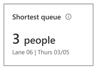
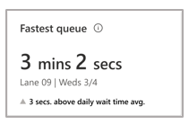

# View the Queue management details page in the Dynamics 365 Connected Store Preview web app

You can use the [**Analytics** page](web-app-get-insights.md) in the Microsoft Dynamics 365 Connected Store Preview web app to get insights on your retail store. The **Analytics** page includes insights for the Shopper analytics, Display effectiveness, and Queue management camera skill zones. This article focuses on the details page for the Queue management skill zone, which is available from the [Queue management summary page](queue-management-summary-page.md). 

## View the Queue management details page

To see the details for a specific queue, select the desired queue in the **All queues** table at the bottom of the [Queue management summary page](queue-management-summary-page.md).

The **All queues** table contains a sortable list of all Queue management zones by name, longest and shortest queue value, and fastest and slowest queue time for the selected time range. Sort the list by selecting a single column heading. You can also filter each metric for a specific value by using the **Filter** button next to each column heading.

To see details for a specific Queue management zone, select the desired queue name at the bottom of the page.

## Queue management details page

On the **Queue management details** page, you can use the cards and graphs to understand the rhythm and flow of a specific Queue management zone.

## Highlights banner

The banner at the top of the page highlights the key takeaways and comparisons for the specific queue. The **Store entries** card is carried over from the [**Analytics page**](web-app-get-insights.md). 

**Longest queue.** This card highlights the value for the greatest number of people who occupied the specific Queue management zone, along with the date when it occurred, for the selected time frame.

**Shortest queue.** This card highlights the value for the least number of people who occupied the specific Queue management zone, along with the date when it occurred, for the selected time frame.

**Slowest queue.** This card highlights the maximum wait (dwell) time for the specific Queue management zone during the selected time frame, along with the date on which the value was observed. 

The subscript describes the absolute change in this value for the current time frame compared to average wait (dwell) time for the specific Queue management zone during the selected time frame. The triangle to the left of the subscript indicates whether the change was positive or negative.

**Fastest queue.** This card highlights the shortest average wait time for people for the specific Queue management zone, along with the date on which the value was observed.

## Graphs

The **Longest queue at [Queue x] by day** and **Average wait time at [Queue x] by day** graphs appear at the bottom of the page.

**Longest queue at [Queue x] by day.** This graph shows the people count trend data for the specific Queue management zone that received the greatest number of entries for each timepoint (hour, day) during the selected time frame.

**Average wait time at [Queue x] by day.** This graph shows the average wait (dwell) time trend data for the specific Queue management zone during the selected time frame.

To see data values for timepoint, hover over the graph. 

## Next steps

Learn about these web app pages:

[Analytics page](web-app-get-insights.md) 
[Shopper analytics summary page](shopper-analytics-summary-page.md) 
[Display effectiveness summary page](display-effectiveness-summary-page.md) 
[Display effectiveness details page](display-effectiveness-details-page.md) 
[Queue management summary page](queue-management-summary-page.md) 
