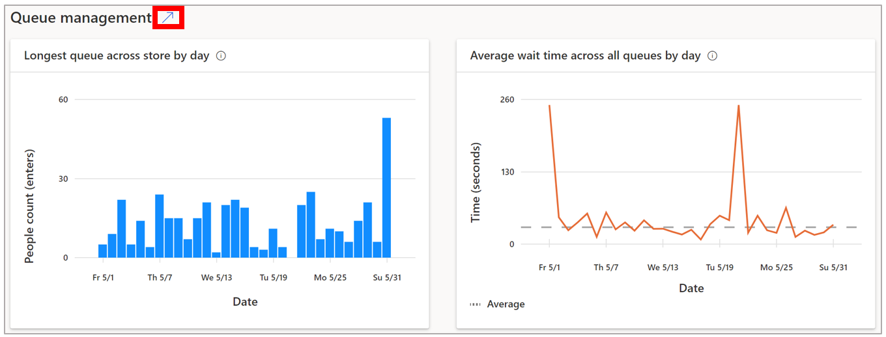
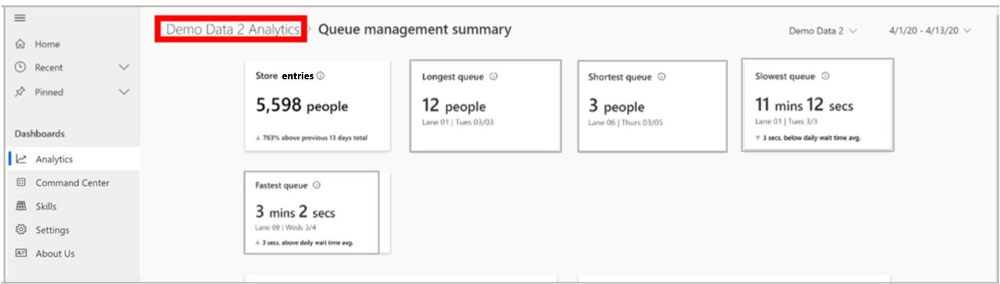
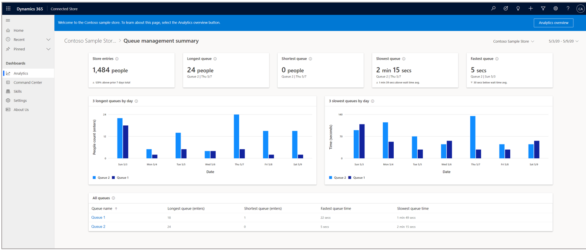

# View the Queue management summary page in Dynamics 365 Connected Store public preview

You can use the [**Analytics** page](web-app-get-insights.md) in the Microsoft Dynamics 365 Connected Store (public preview) web app to get insights on your retail store. The **Analytics** page includes insights for the Shopper analytics, Display effectiveness, and Queue management camera skill zones. This article focuses on the summary page for the Queue management skill zone. 

## View the Queue management summary page

To view the **Queue management summary** page, select the blue arrow to the right of the skill in the **Analytics** page. 

To go back to the **Analytics** page from the summary page, select from the breadcrumb at the top of the page.

## The Queue management summary page

The **Queue management summary** page shows a view of the performance of all queue management zones and their performance relative to each other. Use this page to answer this question: “How efficient are my queues?”

 

On this page, you can use the highlight cards, data visualizations, and summary table to:

- Identify the longest and shortest queue length

- Identify the slowest and fastest queue times with respect to the average queue time for all queues

- Visualize queue length and queue time trends for the longest and slowest queues

- Sort through a list of all store queues configured for insights according to queue name, longest and shortest queue values, and fastest and slowest queue times for the selected time range

## Highlights banner

The banner at the top of the page highlights the key takeaways and comparisons. The **Store footfall** and  **Longest queue** cards are carried over from the [**Analytics** page](web-app-get-insights.md).

**Shortest queue.** This card highlights the shortest queue length along with the name of the queue and the date on which the value was observed. 

	
> [!NOTE]
> Because there are several factors that can contribute to a change in value (for example, number of active queues in the store), the app does include a comparison subscript.

**Fastest queue.** This card highlights the shortest average wait time for people along with the name of the queue and the date on which the value was observed. 

 
The subscript in this card describes the absolute change in this value for the current time frame compared to average wait (dwell) time across all queues during the selected time frame. The triangle to the left of the subscript indicates whether the change was positive or negative.

## Graphs

There are two graphs at the bottom of the page: **3 longest queues** and **3 slowest queues**.

**3 longest queues.** This graph shows the people count trend data for the three Queue management zones that received the greatest footfall during the selected time frame.

**3 slowest queues.** This graph depicts the wait (dwell) time trend data for the three Queue management zones in which people, on average, spent the most time during the selected time frame. 

To see data values for each queue, hover over the graph. 

## Next step

[Learn about the Queue management details page](queue-management-details-page.md)
