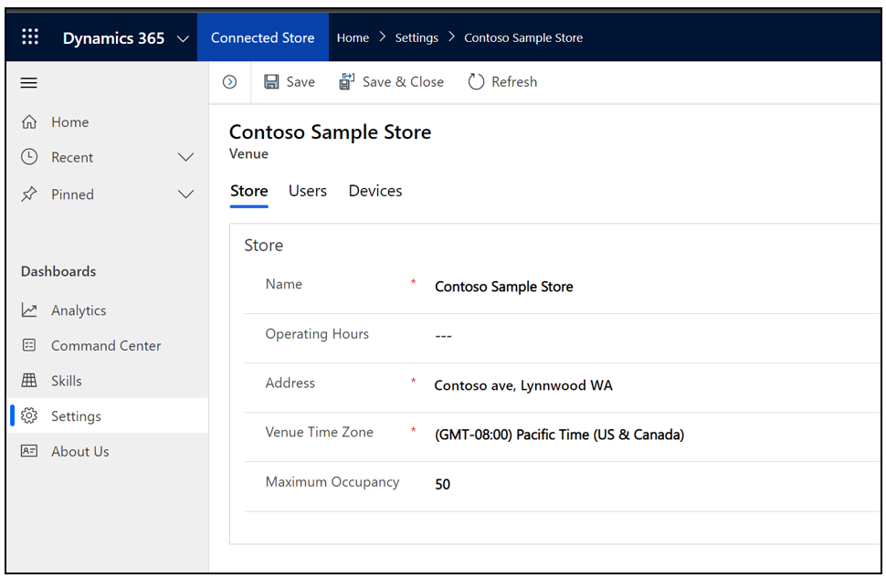

# Set your operating hours in Dynamics 365 Connected Store (public preview)

You can use the Microsoft Dynamics 365 Connected Store web app to set your operating hours. If you don't set your operating hours, by default, the Connected Store dashboards 
will show 24/7 data, which would include after-hours time set aside for cleaning and restocking.

1. In the web app, in the left navigation pane, select **Settings**.

2. On the **Store** tab, select **Operating Hours**, and then enter your hours of operation.

    

