# Update expiring certificates for Dynamics 365 Connected Spaces Preview

To ensure that the Microsoft Dynamics 365 Connected Spaces Preview deployment in your network remains compliant and secure, the certificate used to authenticate to the Connected Spaces project must be updated regularly. Microsoft tracks the validity of the certificate through the Azure Key Vault as part of the Managed Application. 

To provide continual access to the Connected Spaces services so that they can propagate data, the Azure Service Principal admin should review and maintain the certificate to keep it from expiring. 

If you're the Service Principal admin, use the steps in this article to determine when the Connected Spaces Preview certificates expire. You need to collect data from two different places: Key Vault and App registrations. 

## Find certificate expiration dates

To identify when your Connected Spaces Preview certificates expire, you need to collect data from two different places: Key Vault and App registrations. 

### Key Vault

1. In Microsoft Azure, in the main Azure search box, enter **mrg-connected-spaces-** to go to the Managed App resource created during the deployment.

   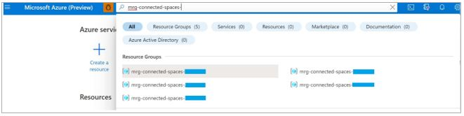
    
2. Select the **Key Vault** row. 

    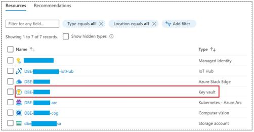

3. Go to the **Certificates** section for the Key Vault.

    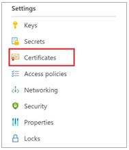

4. Find the certificate named **liveaiserviceprincipalprivatekey**. Note the expiration date. 

    

5. Go to the **Secrets** section for the Key Vault. 

    

6. Find the secret used for the service principal called ServicePrincipalSecret. Note the expiration date. 

    

7. Find the secret that specifies the App registration used with Connected Spaces. It's called **ServicePrincipalId**. 

    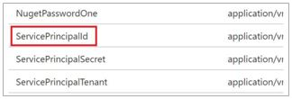
    
8. Copy the value of the secret to your Clipboard to look up the App registration.

### App registrations

1. Go to the Azure Active Directory Service.

    

2. On the **Overview** tab, look up the ID that you copied from the Key Vault.

    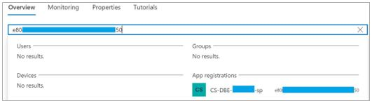

3. In the App registration, go to the **Certificates & secrets** section. 

    

4. On the **Client secrets** tab, note the expiration date for your current secret. 

    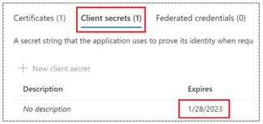

5. Go to the **Certificates** tab, and find the expiration date for the certificate set in the App registration. 

    

These are the expiration dates to keep in mind. 

## Renew service principal certificates and secrets

When Connected Spaces Preview is deployed, a service principal is created in your tenant along with the necessary credentials to authenticate to it. These credentials expire within two years for both the certificate and the secret. You'll receive an email message about six months before the certificate expires, indicating that you need to update the certificate manually. You must do this update before the credentials expire. **Otherwise, you will experience data loss.**

> [!IMPORTANT]
> After you update the secret and the certificate in the Key Vault, you must apply the same changes to the service principal as soon as possible. The device will update and use these new values within 10 minutes after you make the changes. 

### Prerequisites

You must be an owner of the service principal that you want to update.

### Find the credentials in the Key Vault

1. Go to [portalzaure.com](portalzaure.com). 

2. In the main Azure search bar, enter **mrg-connected-spaces-** to search for the resource group. 

    

3. After you find the resource group, locate the Key Vault for this deployment.

    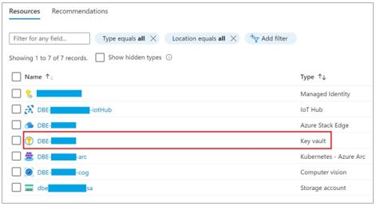

4. Go to **Certificates**.

    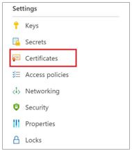

5. Select the **liveaiserviceprincipalprivatekey** certificate. 

6. Select **New Version** at the top of the page to create a new version of the certificate. 

    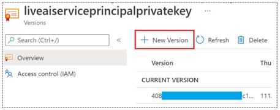

7. Select **Create** at the bottom of the page to create the new certificate. **You don't need to make any other changes on this page.** 

8. After the new version has been created, refresh the page. You'll see that a new version is available.

9. Select the newly created version and then download and save the PFX file. 

    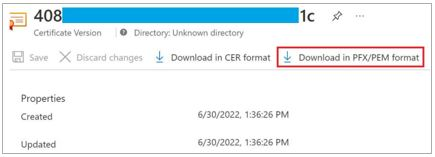

### Update the service principal

After completing the setup for the update, update the service principal with the new credentials.

1. In the main Azure search box at the top of the page, search for the **Azure Active Directory** service. 

    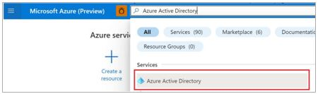

2. On the **Overview** tab, enter **cs-dbe** in the search box to find your App registration. 

    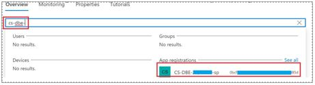

3. Go to **Certificates & secrets** to view your credentials.

    

4. Select the **Client secrets** (default) tab, and then select **New client secret**.

    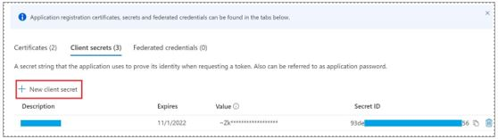

5. In the dialog box that's displayed, enter a description and set the expiration to 24 months. Then select **Add**. 

    

6. You'll see a new exposed secret. This is the only time that the secret is visible. Copy the secret value to a text editor to update the secret in the Key Vault.

    

7. Select the **Trashcan** button to delete any old secrets to avoid any potential security risks.

    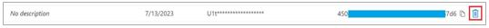

8. Go to **Certificates**.

    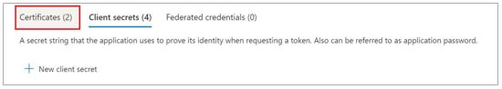

9. Select **Upload certificate**, and then go to the location where you saved the PFX certificate you downloaded from the Key Vault.

    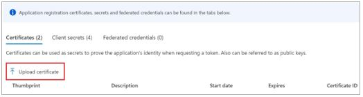

10. Delete any old certificates to avoid any potential security risks.

### Create a new secret

1. Go back to the Key Vault.

2. Go to **Secrets**.

    

3. Select **ServicePrinicpalSecret**.

    

4. Go into **Current** to copy the content type to use in the new secret version. Store it in a text editor to use for the next step.

    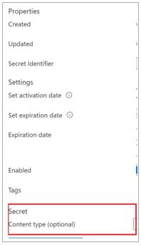

5. Go back to the previous page and select **New Version** at the top of the page to create a new version of this secret.

    

6. Include the expiration date: leave the default (2 years)

7. Include the content type: Paste the value you saved in step 4.

8. Enter your new value. This is the secret you generated for the service principal. 

9. Select the **Create** button at the bottom of the page.

    

