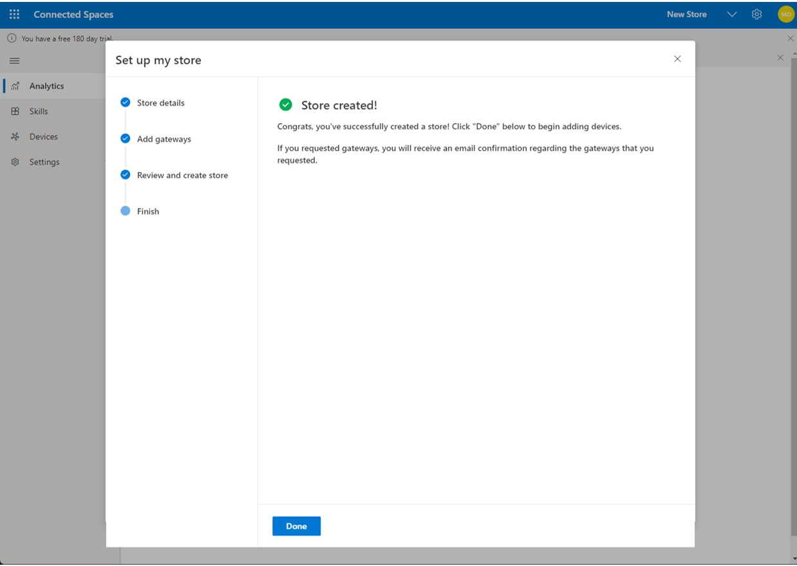

# Set up Dynamics 365 Connected Spaces Preview

[!INCLUDE[banner](includes/banner.md)]

After you've [signed up for a free trial](trial-signup.md) and selected the **Launch Trial** button, you can set up Microsoft Dynamics 365 Connected Spaces Preview by using this procedure. 

1. In the **Permissions requested** dialog box, select **Accept**.

    
    
    > [!NOTE]
    > This dialog box may appear more than once. If this happens, wait a few minutes for the permissions to be applied, and then try to sign in again. [Learn more about known issues with the Permissions prompt](known-issues.md)

   You'll see the Connected Spaces logo and a progress bar at the bottom of the screen, and then the Welcome page will appear. 

2. On the Welcome page, select **Get started**.

   

3. On the next page, look for a message in the upper-left corner of the page. If the message says "Setting up your account for Connected Spaces," wait until the account setup is finished. If the account setup is finished, go to the next step. 

     
  
4. Select **Add a store**.

   

5. On the **Store Details** page:

    - Enter a descriptive name for the store to distinguish it from your other stores.

    - Optional: In the **Max occupancy** field, enter the total number of people that will be allowed in your store at one time. 

    - Select a time zone.

    - Enter an address, city, country/region, and state.
    
    - Select **Next** when you're finished entering your store details.

      
   
6. On the **Gateways** page, do one of the following:

    - If you haven't already installed a gateway, and you want to order an Azure Stack Edge gateway, select **Order gateways on Azure Portal**. Return to this page after ordering and/or installing the gateway. A gateway must be installed to use Connected Spaces.  
    - If you have already installed a gateway, or if you haven't already installed a gateway but you plan to install the gateway later, select **Next** to continue with the Connected Spaces setup.

        
        
7. On the **Review and create store** page, select **View more** to review all the details for your store, and then if everything looks OK, select **Create store**.

    
    
8. On the **Store created** page, select **Done**.

    

## Next steps

- [Learn about camera placement](camera-placement-checklist.md)
- [Learn about camera installation](install-cameras.md)
- [Connect cameras to an installed gateway](cameras-connect.md)
- [Add camera skills](cameras-add-skills.md)
