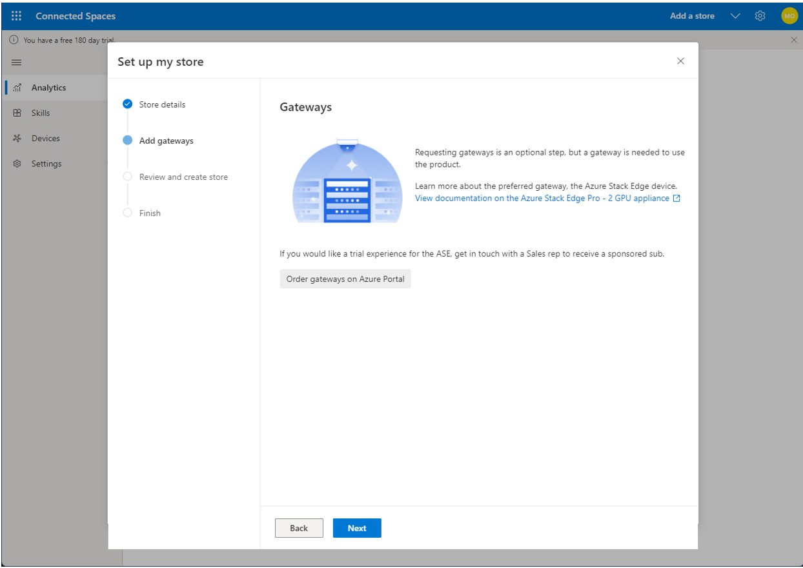

# Set up Dynamics 365 Connected Spaces

[!INCLUDE[banner](includes/banner.md)]

1. Go to xxx.

2. On the Welcome page, select **Get started**.

   

3. On the next page, look for a message in the upper-left corner of the page, and then do one of the following:

    - If the message says "Setting up your account for Connected Spaces", wait until the software is installed.

    - If the message says "You have a free 180-day trial", go to the next step. 

     
  
4. Select **Add a store**.

   

5. In the next page, enter the details for your store.

   
   
6. On the **Gateways** page, do one of the following:

    - If you haven't already intalled a gateway, select **Order gateways on Azure Portal** to learn about and order an Azure Stack Edge device. You must install a gateway to use Dynamics 365 Connected Store. Return to this page after ordering/installing the gateway. 
    - If you have already installed a gateway, or if you haven't already installed a gateway but you plan to install the gateway later, select **Next**.

        
        
7. On the **Review and create store** page, review the details for your store, and then if everything looks OK, select **Create store**.

    
