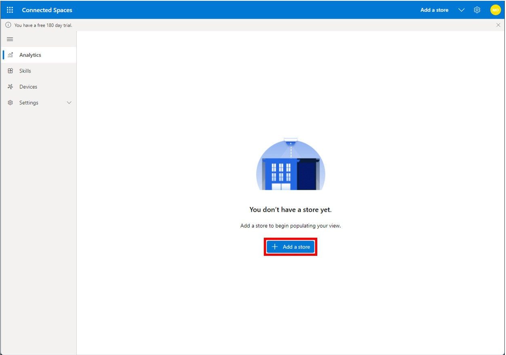

# Set up Dynamics 365 Connected Spaces Preview

[!INCLUDE[banner](includes/banner.md)]

Microsoft Dynamics 365 Connected Spaces Preview brings together computer vision and AI to help transform the retail store experience. By utilizing data from video cameras, Dynamics 365 Connected Spaces delivers real-time actionable recommendations that can make retail store operations more efficient and improve customer experiences. [Learn more about Connected Spaces capabilities](index.md).

## Set up Connected Spaces Preview

1. Go to xxx.

2. On the Welcome page, select **Get started**.

   

3. On the next page, look for a message in the upper-left corner of the page, and then do one of the following:

    - If the message says "Setting up your account for Connected Spaces", wait until the software is installed.

    - If the message says "You have a free 180-day trial", go to the next step. 

     
  
4. Select **Add a store**.

   

5. On the **Store Details** page:

    - Enter a descriptive name for the store to distinguish it from your other stores.

    - In the **Max occupancy** field, enter the total number of people that will be allowed in your store at one time. Connected Spaces uses this value together with computer vision and artificial intelligence to alert you if your store exceeds maximum capacity at any time.

    - Select a time zone.

    - Enter an address, city, country/region, and state.
    
    - Select **Next** when you've finished entering your store details.

      
   
6. On the **Gateways** page, do one of the following:

    - If you haven't already intalled a gateway, and you want to order an Azure Stack Edge gateway, select **Order gateways on Azure Portal**. Return to this page after ordering and/or installing the gateway. A gateway must be installed to use Connected Spaces.  
    - If you have already installed a gateway, or if you haven't already installed a gateway but you plan to install the gateway later, select **Next** to continue with the Connected Spaces setup.

        
        
7. On the **Review and create store** page, select **View more** to review all the details for your store, and then if everything looks OK, select **Create store**.

    
    
8. On the **Store created** page, select **Done**.

## What's next?

- [Learn about camera placement and installation]()
- [Connect cameras to a gateway]()
- [Add skills]()
