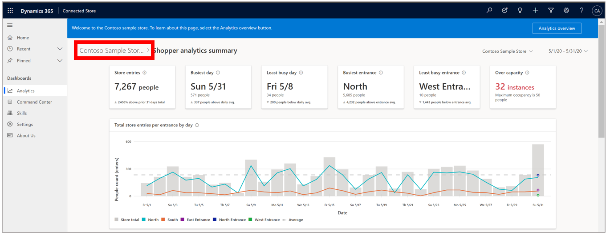

# View the Shopper analytics summary page in the Dynamics 365 Connected Store (public preview) web app

You can use the [**Analytics** page](web-app-get-insights.md) in the Microsoft Dynamics 365 Connected Store (public preview) web app to get insights on your retail store. The **Analytics** page includes insights for the Shopper analytics, Display effectiveness, and Queue management camera skill zones. This article focuses on the summary page for the **Shopper analytics** skill zone. 

## View the Shopper analytics summary page

To view the **Shopper analytics summary** page, select the blue arrow to the right of the skill in the **Analytics** page. 

To go back to the **Analytics** page from the summary page, select from the breadcrumb at the top of the page.

## The Shopper analytics summary page

The **Shopper analytics summary** page includes insights related to footfall trends, patterns, changes, and anomalies at store 
entries/exits. This page shows a view of the performance of all Shopper analytics zones. You can explore how many people visited 
the store during a given timeframe, categorized by entrance.

## Highlights banner

The banner at the top of the page highlights the key takeaways and comparisons. The first two cards, **Store footfall** and **Busiest day**, are carried over from the [**Analytics** page](web-app-get-insights.md). 

**Least busy day**. This card highlights the day and date within the selected time frame that had the least number of people, 
along with the people count. 

The subscript in the card describes the absolute change in this value for the current time frame compared to average footfall across all 
displays during the selected time frame. The triangle to the left of the subscript indicates the difference in footfall for the 
highlighted day, compared to the daily average footfall during the selected time frame. 

**Busiest entrance.** This card highlights the name and corresponding value of the Shopper analytics zone that received the greatest 
footfall for the selected time frame. 

The subscript in the card describes the absolute change in this value for the current time frame compared to the previous time frame of equal duration. The triangle to the left of the subscript indicates whether this change was positive or negative. 

**Least busy entrance.** This card highlights the name and corresponding value of the Shopper analytics zone that received the least 
footfall for the selected time frame. 

The subscript in the card describes the absolute change in this value for the current time frame compared to the previous time frame of equal duration. The triangle to the left of the subscript indicates whether this change was positive or negative. 

## Graphs

The **Total footfall at all entrances** and **Footfall at Entrance x** graphs appear at the bottom of the page.

**Total footfall at all entrances**. This graph shows total store footfall according to Shopper analytics zone. 

**Footfall at Entrance x**. You can view trends for individual zones in these line graphs (for example, **Footfall at Entrance 1**).

To see data for each individual entrance, hover over the desired data in the graph.

## Next step

[Learn about the Display effectiveness summary page](display-effectiveness-summary-page.md)
