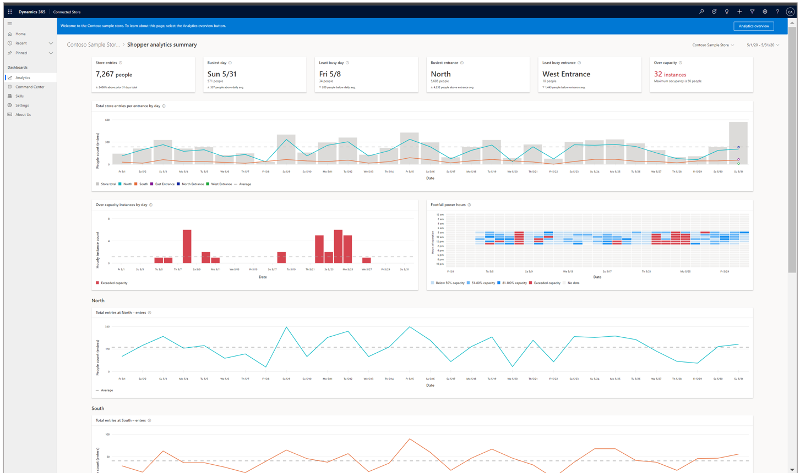
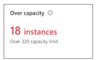
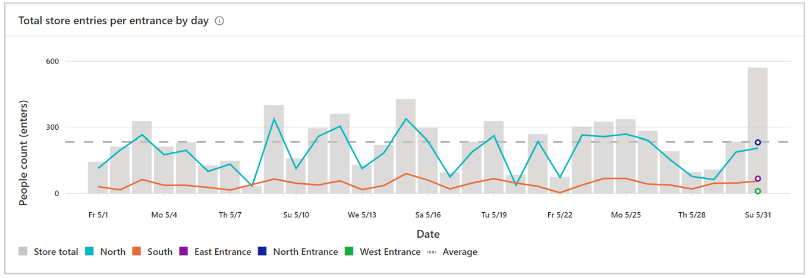
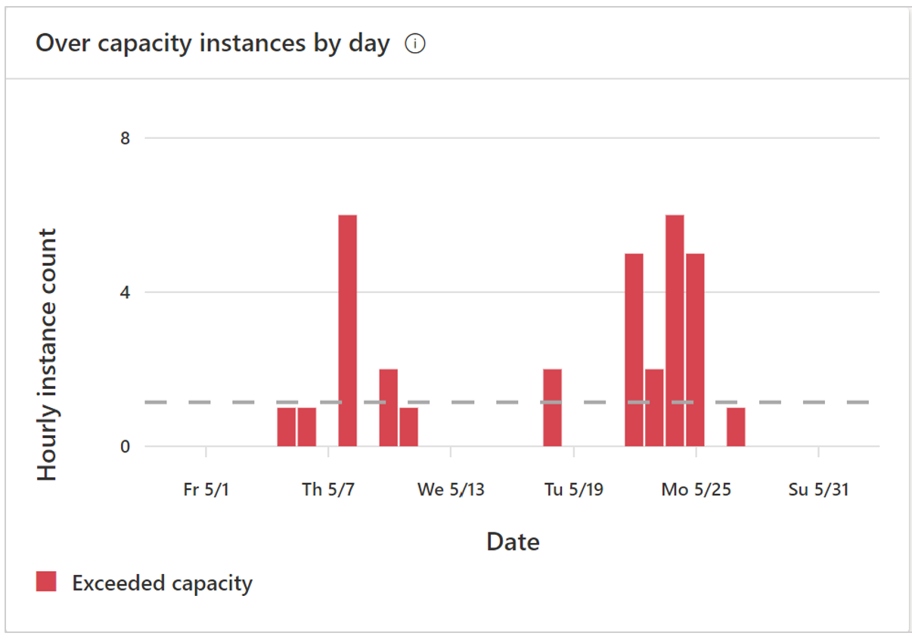
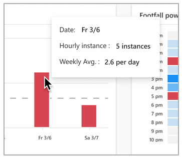

# View the Shopper analytics summary page in the Dynamics 365 Connected Store Preview web app

You can use the [**Analytics** page](web-app-get-insights.md) in the Microsoft Dynamics 365 Connected Store Preview web app to get insights on your retail store. The **Analytics** page includes insights for the Shopper analytics, Display effectiveness, and Queue management camera skill zones. This article focuses on the summary page for the Shopper analytics skill zone. 

## View the Shopper analytics summary page

To view the **Shopper analytics summary** page, select the blue arrow to the right of the skill in the **Analytics** page. 

To go back to the **Analytics** page from the summary page, select from the breadcrumb at the top of the page.

## The Shopper analytics summary page

The **Shopper analytics summary** page includes insights related to entry trends, patterns, changes, anomalies at store 
entries/exits, and over capacity (determined by the [**Maximum Occupancy** setting in the mobile app](mobile-app-create-store.md)). This page shows a view of the performance of all Shopper analytics zones. You can explore how many people visited the store during a given timeframe, categorized by entrance.

## Highlights banner

The banner at the top of the page highlights the key takeaways and comparisons. The first two cards, **Store entries** and **Busiest day**, are carried over from the [**Analytics** page](web-app-get-insights.md). 

**Least busy day**. This card highlights the day and date within the selected time frame that had the least number of people, 
along with the people count. 

The subscript in the card describes the absolute change in this value for the current time frame compared to average entries across all 
displays during the selected time frame. The triangle to the left of the subscript indicates the difference in entries for the 
highlighted day, compared to the daily average entries during the selected time frame. 

**Busiest entrance.** This card highlights the name and corresponding value of the Shopper analytics zone that received the greatest 
entries for the selected time frame. 

The subscript in the card describes the absolute change in this value for the current time frame compared to the previous time frame of equal duration. The triangle to the left of the subscript indicates whether this change was positive or negative. 

**Least busy entrance.** This card highlights the name and corresponding value of the Shopper analytics zone that received the least 
entries for the selected time frame. 

The subscript in the card describes the absolute change in this value for the current time frame compared to the previous time frame of equal duration. The triangle to the left of the subscript indicates whether this change was positive or negative. 

**Over capacity.** This card highlights the number of instances for which the store occupancy exceeds the **Maximum Occupancy** value. The **Maximum Occupancy** value is set in the mobile app during store configuration. For example, if the **Maximum Occupancy** value for the store is set to 320 people (shown in the subscript in the card), the card reports the number of instances during the selected time frame for which the store occupancy was greater than 320 people. In the following example, there were 18 such instances.

> [!NOTE]
> If you haven't [set a **Maximum Occupancy** value in the mobile app](mobile-app-create-store.md), you'll see a placeholder instead of the **Over capacity** card. The placeholder prompts you to download or go to the mobile app to set a **Maximum Occupancy** value. After you configure the **Maximum Occupancy** value, you'll see a tool tip in the web app that prompts you to [set up alerts and notifications in the Command Center](web-app-command-center.md). 

## Graphs

There are several graphs on this page:

- **Total store entries per entrance by [time slice (day, hour)]**. This graph shows total store entries according to the Shopper analytics zone. 

    

- **Over capacity instances by [time slice (day, hour)]**. This graph shows trends in instances of over capacity across time for the selected time frame. In the example shown in the screen shot below, most instances of over capacity occurred on Friday. The gray dotted line reflects the average number of over-capacity instances for the selected time frame. 

    

    > [!NOTE]
    > If you haven't [set a **Maximum Occupancy** value in the mobile app](mobile-app-create-store.md), you'll see a placeholder instead of the **Over capacity instances** graph. The placeholder prompts you to download or go to the mobile app to set a value. After you configure the **Maximum Occupancy** value, you'll see a tool tip in the web app that prompts you to [set up alerts and notifications in the Command Center](web-app-command-center.md). 

    You can hover over data to reveal more details.

    

- **Footfall power hours**. This heat map identifies patterns in over-capacity instances across day and time. In the following example, using a weekly time frame view (set in the date picker), you can identify which hours exceeded the maximum occupancy threshold, and then make any necessary adjustmens to schedule and staffing.

    

    > [!NOTE]
    > If you haven't [set a **Maximum Occupancy** value in the mobile app](mobile-app-create-store.md), you'll see a placeholder instead of the **Footfall power hours** heatmap. The placeholder prompts you to download or go to the mobile app to set a value. After you configure the **Maximum Occupancy** value, you'll see a tool tip in the web app that prompts you to [set up alerts and notifications in the Command Center](web-app-command-center.md). 
    
    You can hover over data to reveal more details.

    

- **Total entries at *Entrance x* - enters**. You can view trends for individual zones in these line graphs (for example, **Total entries at North - enters**).

    

    To see data for each individual entrance, hover over the desired data in the graph.

    

## Next steps

Learn about these web app pages:

[Analytics page](web-app-get-insights.md) 
[Display effectiveness summary page](display-effectiveness-summary-page.md) 
[Display effectiveness details page](display-effectiveness-details-page.md) 
[Queue management summary page](queue-management-summary-page.md) 
[Queue management details page](queue-management-details-page.md)
