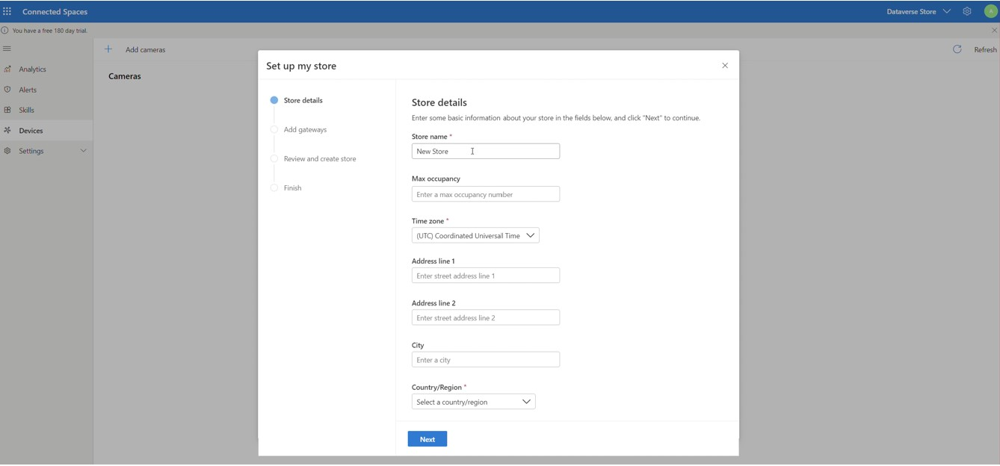
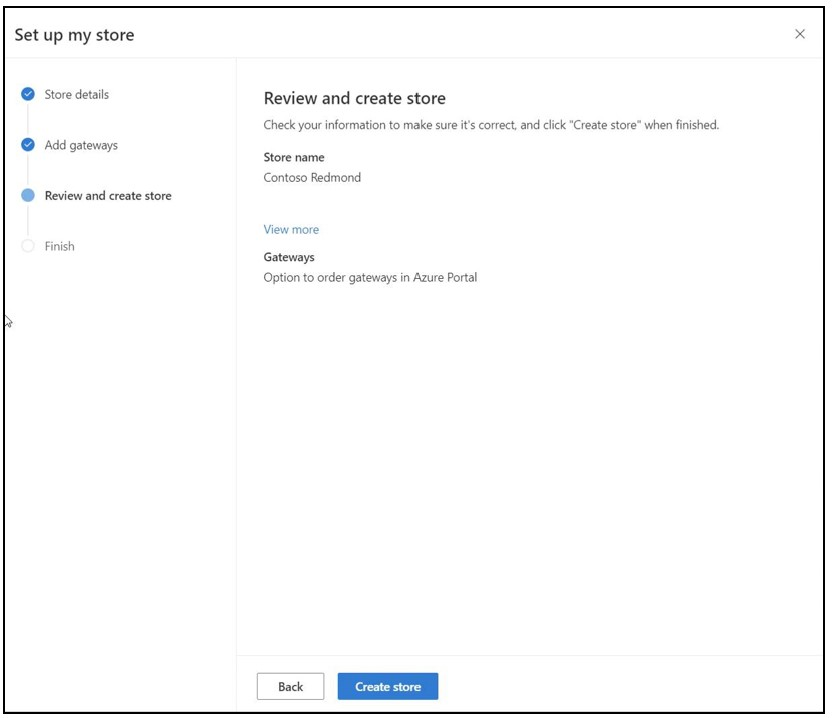

# Create a store in Dynamics 365 Connected Spaces Preview

[!INCLUDE[banner](includes/banner.md)]

After you [prepare your network and install Azure Stack Edge Pro (2 GPU)](ase-install.md), you’re ready to create a store in 
Microsoft Dynamics 365 Connected Spaces Preview. 

## Create a store

When you sign in to Connected Spaces with your admin credentials for the first time (and if you haven't already created a store), the **Set up my store** page automatically appears.

On the **Set up my store** page:

1. In the **Store name** field, enter a friendly name for your store.

2. In the **Max occupancy** field, set the maximum number of people allowed in the store at one time. Connected Spaces uses computer vision to calculate entrances and exits and notifies you if the maximum occupancy value is exceeded.

3. In the **Time zone** field, set the time zone for your store.

4. Fill in the **Address** and **City** fields with the address for your store.

5. In the **Country/Region** field, select the appropriate country/region.

    > [!NOTE]
    > You must select a value in the **Country/Region** field to enable the **State** field.

6. In the **State** field, enter the state for your store. 

7. Select **Next**.

8. Make sure all the store details are correct, and then select **Create store**.

      
    
9. Select **Done**. 

Now you're ready to connect cameras to your store. 
 
## Next steps

[Connect cameras](cameras-connect.md)

[Add camera skills](cameras-add-skills.md)
