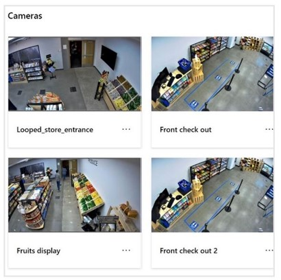
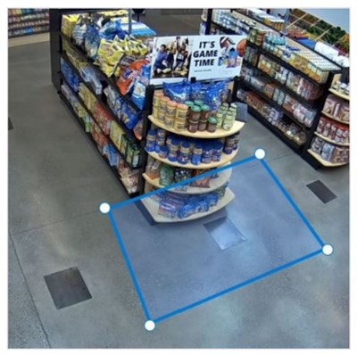
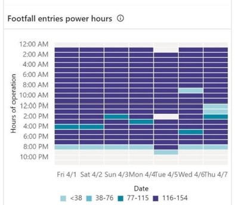

# Transparency Note for Dynamics 365 Connected Spaces Preview

## What is a Transparency Note? 

An AI system includes not only the technology, but also the people who will use it, the people who will be affected by it, and the environment in which it is 
deployed. Creating a system that is fit for its intended purpose requires an understanding of how the technology works, its capabilities and limitations, and how to 
achieve the best performance. Microsoft’s Transparency Notes are intended to help you understand how our AI technology works, the choices system owners can make that 
influence system performance and behavior, and the importance of thinking about the whole system, including the technology, the people, and the environment. You can 
use Transparency Notes when developing or deploying your own system, or share them with the people who will use or be affected by your system.  

Microsoft’s Transparency Notes are part of a broader effort at Microsoft to put our AI Principles into practice. To find out more, visit [Microsoft’s responsible AI 
resources](https://www.microsoft.com/en-us/ai/responsible-ai-resources). 

## Introduction to Dynamics 365 Connected Spaces Preview

Microsoft Dynamics 365 Connected Spaces Preview brings together computer vision and AI to help transform the retail store experience. By utilizing data from video cameras, Dynamics 365 Connected Spaces Preview delivers real-time actionable recommendations that can make retail store operations more efficient and improve customer experiences. 

### The basics of Dynamics 365 Connected Spaces Preview

Dynamics 365 Connected Spaces Preview aims to provide actionable analytics to brick-and-mortar retail businesses, analytics that support maintaining a healthy business and improving in-store experiences for shoppers and associates. 

#### How it works

|Cameras|Zone and line "skills"|Analytics|
|----------------------------------------------------|----------------------------------------------------|----------------------------------------------------|
||||
|Customers connect the system to cameras installed in their physical space. Video from these cameras is processed on an edge device and may be stored in a tenanted cloud environment (if a customer chooses).|Users can specify zones or lines in the field of view of a camera. A **person tracking AI “skill”** detects when people enter, exit or cross into these areas. Aggregated metrics are stored in a tenanted database. | Users view metrics and configure alerts related to volume and timing of people crossing/entering lines and zones. The intended use of this data is to evaluate display effectiveness, queue length, and store occupancy. |

Dynamics 365 Connected Spaces Preview offers three out-of-box skills: **Display effectiveness**, **Queue management**, and **Shopper analytics**. All three skills rely on an AI system called [Spatial Analysis](https://docs.microsoft.com/azure/cognitive-services/computer-vision/intro-to-spatial-analysis-public-preview) that ingests video and uses computer vision AI models to detect people and infer events when people interact with regions of interest. 
To understand how this works, it is important to define a set of key components that make up this pipeline. 

Two key AI components of the system are **People Detection** and **People Tracking**. The People Detection component looks at a frame of video and determines whether there are people in the frame by generating a bounding box around a human body. The People Tracking component consumes the outputs from people detection and uses temporal logic to track the coordinates of a bounding box as a detected person moves around the user-defined space. It does not track people across multiple cameras, attempt to discover identities or demographics of detected people, or use facial recognition or gait tracking. If a person exits the field of view for longer than approximately one minute and then re-enters the view, the system will perceive them as a new person. 

People Tracking is used to detect when a person enters a **Region of Interest**. For Connected Spaces, a Region of Interest is either a user-defined polygonal zone or a line. When a person interacts with a Region of Interest, an event is generated that includes information about what occurred in the input video (but does not include any images or video). Events are aggregated to produce the analytics and actionable insights displayed in the Connected Spaces dashboards. 

### Example use cases 

The preview release of Dynamics 365 Connected Spaces enables the following scenarios to make retail store operations more efficient and improve customer experiences: 

- **Display effectiveness.** Create the real-world equivalent of the digital customer engagement funnel for promotions. This capability allows merchandisers and store managers to measure the effectiveness of promotions/displays within the store, tracking shopper footfall and engagement as defined by time spent in front of the display. 

- **Queue management.** Monitor queue wait time and queue lengths to improve shopper experience and provide informed insights for employee shift management. 

- **Shopper analytics.** Understand traffic patterns into and around the store to allow retailers to plan for shift management and inventory. 

Some common customer motivations for using Dynamics 365 Connected Spaces Preview include: 

- Collecting observational datapoints and aggregated metrics about how people move through retail spaces. 

- Leveraging analytics reports to optimize their retail spaces and plan operations. 

## Characteristics and limitations 

### How AI works to produce insights  

The edge device includes computer vision skills (AI models) that detect human presence and movement from in-store camera video footage to derive data such as people count and dwell time. The derived data (or inference data) is sent to the Connected Spaces cloud to generate insights. The Connected Spaces service and web app is a multi-tenant software as a service (SaaS) that processes the data from the Connected Spaces edge gateway and correlates with other business data to generate aggregate and actionable insights for each customer. 

- The goal of computer vision AI skills is exclusively to detect and locate human presence in video footage and output a bounding box around a human body. Connected Spaces AI skills that detect people and their dwell or wait times in certain zones of the store do not detect faces or discover the identities or demographics of shoppers and other individuals at your retail location. 

- For each bounding box movement detected in a camera zone, the AI model outputs event data, including the following: 

    - Bounding box coordinates of a person’s body 

    - Event type (for example, zone entry or exit and directional line crossing) 

    - Pseudonymous numerical identifier to track the bounding box 

    - Confidence score for the detection 

- Inferencing by the AI skills of video footage occurs locally in memory on the edge gateway. This inference data does not include data that could identify individuals. Customers have the option to store and manage their video data and derived inference data in Microsoft Dataverse in the customer's Power Platform environment. For more information about the event data generated by the models and insights derived, see [Data and Privacy](data-privacy.md). 

- The inferenced data output from the AI skills is depersonalized and aggregated into insight data, which is sent to the Connected Spaces cloud service. In the cloud, insight data is aggregated further into hourly summaries and correlated with other business data and then stored in the customer's Microsoft Dataverse cloud storage for viewing via the Connected Spaces web app. 

### General limitations for AI models 

It is important to understand that while AI systems are incredibly valuable tools, they are **non-deterministic**. This means that perfect **accuracy** (the measure of how well the system-generated events correspond to real events that happened in a space) of predictions is not possible. A good model will have high accuracy, but it will occasionally output incorrect predictions. Failure to understand this limitation can lead to over-reliance on the system and unmerited decisions that can impact stakeholders. Ensuring that predictions made by an AI model are weighted against human judgment and logic can help mitigate this risk. The following table defines some key terms that relate to the accuracy of a system to help illustrate the kind of errors Connected Spaces skills might make.  

|Term|Definition|Example| 
|----------------------------------------------------|----------------------------------------------------|----------------------------------------------------|
|True Positive|The system-generated event correctly corresponds to a real event.|The system correctly detects a person entering a store where there is one.| 
|True Negative|The system correctly does not generate an event when a real event has not occurred.|The system correctly does not detect a person entering a store where there is not one.| 
|False Positive|The system incorrectly generates an event when no real event has occurred.|The system incorrectly detects a person entering a store where there is not one.| 
|False Negative|The system incorrectly fails to generate an event when a real event has occurred.|The system incorrectly does not detect a person entering a store where there is one.| 

### Best practices for improving system performance 

For computer vision AI models, several factors beyond core model accuracy can affect the accuracy and confidence of predictions such as camera placement, obstacles or obstructions in a camera’s field of view, configuration of regions of interest, how people interact with the system, and how people interpret the system's output. Some best practices for obtaining the best system performance include: 

- Camera placement should maximize the chance of a good view of people in the space and reduce the likelihood of occlusion.  

- Often objects or people will block the view of a camera, occluding part of a scene. This will impact the accuracy of the system, especially if occlusions occur in a region of interest. The system has a limited ability to re-identify a person after they have been occluded. Cameras should be setup to minimize occlusions as much as possible. 

- Zone and line placement designate a specific region of interest for generating insights. The region should be optimized to cover the largest area possible without including any area that you do not care about. Too small a region can result in unreliable data. 

- Cameras should be setup to yield high quality images, avoiding lighting conditions outside the recommended operating range that result in over or under exposure of images. 

More detailed guidance on best practices for [drawing skill zones](cameras-add-skills.md#tips-for-drawing-skill-zones) and [camera placement](camera-placement-recommendations.md) is available in the Dynamics 365 Connected Spaces Preview documentation. 

### Guidelines for choosing a use case  

- **Carefully consider region of interest and camera placement for skills** – When defining a region of interest for a skill, consider avoiding capturing more data than is needed for a skill. Avoid positioning cameras towards sensitive areas of a store (for example, restrooms, employee break rooms) or public spaces outside of the store (for example, sidewalks, mall concourses). 

- **Carefully consider the impact on the work-life of retail employees** – Connected Spaces was not designed or intended for employee surveillance, evaluating employee performance, modifying employee behavior, or just-in-time shift scheduling. Using the system to engage in such behaviors could be detrimental to employee well-being, and thus is not a recommended use. 

- **Avoid discovery or disclosure of sensitive information** – Connected Spaces should not be used in such a way that reveals personal private information about the identity, relationships, or life circumstances, such as inferring religion based on clothing, of shoppers and employees. 

- **Communicate with shoppers and employees about the use of Connected Spaces** – You should always inform people of the use of cameras and an AI solution in a retail space. In many places this is legally required, and a thoughtful and transparent disclosure strategy can also build trust with shoppers and employees. You can build that trust by helping shoppers and employees understand what technology is used, what it does including any benefits to them, and how their data is protected. To help you decide what information and how to share it, consider the design tips in the guides for communicating with [shoppers](communication-plan.md) and [employees](employee-plan.md). 

- **Seek appropriate legal and professional advice** – We strongly recommend seeking legal advice from a specialist to understand any laws and regulations applicable to your use case and in your geographic area when using Connected Spaces.  You are responsible for complying with all laws and regulations, including specific requirements related to notice, disclosure, and consent. 

## Learn more about Responsible AI 

[Microsoft Responsible AI principles](https://www.microsoft.com/en-us/ai/responsible-ai) 

[Microsoft Responsible AI resources](https://www.microsoft.com/en-us/ai/responsible-ai-resources) 

[Microsoft principles for developing and deploying facial recognition technology](https://blogs.microsoft.com/wp-content/uploads/prod/sites/5/2018/12/MSFT-Principles-on-Facial-Recognition.pdf) 

[Microsoft Azure Learning courses on Responsible AI](https://docs.microsoft.com/en-us/learn/paths/responsible-ai-business-principles/) 

## Contact us 

If you have any questions or comments, please post them in the [Dynamics 365 Connected Spaces Preview Community Forums](https://community.dynamics.com/).  

## About this document 

© 2022 Microsoft Corporation. All rights reserved. This document is provided "as-is" and for informational purposes only. Information and views expressed in this document, including URL and other Internet Web site references, may change without notice. You bear the risk of using it. Some examples are for illustration only and are fictitious. No real association is intended or inferred. 
