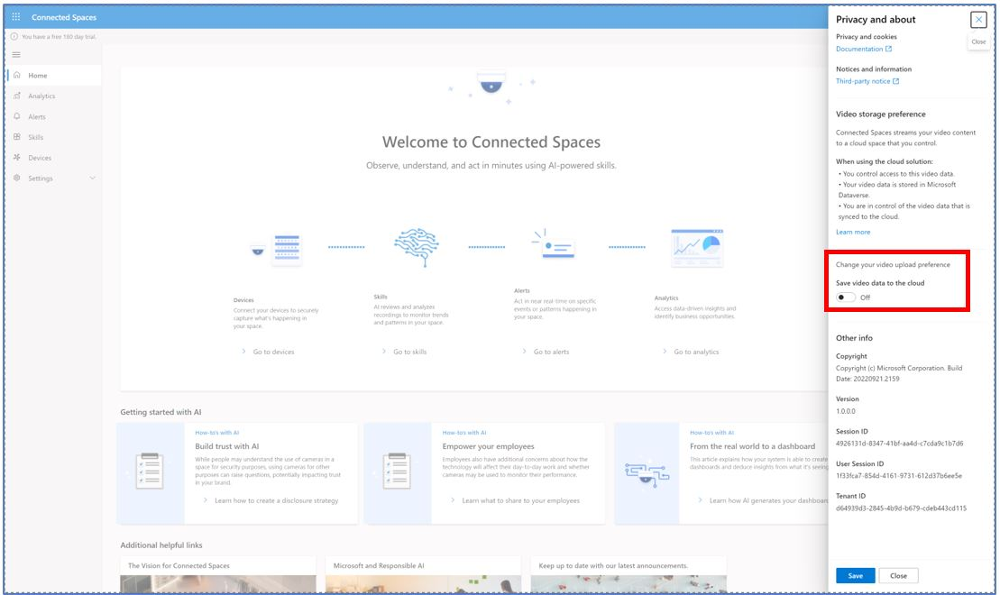
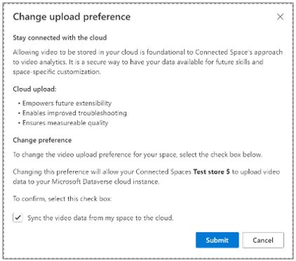

# Choose whether to upload video and inference data to the cloud in Dynamics 365 Connected Spaces

After local processing, insights data is uploaded to the Microsoft Dynamics 365 Connected Spaces cloud service for further processing and presentation through Connected Spaces dashboards. You can control whether you want to upload video data and inference data to your Microsoft Dataverse cloud storage and manage it. 

[Initial processing of video and inference data occurs on the customer's premises on an edge gateway device to generate aggregated insights data](data-privacy.md). Inference data and insights data is streamed to your Microsoft Dataverse cloud storage by default. Video data is off by default; to sync video data to the cloud, customers must opt in. Use of the service is not possible without cloud processing of insights data, but you can choose to turn your video and inference data upload off or on in the Connected Spaces web app. This request takes a few minutes to complete. 

> [!NOTE]
> Turning video upload off might adversely affect the Connected Spaces user experience. It impacts the ability to use certain features of the service and to detect and troubleshoot data quality issues (see [Benefits of uploading video and inference data](video-inference-data-upload.md#benefits-of-uploading-video-and-inference-data)).

## Turn video upload off or on

1.	In the upper-right corner of the screen, go to **Settings** > **Privacy and about**.
    
2.	On the right side of the screen, in the **Privacy and about** pane, turn the **Save video data to the cloud** setting off or on, and then select **Save**. 

     

3.	In the **Change upload preference** dialog box, select **Submit**.  

    
    
4. To confirm that your request has been sent, check the **Privacy and about** panel. You should see your updated **Settings** preference. 
 
## Benefits of uploading video and inference data 

Uploading video and inference data to Microsoft Dataverse provides the following benefits:

- **Empowers future extensibility.** Upcoming features may require video data to be powered. If you don't upload video and inference data, you may not have access to these features when released.

- **Enables improved troubleshooting.** With video and inference uploaded to the cloud, when unexpected issues or challenges arise, video and inference data may be needed to help troubleshoot and provide fixes. 

- **Ensures measurable quality.** With video and inference data uploaded to the cloud, quality of data can be ensured and measured. 

## See also

[Data and privacy](data-privacy.md)
