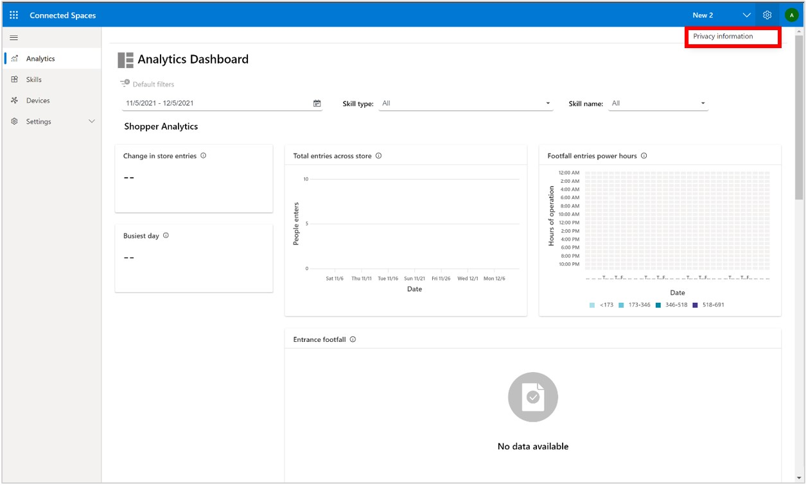
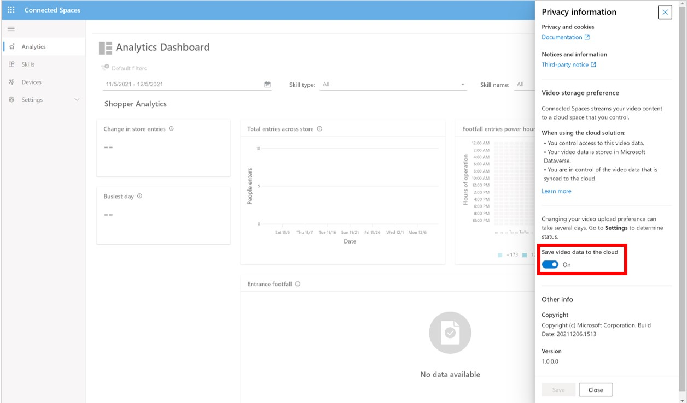
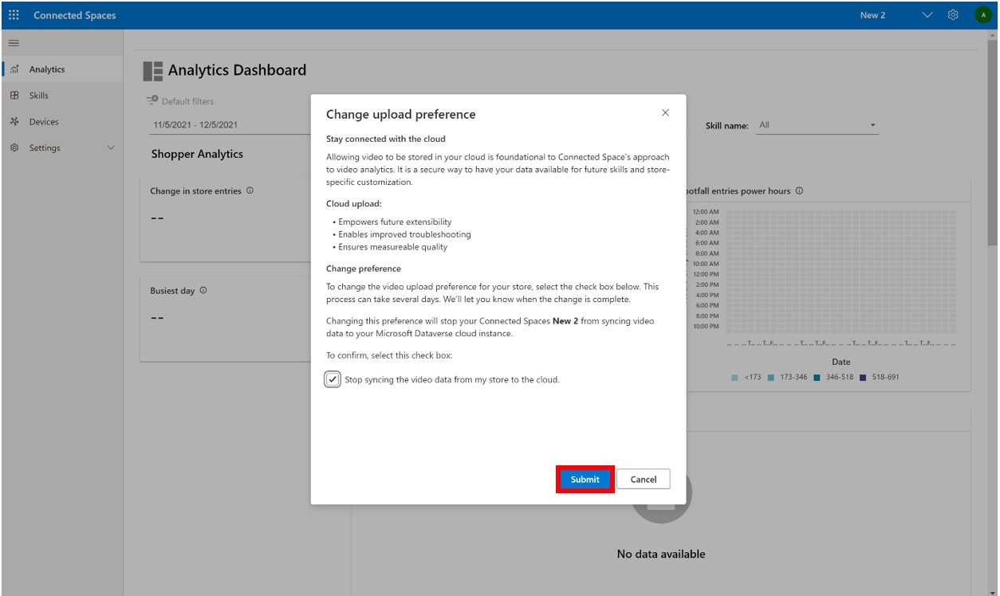
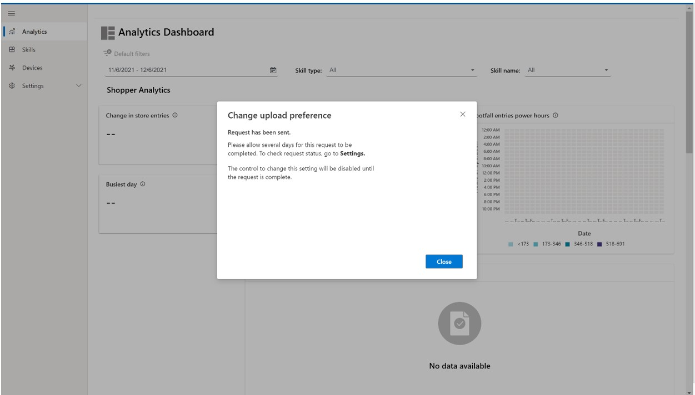
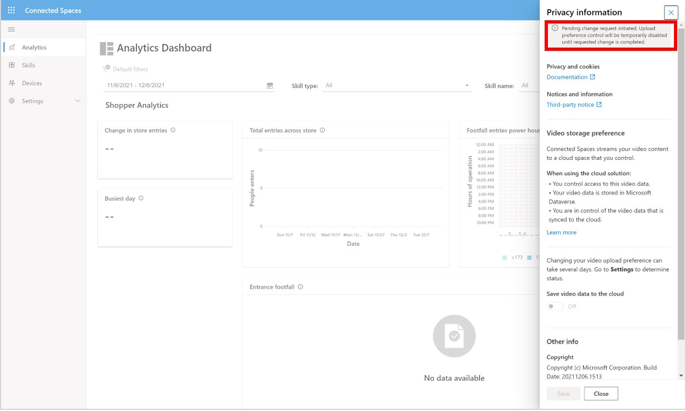

# Choose whether to upload video and inference data to the cloud in Dynamics 365 Connected Spaces

After local processing, insights data is uploaded to the Microsoft Dynamics 365 Connected Spaces cloud service for further processing and presentation through Connected Spaces dashboards. You can control whether you want to upload video data and inference data to your Microsoft Dataverse cloud storage and manage it. 

[Initial processing of video and inference data occurs on the customer's premises on an edge gateway device to generate aggregated insights data](data-privacy.md). Video, inference data, and insight data is streamed to your Microsoft Dataverse cloud storage by default. Use of the service is not possible without cloud processing of insight data, but you can choose to turn your video and inference data upload off or on in the Connected Spaces web app. This request takes several days to complete. 

> [!NOTE]
> Turning video upload off might adversely affect the user experience of Connected Spaces. It impacts your ability to use certain features of the service and to detect and troubleshoot data quality issues (see [Benefits of uploading video and inference data](video-inference-data-upload.md#benefits-of-uploading-video-and-inference-data)).

## Turn video upload off or on

1.	Go to **Settings** > **Privacy information**.

    

2.	On the right side of the screen, in the **Privacy information** pane, turn the **Save video data to the cloud** setting off or on, and then select **Save**. 

     

3.	In the **Change upload preference** dialog box, select **Submit**.  

    
    
    You'll see the following confirmation
    
     

To confirm that your request has been sent, you'll also see a message at the top of the **Privacy information** pane. 

The request might take several days to change. The **Save video data to the cloud** setting will be disabled until the change has occurred. When the change has occurred, the message will disappear. 
 
## Benefits of uploading video and inference data 

Uploading video and inference data to Microsoft Dataverse provides the following benefits:

- **Empowers future extensibility.** Upcoming features may require video data to be powered. If you don't upload video and inference data, you may not have access to these features when released.

- **Enables improved troubleshooting.** With video and inference uploaded to the cloud, when unexpected issues or challenges arise, video and inference data may be needed to help troubleshoot and provide fixes. 

- **Ensures measurable quality.** With video and inference data uploaded to the cloud, quality of data can be ensured and measured. 

## See also

[Data and privacy](data-privacy.md)
